# Lever: how the audio is cut into chunks

Chunk length, batch and overlap default per machine from `mlx_asr/profiles.json`: 30s/B32 on
the M2 Ultra and 60s/B16 on the M4, overlap 0 on both. On the 20-file corpus 60s versus 30s
is +0.10 points with a CI of [-1.89, +2.03], so the pair is chosen on throughput, and the
`--fast` decomposition showed 30s/B32 is faster on the 60-core Ultra (28.9x against 19.8x)
and slower on the 10-core M4. Prefix overlap won 1.4-1.8 points at 30s chunks on a single
clip but reversed sign on a real corpus, so it defaults to zero; cut points default to
energy minima, which were never behind a VAD.

`--overlap-seconds`, `--vad` and `--compact-silence` apply to Voxtral only;
`--chunk-seconds` also applies to `kotoba`, where it sets the independent-window length. The
`whisper-*` driver's 30s window is fixed by the model's positional encoding. Passing a flag to
an engine that cannot honour it is an error, not a warning.

| setting | default | why |
|---|---|---|
| `--chunk-seconds` | per machine: 30s on M2 Ultra, 60s on M4 | 30s and 60s are indistinguishable on the 20-file corpus; throughput decides, and it reverses across hardware |
| batch | per machine: 32 on M2 Ultra, 16 on M4 | the batch carries most of the speedup; 30s/B32 is the faster pair on 60 GPU cores and the slower one on 10 |
| `--overlap-seconds` | 0 | won on one clip at 30s chunks, reversed sign on the 7-file corpus, and is the only arm slower than the old default |
| cut points | energy minima; `--vad` opt-in | energy is never behind; VAD ties on Japanese at n=17 and loses all 3 English files |
| `--compact-silence` | off | accuracy ties on all four precisions; the 3-5% speed gain does not justify silently discarding input |
| composite flag | none (`--fast` removed) | the right chunk/batch pair reverses sign across hardware, so every lever is set independently |

**Setup:** [one clip](reference/corpus.md#the-single-clip) scored by plain CER, and the
[7-file subset](reference/corpus.md#the-7-file-subset) and [20-file corpus](reference/corpus.md#the-20-file-corpus)
scored by [coverage CER/WER](reference/metrics.md#coverage-cer-and-why-it-had-to-exist); M2 Ultra 128GB
and M4 16GB as stated per experiment. The two kinds of material disagree, which is the main
lesson of this page. Single-clip differences are compared with a **paired** test over 40
regions of the same audio (`scripts/benchmarks/compare_configs.py`), so shared difficulty
cancels; absolute CER differences under about half a point are not resolvable on one clip.
Scripts: `scripts/benchmarks/sweep_overlap.py` (overlap), `scripts/benchmarks/run_matrix.sh`
(chunk length), `scripts/benchmarks/probes/probe_seam_errors.py` (seam analysis).

## Experiment: chunk length

**Basis:** [one clip](reference/corpus.md#the-single-clip), M2 Ultra 128GB, 4-bit, no overlap; batch changes with chunk length.

<picture>
  <source media="(prefers-color-scheme: dark)" srcset="img/chunking-length-dark.svg">
  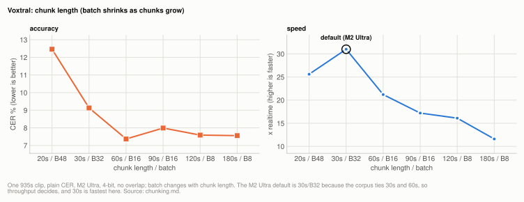
</picture>

**Table:** CER and speed by chunk length on one clip, M2 Ultra, with the batch each length runs at.

| chunk | batch | CER | x realtime |
|---|---|---|---|
| 20s | 48 | 12.46% | 25.6x |
| 30s | 32 | 9.13% | 31.0x |
| 60s | 16 | **7.37%** | 21.2x |
| 90s | 16 | 7.99% | 17.2x |
| 120s | 8 | 7.59% | 16.1x |
| 180s | 8 | 7.56% | 11.6x |

Accuracy improves up to 60s then flattens in the 7.5-8.0% band while speed falls away,
because chunks beyond ~60s exceed the encoder's 750-frame sliding window (a 60s chunk is
already ~1948 conv frames) and the batch has to shrink to fit memory. At 20s the loss is
mostly deletions, as short rows end early and drop text. The mechanism behind the short-chunk
loss is in [How it works](#errors-concentrate-at-chunk-starts).

Paired testing is stricter than the point estimates suggest:

<picture>
  <source media="(prefers-color-scheme: dark)" srcset="img/chunking-length-paired-dark.svg">
  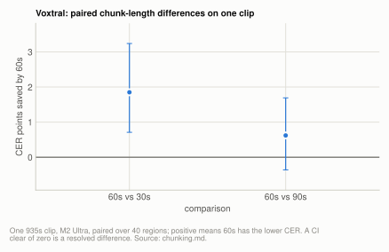
</picture>

**Table:** paired CER difference between chunk lengths on one clip, 40 regions, positive meaning 60s is better.

| comparison | diff | 95% CI | verdict |
|---|---|---|---|
| 60s beats 30s | 1.85 | [+0.71, +3.24] | significant |
| 60s beats 90s | 0.62 | [-0.36, +1.69] | **not supported** |

So on this clip **60s is the right choice because it is simultaneously the fastest of the
long options and never measurably worse**, which is a weaker justification than "longer
chunks are worse" but the one the data supports. An earlier version of these docs claimed the
stronger thing; that was a correction, not a new measurement.

Chunk length is still worth understanding, because it is the largest lever on *throughput*
and because it does drive accuracy on dense single-speaker narration. It is not a lever to
tune for accuracy on spontaneous conversational audio, as the next experiment shows.

## Experiment: 30s versus 60s chunks

**Basis:** [7-file subset](reference/corpus.md#the-7-file-subset), then the [20-file corpus](reference/corpus.md#the-20-file-corpus) on M4 16GB, sequential, `--delay-ms 2400`, kv8, 60s/B16 against 30s/B32.

On the **7-file** subset the 60s-versus-30s difference does not resolve
(+1.67, CI [-1.22, +4.73]), and 30s/batch 32 was nominally better on every axis including
speed. Between-file variance dwarfs the effect.

The corpus later grew to 20 files, lowering the resolution floor from about 3.2 points to
about 1.6. A +1.67-point effect sat almost exactly on that floor, making this the one
small-corpus result that more audio might plausibly turn into a decision. It did not.

Both arms re-run on one machine (M4 16GB, 20 files, sequential, `--delay-ms 2400`, kv8;
60s at batch 16 and 30s at batch 32, each machine's profile for that chunk length):

<picture>
  <source media="(prefers-color-scheme: dark)" srcset="img/chunking-30-60-dark.svg">
  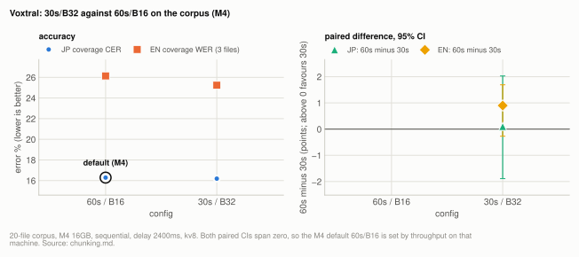
</picture>

**Table:** coverage error per arm on the 20-file corpus, M4 16GB, with the paired difference (60s minus 30s, positive meaning 30s is better) on the 30s row.

| config | JP coverage CER, 17 files | EN coverage WER, 3 files | JP paired difference | JP 95% CI | EN paired difference | EN 95% CI |
|---|---|---|---|---|---|---|
| 60s / b16 (default on M4) | 16.29% | 26.14% | | | | |
| 30s / b32 | **16.19%** | **25.24%** | +0.10 | [-1.89, +2.03] | +0.90 | [-0.27, +1.69] |

Not resolvable on either unit, and the Japanese point estimate fell from +1.67 at n=7 to
+0.10 at n=17: the two chunk lengths are indistinguishable on this material. 30s won 6 of 17
Japanese files and 60s won 10, with a sign test at p=0.454. Per file the spread is enormous
and two-sided (one file 18.25 points better at 30s, another 10.02 points better at 60s),
which is the between-file variance that dominates every config effect in this project.

This is a settled negative: chunk length between 30s and 60s can be chosen purely on
throughput. That makes it a hardware decision, which is what `profiles.json` encodes. No
accuracy claim should be attached to either value.

Speed is not comparable across those two rows, since the machine was under unrelated
background load for part of the second arm and the harness flagged it; accuracy is unaffected
by load because decoding is greedy. The clean throughput comparison for these two configs is
in [decode-throughput.md](decode-throughput.md) and in the `--fast` decomposition below.

## Experiment: prefix overlap

**Basis:** [one clip](reference/corpus.md#the-single-clip), M2 Ultra 128GB, 30s chunks, batch 32, kv8 (chart and first table); M4 16GB at 30s/B32 for the repeat; 60s chunks for the second table.

`--overlap-seconds N` prepends N seconds of the preceding audio to each chunk and discards
the tokens produced from it, so the model warms up before the region that is kept.

<picture>
  <source media="(prefers-color-scheme: dark)" srcset="img/chunking-overlap-dark.svg">
  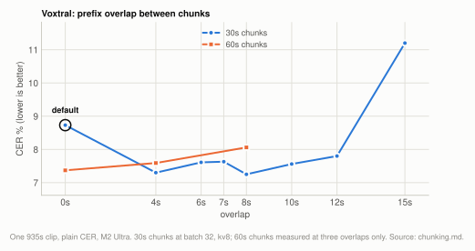
</picture>

**Table:** CER, speed and extra decoded audio by prefix overlap on one clip, M2 Ultra, 30s chunks, batch 32.

| overlap | CER | delta | x realtime | extra audio decoded |
|---|---|---|---|---|
| 0s | 8.73% | - | 32.7x | 0s |
| 4s | 7.30% | -1.43 | 29.2x | +124s |
| 6s | 7.61% | -1.12 | 27.7x | +186s |
| 7s | 7.63% | -1.09 | 27.0x | +218s |
| 8s | **7.25%** | **-1.47** | 26.3x | +248s |
| 10s | 7.56% | -1.17 | 25.6x | +310s |
| 12s | 7.80% | -0.93 | 23.1x | +372s |
| 15s | 11.20% | +2.47 | 22.2x | +466s |

M4 16GB, 30s chunks, batch 32: 0s 9.23% -> 4s 7.97% -> 8s 7.42%, same shape.

Three things to read off this:

- **The win is real at short chunks and reproduces on both machines**, and it survives
  a paired test (+1.80, CI [+0.62, +3.20]).
- **The curve is noisy, not smooth.** Between 4s and 12s it wanders in the 7.25-7.80%
  band with no clean optimum, a spread smaller than the measurement noise. "4s or more
  helps by about 1.5 points" is defensible; "8s is optimal" is not. 4s buys most of the
  gain for half the extra decode.
- **It collapses at 15s** on a 30s chunk, where the warm-up region is half the chunk and
  rows start hitting EOS inside it.

At 60s chunks it stops paying, because seams are sparse:

**Table:** CER by prefix overlap on one clip at 60s chunks (plotted as the second series of the overlap chart above).

| overlap | CER | delta |
|---|---|---|
| 0s | 7.37% | - |
| 4s | 7.59% | +0.21 |
| 8s | 8.06% | +0.69 |

Paired, that is -0.69 with CI [-1.47, +0.07], so the supported claim is **"no benefit at
long chunks"** rather than "harmful". An earlier version said harmful; corrected.

## Experiment: prefix overlap, paired over files

**Basis:** [7-file subset](reference/corpus.md#the-7-file-subset), overlap against no overlap, scored by coverage CER/WER; the machine and overlap length for this run are not recorded on this page.

<picture>
  <source media="(prefers-color-scheme: dark)" srcset="img/chunking-overlap-paired-dark.svg">
  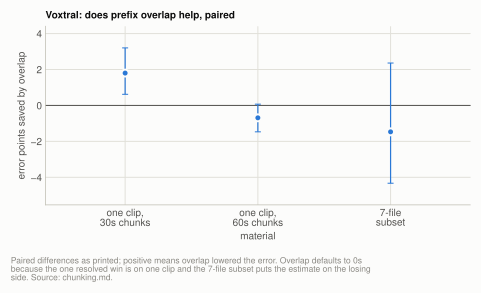
</picture>

**Table:** every paired overlap-against-none difference on this page, positive meaning overlap lowered the error; the clip rows are from the previous experiment.

| material | error points saved by overlap | 95% CI |
|---|---|---|
| one clip, 30s chunks | +1.80 | [+0.62, +3.20] |
| one clip, 60s chunks | -0.69 | [-1.47, +0.07] |
| 7-file subset | -1.47 | [-4.33, +2.36] |

On the 7-file subset the effect **reversed sign**: -1.47 points, CI [-4.33, +2.36], with
no-overlap nominally better on 5 files to 2. English was worse by 4 points
(26.55% -> 30.77% coverage WER). Two plausible mechanisms: these recordings contain long
stretches of non-reference material, so a warm-up window often carries content the
reference cut; and the seam-error enrichment in
[How it works](#errors-concentrate-at-chunk-starts) was measured on dense
narration and may not hold for conversational audio with frequent long pauses.

So overlap defaults to zero on every profile. It was for a while bundled into a `--fast`
flag, on the theory that halving the chunk creates the dense-seam condition where the clip
result applies; that turned out to be wrong twice over, and the direct measurement is in the
`--fast` experiment below. This is the clearest case in the project of a significant
single-clip result that did not generalize.

## Experiment: where to cut, energy versus VAD

**Basis:** [one clip](reference/corpus.md#the-single-clip), M2 Ultra 128GB, 4-bit, kv8; then the [20-file corpus](reference/corpus.md#the-20-file-corpus) on an idle M2 Ultra at 60s/B16 (2026-08-24).

`--vad` uses Silero VAD (ONNX, no torch) to cut in the middle of the longest non-speech
run near each target, instead of at the quietest 50ms window. It never removes audio,
only chooses where to cut, so the chunks still cover the input exactly. VAD inference is
negligible: 2.2s for 935s of audio, 426x realtime.

M2 Ultra 128GB, 4-bit, kv8, single clip:

<picture>
  <source media="(prefers-color-scheme: dark)" srcset="img/chunking-vad-clip-dark.svg">
  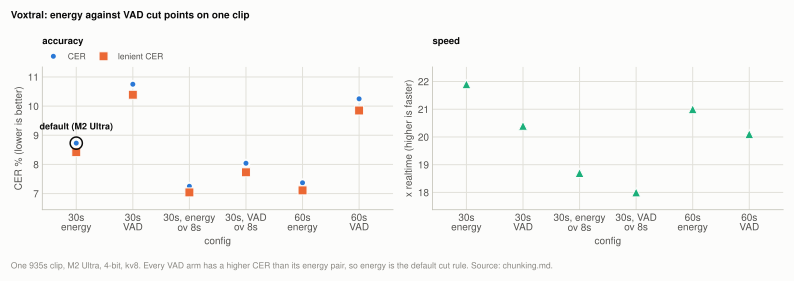
</picture>

**Table:** CER, lenient CER and speed for energy and VAD cut points on one clip, M2 Ultra.

| config | CER | lenient CER | x realtime |
|---|---|---|---|
| 30s, energy | **8.73%** | 8.42% | 21.9x |
| 30s, VAD | 10.75% | 10.39% | 20.4x |
| 30s, energy, overlap 8s | **7.25%** | 7.04% | 18.7x |
| 30s, VAD, overlap 8s | 8.04% | 7.73% | 18.0x |
| 60s, energy | **7.37%** | 7.11% | 21.0x |
| 60s, VAD | 10.25% | 9.85% | 20.1x |

VAD loses by 0.8-3.0 points in every pairing on this clip, and it clears significance
there: paired over 40 regions at 60s chunks, energy beats VAD by 3.00 points, CI [+0.74,
+5.93], winning 21 regions to 7 (sign test p=0.013).

**On the corpus the margin mostly evaporates.** Run across all 20 files at the config that
was the default then (60s/B16, the first row of the `--fast` table below; 2026-08-24, idle
M2 Ultra), energy still leads but not resolvably:

<picture>
  <source media="(prefers-color-scheme: dark)" srcset="img/chunking-vad-corpus-dark.svg">
  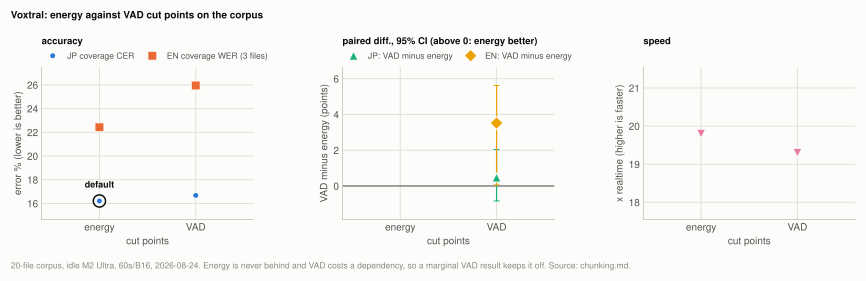
</picture>

**Table:** coverage error, speed and paired difference (VAD minus energy, positive meaning energy is better) on the 20-file corpus, idle M2 Ultra, 60s/B16.

| cut points | JP coverage CER | EN coverage WER | x realtime | JP difference | JP 95% CI | EN difference | EN 95% CI |
|---|---|---|---|---|---|---|---|
| energy (default) | **16.21%** | **22.43%** | 19.8x | | | | |
| VAD | 16.68% | 25.95% | 19.3x | +0.47 | [-0.84, +2.04] | +3.52 | [+0.06, +5.62] |

    Japanese: +0.47 points, CI [-0.84, +2.04], VAD wins 9 of 17 files -> not resolvable
    English:  +3.52 points, CI [+0.06, +5.62], VAD loses all 3 files -> resolved, but n=3

So the supported reading is narrower than the clip suggested. The 3.00-point Japanese margin
does not reproduce, and VAD wins slightly more Japanese files than it loses; the aggregate
tips to energy on length weighting rather than on a consistent per-file advantage. The
English arm resolves against VAD, but n=3 cannot carry much
([metrics.md](reference/metrics.md#the-english-bootstrap-is-n3-and-that-is-worse-than-it-sounds)).

**Marginal, so it stays off.** Energy is never behind, VAD costs an `onnxruntime`
dependency and a little speed, and a flag that changes nothing measurable should not be the
default. What is no longer supported is the stronger claim that VAD cut points are worse.

The clip result is the opposite of what the VAD literature predicts, and the VAD cuts really
are cleaner by the obvious measure: speech probability in the 1s *after* a cut is 0.316 for
VAD versus 0.485 for energy, and only 10 of 30 VAD cuts start inside speech versus 17 of
31 energy cuts.

The likely explanation ties back to overlap. The energy splitter picks the quietest
*instant*, which lands mid-pause and hands the next chunk a run of leading silence to
warm up on. VAD picks the middle of a non-speech *run*, often a short inter-word gap
that satisfies the detector but leaves almost no silence before speech resumes.
**Warm-up room matters more to this model than cut cleanliness.** Kept as an opt-in flag
for noisy material where energy minima may mislead.

## Experiment: carrying context across seams instead of overlapping

**Basis:** [one clip](reference/corpus.md#the-single-clip), M2 Ultra 128GB, 30s chunks, batch 32.

The Voxtral paper notes the decoder reuses KV state as audio is appended, so a chunk
boundary is where this tool discards context. Two ways to give it back, using the
existing per-chunk prompt mechanism. M2 Ultra 128GB, 30s chunks, batch 32, single clip:

<picture>
  <source media="(prefers-color-scheme: dark)" srcset="img/chunking-carry-dark.svg">
  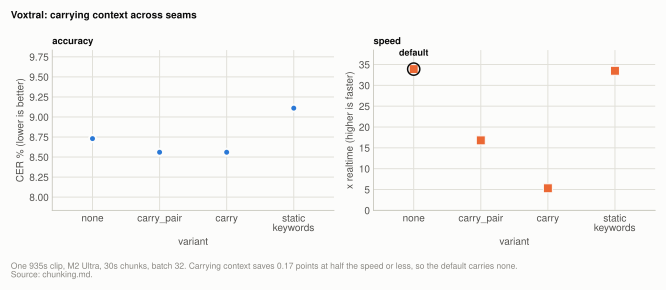
</picture>

**Table:** CER, wall clock and speed for each way of carrying context across seams, one clip, M2 Ultra.

| variant | CER | delta | wall | x realtime | note |
|---|---|---|---|---|---|
| none | 8.73% | - | 27.6s | 33.9x | |
| carry_pair | 8.56% | -0.17 | 55.8s | 16.8x | 2 batched passes, pass 2 gets pass 1's tails |
| carry | 8.56% | -0.17 | 177.6s | 5.3x | strictly sequential, batch 1 |
| static keywords | 9.11% | +0.38 | 27.9s | 33.5x | domain prompt in every chunk |

Carrying context recovers 0.17 points against the ~1.5 that seams cost, and at best
doubles wall clock. Notably the strictly sequential version, which has true
left-to-right context, is **no better** than the cheap two-pass one, which says the
31-token prompt window is too small to carry meaningful context. Not worth it: longer
chunks recover the full amount for free.

## Experiment: dropping silence before decode

**Basis:** [one clip](reference/corpus.md#the-single-clip) for the cut-cleanliness measurement; [20-file corpus](reference/corpus.md#the-20-file-corpus), idle M2 Ultra, 4-bit (2026-08-24) for accuracy and speed.

`--compact-silence` drops the middle of pauses longer than 400ms, keeping the first
240ms. Since decode cost is one step per 80ms frame, removing silence removes steps
one-for-one; on the reference clip it removed 12% of the audio. Timestamps are mapped
back to the original timeline, and the resulting chunk cuts were measurably *cleaner*
(no cut louder than -50dB, versus 3 cuts above -45dB without it). The single-clip accuracy
result, which appeared to depend on quantization, did not reproduce and is under
[Superseded](#superseded).

On the corpus at the 4-bit config that was the default then (2026-08-24, 20 files, idle M2
Ultra) it is slightly better rather than worse:

<picture>
  <source media="(prefers-color-scheme: dark)" srcset="img/chunking-silence-dark.svg">
  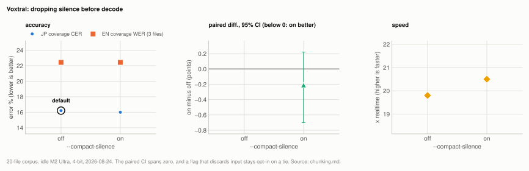
</picture>

**Table:** coverage error, speed and paired Japanese difference (on minus off) with and without silence compaction, 20-file corpus, idle M2 Ultra, 4-bit.

| | JP coverage CER | EN coverage WER | x realtime | JP difference | JP 95% CI |
|---|---|---|---|---|---|
| off (default) | 16.21% | 22.43% | 19.8x | | |
| `--compact-silence` | **16.00%** | 22.43% | **20.5x** | -0.21 | [-0.70, +0.22] |

    -0.21 points, CI [-0.70, +0.22], better on 6 of 8 files that moved -> not resolvable

It removed 3-4% of audio on the spontaneous recordings, less than the 12% on the narration
clip, and the win is concentrated in the three longest files (-2.19, -1.30, -0.59 points).
One file went the other way by +1.04.

## Experiment: silence compaction across precisions

**Basis:** [20-file corpus](reference/corpus.md#the-20-file-corpus), M2 Ultra, `--compact-silence` off and on at 4-bit, 8-bit, mxfp8 and nvfp4.

That dependence was the reason the flag was off, so it was run on every precision available.
All four are ties on accuracy and all four are faster:

<picture>
  <source media="(prefers-color-scheme: dark)" srcset="img/chunking-silence-precision-dark.svg">
  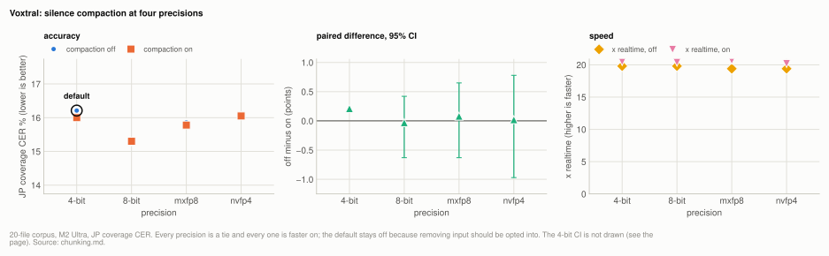
</picture>

**Table:** JP coverage CER and speed with silence compaction off and on at each precision, with the paired difference (off minus on), 20-file corpus, M2 Ultra.

| precision | off | on | difference | 95% CI | x realtime, off | x realtime, on |
|---|---|---|---|---|---|---|
| 4-bit (default) | 16.21% | 16.00% | +0.21 | [-0.70, +0.22] | 19.8x | **20.5x** |
| 8-bit | 15.27% | 15.30% | -0.03 | [-0.63, +0.42] | 19.8x | **20.4x** |
| mxfp8 | 15.86% | 15.78% | +0.08 | [-0.63, +0.65] | 19.4x | **20.7x** |
| nvfp4 | 16.07% | 16.05% | +0.02 | [-0.97, +0.78] | 19.4x | **20.2x** |

The 4-bit row's interval is identical to the one printed in the previous experiment, where
the same comparison is signed on minus off (-0.21). Against this table's off minus on sign it
does not bracket +0.21 in the usual way, so the chart omits that one error bar until the
interval is recomputed in this table's sign.

**nvfp4 is the headline**, because that is the arm the 4-point loss came from. On the corpus
it is +0.02 points and splits 4 files to 4. Nothing survives of the effect, so the
quantization-dependence claim is **withdrawn**: it described one clip and one precision, and
the mechanism story built on it (that quantized weights lean harder on pauses for
segmentation) has no evidence behind it.

**It stays off anyway, and this is the uncomfortable part.** Accuracy is a tie on all four
precisions, so by the project's own rule (positive on, negative off, marginal off) the
accuracy case does not move the default. What is left is a consistent 3-5% throughput gain,
which is real but is a speed argument for a flag that silently discards audio. Removing
input is a behaviour change users should opt into rather than inherit, so the flag keeps its
current default and its documentation now says the cost is unmeasurable rather than
quantization-dependent. Closes
[#6](https://github.com/prog893/mlx-asr/issues/6).

## Experiment: the composite flag

**Basis:** [20-file corpus](reference/corpus.md#the-20-file-corpus), idle M2 Ultra, JP coverage CER; the bundle measured as one config and then decomposed.

`--fast` set three levers at once (halve the chunk, double the batch, add 8s warm-up
overlap). Only its components had been measured separately, which is not enough to predict a
combination: overlap on its own won on a clip and then reversed sign on the corpus. Measured
as one config, and then decomposed, 20 files, idle M2 Ultra:

<picture>
  <source media="(prefers-color-scheme: dark)" srcset="img/chunking-composite-dark.svg">
  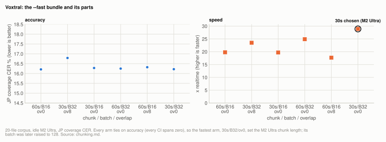
</picture>

**Table:** JP coverage CER and speed for the `--fast` bundle and each of its components, 20-file corpus, idle M2 Ultra.

| config | JP coverage CER | x realtime | isolates |
|---|---|---|---|
| 60s / B16 / ov0 (the old default) | 16.21% | 19.8x | |
| 30s / B32 / ov8 (what `--fast` did) | 16.79% | 23.5x | the bundle |
| 30s / B16 / ov0 | 16.28% | 19.7x | chunk alone |
| 60s / B32 / ov0 | 16.25% | 24.9x | batch alone |
| 60s / B16 / ov8 | 16.32% | 17.7x | overlap alone |
| **30s / B32 / ov0** | **16.22%** | **28.9x** | chunk + batch |

Every arm is a tie on accuracy against the default (largest difference 0.11 points, every
CI spanning zero), so this is entirely a throughput result.

Two things fall out, and the second corrects the obvious reading:

- **The bundle was holding back its own speedup.** Dropping the 8s overlap is worth another
  5.4x on top, and recovers the 0.58 CER points the overlap had cost. Overlap measured alone
  is the only arm *slower* than the default (17.7x against 19.8x), which is what a flag that
  decodes extra audio should be expected to do.
- **The batch does most of the work.** Halving the chunk alone changes nothing (19.7x
  against 19.8x); doubling the batch alone gets 24.9x, most of the total. The two together
  reach 28.9x, so shorter chunks help only once the batch is wide enough to hold them in one
  pass. A flag called `--fast` bundling both obscured which half mattered.

## Experiment: chunk and batch across GPU core counts

**Basis:** M2 Ultra 128GB (60 GPU cores) and M4 16GB (10 GPU cores), 60s/B16 against 30s/B32; the Ultra figures are from the previous experiment on the [20-file corpus](reference/corpus.md#the-20-file-corpus).

Same change, the two benchmarked machines:

<picture>
  <source media="(prefers-color-scheme: dark)" srcset="img/chunking-machines-dark.svg">
  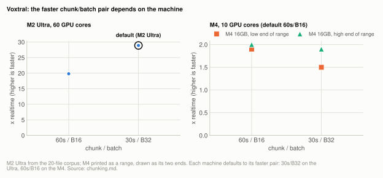
</picture>

**Table:** speed of the two chunk/batch pairs on each benchmarked machine, the faster pair per machine in bold (the M4 cells are ranges as recorded).

| machine | GPU cores | 60s / B16 | 30s / B32 |
|---|---|---|---|
| M2 Ultra 128GB | 60 | 19.8x | **28.9x** |
| M4 16GB | 10 | **1.9-2.0x** | 1.5-1.9x |

Halving the chunk doubles the chunk count, and each chunk pays fixed encoder cost. With 60
cores that encoder work is cheap and the decode saving dominates; with 10 cores the encoder
is already 36% of wall clock and compute-bound, so the extra passes cost more than the
shorter rows save. `profiles.json` has carried a note to this effect since the M4 was
profiled.

**That is why the flag was removed rather than turned on.** A flag has one value; this lever
has two right answers, one per machine, and `profiles.json` already had a field for it. The
Ultra profile now defaults to 30s/B32 and the M4 keeps 60s/B16, so each machine gets its
measured best with nothing to remember. No composite flag replaced it: every lever it touched
is set independently, defaulting per machine.

Two claims died with it. The README said "faster, slightly less accurate", which was wrong in
both halves (the accuracy cost is unresolvable, and the speed gain is not universal), and this
document said the bundled overlap was justified by the short-chunk regime, which the third row
above refutes.

## How it works

### Errors concentrate at chunk starts

Locating every edit operation relative to the nearest chunk boundary, 30s chunks, single clip:

<picture>
  <source media="(prefers-color-scheme: dark)" srcset="img/chunking-seams-dark.svg">
  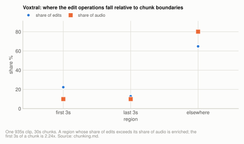
</picture>

**Table:** substitutions, insertions and deletions by position within a 30s chunk on one clip, with each region's share of edits, share of audio and enrichment.

| region | subs | ins | del | total | share of edits | share of audio | enrichment |
|---|---|---|---|---|---|---|---|
| first 3s of a chunk | 33 | 24 | 28 | 85 | 22.3% | 9.9% | **2.24x** |
| last 3s of a chunk | 11 | 28 | 10 | 49 | 12.9% | 9.9% | 1.29x |
| elsewhere | 128 | 42 | 77 | 247 | 64.8% | 80.1% | 0.81x |

Errors concentrate at chunk *starts* rather than ends, which is what a causal model predicts:
at position 0 of a chunk it has no left context. This also says which direction of overlap
can help. Both encoder and decoder are causal, so appending audio *after* a chunk cannot
change tokens already emitted; prepending audio can. That is why `--overlap-seconds` is a
prefix, and why longer chunks, which have fewer starts, win on the single clip up to the
point where the encoder's sliding window ends the gains.

## Superseded

### Silence compaction on one clip, split by quantization

Replaced by the 20-file corpus runs in
[Experiment: dropping silence before decode](#experiment-dropping-silence-before-decode) and
[Experiment: silence compaction across precisions](#experiment-silence-compaction-across-precisions),
where all four precisions tie. On the clip the accuracy result appeared to split by
quantization; the table is kept as the record of what was measured rather than as a finding:

**Table:** superseded single-clip CER and deletion counts with and without silence compaction, per machine, precision and chunk/batch pair.

| config | CER baseline | CER compacted | deletions |
|---|---|---|---|
| M4 16GB, nvfp4, 60s/B16 | 7.49% | 11.63% | 105 -> 222 |
| M4 16GB, nvfp4, 30s/B32 | 9.06% | 13.39% | 115 -> 338 |
| M2 Ultra 128GB, 4bit affine, 60s/B16 | 7.23% | 8.23% | 103 -> 118 |
| M2 Ultra 128GB, 4bit affine, 30s/B32 | 9.13% | 8.59% | 123 -> 109 |

On nvfp4 the deletions tripled and the loss was concentrated rather than spread: one
two-minute stretch lost 45% of its text after only 4.8s of silence was removed there. The
reading at the time was that the model leans on pauses for its own segmentation and that
more aggressively quantized weights tolerate their removal worse.

That reading is **withdrawn**. The same nvfp4 comparison over the corpus is a tie, so
whatever happened on this clip was specific to it. Recorded rather than deleted because the
clip numbers are real and because a plausible mechanism story built on one recording is
exactly the failure mode worth leaving visible.

## Related

[delay.md](delay.md) is a larger lever and free. [decode-throughput.md](decode-throughput.md)
explains why short chunks cost encoder time and why the batch that pairs with a chunk
length is not a free choice.
