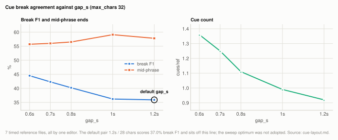

# Lever: subtitle cue grouping

The default is `gap_s=1.2, max_chars=28`, and it is deliberately not the optimum of
either sweep run here. Every timed reference available was authored by one editor, so
optimising against them measures agreement with one subtitle house style rather than good
segmentation. Measured end to end, the choice costs 5.4 break-F1 points against the n=7
optimum `0.7/32` and is slightly better on p95 drift. `gap_s` is the only knob that
matters, and it is exposed as `--gap-seconds` so you can fit it to your own references.

**Voxtral only.** Cue grouping is our heuristic over Voxtral's per-token timestamps. The
other engines emit their own segments, so `--gap-seconds`, `--max-chars` and
`--max-dur-seconds` are rejected there.

| setting | default | why |
|---|---|---|
| `--gap-seconds` (`gap_s`) | 1.2 | conservative; the n=7 sweep favours lower values, but only against one editor's convention, and partly by emitting more cues |
| `--max-chars` (`max_chars`) | 28 | worth under a point anywhere in 28-72; kept as a safety valve |
| `--max-dur-seconds` (`max_dur_s`) | 7.0 | inert from 4 to 9 seconds on this material; kept as a safety valve |

**Setup:** 7 files with author-written timed subtitle references (one prepared-narration
clip and six published videos, all by one editor; see [timed references](corpus.md#timed-references)), scored by
break F1 and mid-phrase rate from `eval_timing`. The sweep regroups cached Voxtral tokens,
so its scores do not depend on the machine.

## Experiment: gap_s at max_chars 32

**Basis:** the 7 [timed references](corpus.md#timed-references), cached Voxtral tokens regrouped by `sweep_cues.py` (machine-independent), `gap_s` 0.6 to 1.2 at `max_chars=32` plus the default pair.

With seven timed references `gap_s` is not flat, as the earlier n=1 sweep suggested (see
[Superseded](#the-n1-sweep)). It is monotonic, and it points the **opposite
way** from the n=1 result. The last table row is the default pair, which uses
`max_chars=28` and so is not a point on the charted line.

<picture>
  <source media="(prefers-color-scheme: dark)" srcset="img/cue-layout-gap-dark.svg">
  
</picture>

| gap_s (max_chars 32) | break F1 | mid-phrase | cues/ref |
|---|---|---|---|
| 0.6 | 44.5% | 55.7% | 1.36 |
| 0.7 | 42.3% | 56.0% | 1.25 |
| 0.8 | 40.2% | 56.5% | 1.11 |
| 1.0 | 36.2% | 59.1% | 0.99 |
| 1.2 | 35.9% | 57.8% | 0.92 |
| 1.2 / chars 28 (**default**) | 37.0% | 58.1% | 1.01 |

Per file, the default pair against the n=7 optimum:

| file | 1.2/28 (default) | 0.7/32 |
|---|---|---|
| narration-jp (**the file 1.2/28 was fitted to**) | **46.1%** | 35.9% |
| rec-16 | 38.2% | **49.2%** |
| rec-13 | 28.6% | **36.5%** |
| rec-14 | 32.4% | **41.2%** |
| rec-17 | 33.3% | **41.2%** |
| rec-15 | 41.9% | **48.8%** |
| rec-20 | 38.8% | **43.6%** |

**The one file where the default pair wins is the one it was fitted to.** It loses on all
six held-out files. That is overfitting visible in a single table, and it is the clearest
worked example in this project of why n=1 tuning is dangerous.

The n=7 sweep is better evidence than the n=1 one, but it is **not evidence of good
segmentation**. It is evidence of agreement with one subtitle convention: all seven
references share line-wrap width and pause conventions, so "optimal `gap_s`" there may be
a fact about that convention rather than about Japanese subtitles. Fitting the default to
it would export one editor's style to every user, which is a worse default than a
conservative pair that no reference chose.

There is also a mechanical reason to distrust the low end. Lower `gap_s` buys part of its
F1 by emitting more cues (cues/ref 0.92 at 1.2, 1.25 at 0.7, 1.36 at 0.6). F1 rewards
that; a reader does not.

`mlx_asr/output.py` documents this and a test pins the defaults, so a future sweep result
cannot be quietly applied.

## Experiment: the default pair against the sweep optimum, end to end

**Basis:** the 7 [timed references](corpus.md#timed-references), Voxtral end to end on the same audio with written SRTs scored by `eval_timing`, `1.2/28` against `0.7/32`.

Measured end to end on the same audio with everything else fixed:

| Voxtral, 7 timed files | break F1 | mid-phrase | median drift | p95 drift |
|---|---|---|---|---|
| **`1.2/28` (default)** | **37.4%** | 58.1% | 278 ms | 786 ms |
| `0.7/32` (n=7 optimum) | 42.9% | 57.0% | 258 ms | 829 ms |

So the default costs 5.4 break points, and it is *better* on p95 drift, so the points are
not bought with timing accuracy.

This comparison also fixed a reporting bug. The published break figure used to be 42.8%,
which was measured at `0.7/32` while the CLI default was `1.2/28`. Re-running both arms
confirmed the cause: the `0.7/32` arm reproduces the old number to 0.1 points. The root
problem was that the cue config was neither settable from the CLI nor recorded in any
output, so a run could not be attributed to a configuration. Both are fixed:
`--gap-seconds`, `--max-chars` and `--max-dur-seconds` exist, and `--stats-json` records
the resolved values next to the cue count.

**One measurement subtlety.** `sweep_cues.py` scores `build_cues` output directly; the
end-to-end run scores the *written SRT*, and `write_srt` clamps
`end = max(end, start + 0.5)`, which nudges short cue ends later. Measured at identical
`0.7/32`: **42.8% via SRT against 42.3% via raw cues**, with 26-27 of ~210 cues clamped.
Quote the SRT number when describing files a user gets, and the raw number when comparing
grid points. The 37.4% and 37.0% figures for the default pair are the same measurement
taken these two ways.

## Experiment: max_chars and max_dur_s

**Basis:** the 7 [timed references](corpus.md#timed-references), the same cached-token regrouping as the `gap_s` sweep, `max_chars` 28 to 72 and `max_dur_s` 4 to 9 seconds.

`max_chars` is worth under a point anywhere in 28-72. `max_dur_s` is inert on this
material at any value from 4 to 9 seconds, because `gap_s` or `max_chars` always fires
first. Both are kept as safety valves for long unbroken speech rather than as tuned
knobs.

## How it works

`build_cues` turns per-token timestamps into subtitle cues. A cue breaks on: a silence
gap longer than `gap_s`, text reaching `max_chars`, duration reaching `max_dur_s`, or
sentence-ending punctuation once the cue has some body.

This is our heuristic over the model's output. Voxtral emits per-token timestamps;
grouping them into cues is a downstream choice, which is why cue placement is the weaker
half of this project's timing story while timestamp accuracy is the stronger half. See
[timestamps.md](timestamps.md).

The timed references are the only material in the project that can score cue placement
at all, since it needs real cue boundaries to compare against. That all seven share one
editor's conventions is the fact that decided the outcome.

`scripts/benchmarks/sweep_cues.py` runs the sweep. Cue grouping does not affect decoding,
so it re-runs only `build_cues` over cached `(token, time)` pairs. A 72-point grid
therefore costs seconds rather than hours. Break metrics are boundary F1 against the
author's cue ends within a 0.5s tolerance, plus the rate of hypothesis cue ends landing
inside a reference cue ("mid-phrase"). Drift is deliberately not scored by the sweep,
since regrouping cues cannot move a token's timestamp.

If you have your own timed references, sweep `gap_s` and nothing else:

```bash
for g in 0.6 0.7 0.8 1.0 1.2; do
  mlx-asr audio.wav -f srt --gap-seconds $g -o "cues_$g.srt"
done
(cd scripts && uv run python -m metrics.eval_timing ../reference.srt ../cues_0.7.srt)
```

Or use `scripts/benchmarks/sweep_cues.py --corpus DIR` to do the whole grid from one decode.

## Superseded

### The n=1 sweep

376 combinations against the single timed reference then available. It moved the defaults
from `(1.0, 32)` to `(1.2, 28)`, reporting break F1 up from 35.4% to 43.6%.

Its own docstring flagged the risk at the time: n=1, `gap_s` apparently flat by median
across 0.6-1.3, and `max_chars=28` suspiciously close to that reference's mechanical
15-character line-wrap width, so part of the gain might be matching its wrap arithmetic
rather than real phrase awareness. The n=7 sweep above replaced its reading of `gap_s`;
the `(1.2, 28)` pair it produced remains the default for the reasons given there.

## Not settled

**Extending cue ends.** Extending each cue's end to the next cue's start, the usual subtitle convention, to fix a
systematic early bias. It makes break F1 *worse* (43.6% -> 40.2 / 27.0 / 34.3% at 0.5 / 1
/ 2s holds, on the n=1 data), because every extended end stops matching a human cue end.
A 0.2s hold was F1-neutral and improved drift, so that is the only variant worth
revisiting on the larger set. The rejection rests on n=1 data only.

## Related

[timestamps.md](timestamps.md) for the drift half of timing, which these knobs do not
affect.
