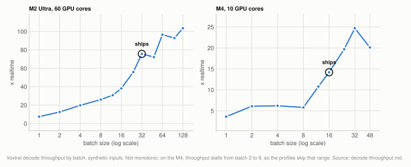
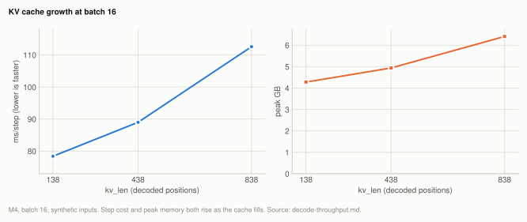
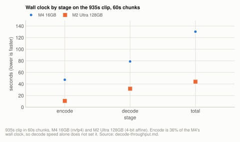
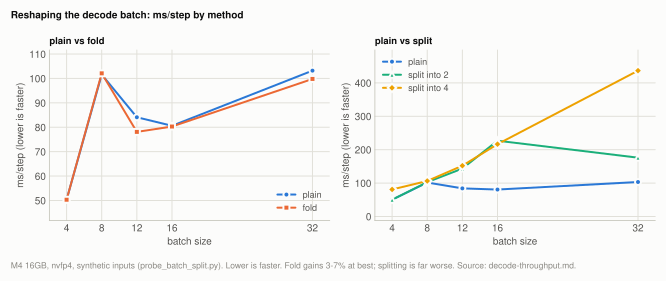
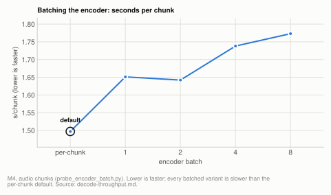
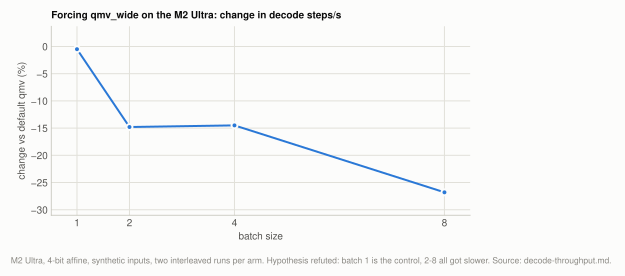

# Lever: batch size and decode throughput

**Voxtral only.** Multi-stream batching is what this project added; the other engines
decode one stream at a time and reject `--max-batch`. Batch size is the single largest
speed lever and it is **not monotonic**: on every machine measured, batch 2-8 is *slower
per step* than batch 1, and on the M4 batch 8 costs 5x batch 1 per step, so the default is
either 1 or 12 and up, taken from a measured per-machine profile (16 on the M4, 32 on the
M2 Ultra). The cause is upstream kernel dispatch in MLX, which reshaping the batch,
batching the encoder, `mx.compile` and forcing MLX's `qmv_wide` kernel all failed to work
around.

| setting | default | why |
|---|---|---|
| `--max-batch`, machine listed in `profiles.json` | the profile's measured batch: 16 on the M4 16GB, 32 on the M2 Ultra 128GB | throughput is not monotonic in batch, so it is measured per machine rather than predicted from specs |
| `--max-batch`, unlisted machine | the smaller of a memory cap and a compute cap, snapped onto 1, 12, 16, 24, 32, 64, 128 | anything landing in 2-11 falls back to 1; see [How the default is chosen](#how-the-default-is-chosen) |
| `--kv-bits` | 8 | halves KV cache reads; faster and no less accurate on both machines ([quantization.md](quantization.md)) |
| encoder | one chunk at a time | a batched encoder measured 0.84-0.91x |
| decode batch layout | plain `[B,1,d]`, no fold or split | fold is worth 3-7% at best; splitting is far worse |
| `mx.compile` on the decode step | off | equal or worse at batch 1, 16 and 32 |

**Setup:** `mlx-asr-bench` driving the real decoder with random embeddings (no audio, no
reference, no corpus) on an M4 16GB (10 GPU cores, nvfp4) and an M2 Ultra 128GB (60 GPU
cores, 4-bit affine), mlx 0.32.0; the encoder probe and the wall-clock split use audio from
the 935s clip. `x realtime = steps/s x batch x 0.08`, since each row advances 80ms per step;
`peak GB` is the MLX peak during the run.

## Experiment: batch size on two machines

**Basis:** synthetic inputs via `mlx-asr-bench` (random embeddings, no audio), M4 16GB (10 GPU
cores, nvfp4 weights) and M2 Ultra 128GB (60 GPU cores, 4-bit affine), mlx 0.32.0; one
table with a machine column.

400 steps per batch size, reported in four blocks so decay within a measurement is visible.

The per-machine batch default is chosen on end-to-end corpus runs
([chunking.md](chunking.md)), because this synthetic decode-only throughput keeps rising
past it on both machines (M4 peaks at 32, the M2 Ultra at 128).

<picture>
  <source media="(prefers-color-scheme: dark)" srcset="img/batch-dark.svg">
  
</picture>

**Table:** decode throughput and peak memory by batch size on each machine, synthetic inputs.

| machine | batch | steps/s | ms/step | x realtime | peak GB |
|---|---|---|---|---|---|
| M4 16GB | 1 | 44.63 | 22.4 | 3.6 | 2.79 |
| M4 16GB | 2 | 38.19 | 26.2 | 6.1 | 2.91 |
| M4 16GB | 4 | 19.26 | 51.9 | 6.2 | 3.25 |
| M4 16GB | 8 | 9.03 | **110.8** | 5.8 | 3.78 |
| M4 16GB | 12 | 11.28 | 88.7 | 10.8 | 4.45 |
| M4 16GB | 16 | 11.07 | 90.3 | 14.2 | 4.94 |
| M4 16GB | 24 | 10.28 | 97.3 | 19.7 | 5.92 |
| M4 16GB | 32 | 9.66 | 103.6 | **24.7** | 6.84 |
| M4 16GB | 48 | 5.23 | 191.4 | 20.1 | 8.42 |
| M2 Ultra 128GB | 1 | 92.60 | 10.8 | 7.4 | 5.15 |
| M2 Ultra 128GB | 2 | 78.35 | 12.8 | 12.5 | 5.32 |
| M2 Ultra 128GB | 4 | 61.45 | 16.3 | 19.7 | 5.65 |
| M2 Ultra 128GB | 8 | 40.55 | 24.7 | 26.0 | 6.28 |
| M2 Ultra 128GB | 12 | 32.09 | 31.2 | 30.8 | 6.75 |
| M2 Ultra 128GB | 16 | 29.74 | 33.6 | 38.1 | 7.43 |
| M2 Ultra 128GB | 24 | 29.10 | 34.4 | 55.9 | 8.38 |
| M2 Ultra 128GB | 32 | 29.54 | 33.9 | 75.6 | 9.06 |
| M2 Ultra 128GB | 48 | 18.81 | 53.2 | 72.2 | 10.73 |
| M2 Ultra 128GB | 64 | 18.85 | 53.0 | 96.5 | 12.41 |
| M2 Ultra 128GB | 96 | 12.08 | 82.8 | 92.8 | 16.16 |
| M2 Ultra 128GB | 128 | 10.11 | 99.0 | **103.5** | 19.61 |

Read the M4 rows carefully: **batch 8 costs 5x more per step than batch 1**, and
batch 12 is *cheaper* than batch 8. Batch 1 at 22.4ms is exactly 2.5GB / 120GB/s, the
bandwidth floor, so nothing is wrong at batch 1; the penalty from 2 upward is a
kernel-path effect. Per-step cost grows roughly linearly with batch in the 2-8 range,
as though the batched quantized matmul falls back to a per-row path and then recovers
once the batch is large enough to select a tiled kernel.

The Ultra shows the same shape, much shallower, plus a second regression at 48 and
again at 96.

Because throughput per row keeps rising even where ms/step rises, x-realtime is the
metric to optimize, not ms/step.

## Experiment: KV cache length

**Basis:** synthetic inputs (random embeddings, no audio) via
`scripts/benchmarks/probes/probe_kvlen.py`, M4 16GB (nvfp4 weights), mlx 0.32.0, batch 16.

steps/s decays as the cache fills, about 25% over 800 steps at batch 16 on the M4:

<picture>
  <source media="(prefers-color-scheme: dark)" srcset="img/decode-throughput-kvlen-dark.svg">
  
</picture>

**Table:** ms per step and peak memory at batch 16 as the KV cache grows, M4.

| kv_len | ms/step | peak GB |
|---|---|---|
| 138 | 78.4 | 4.28 |
| 438 | 89.0 | 4.94 |
| 838 | 112.6 | 6.41 |

At batch 16 and 838 positions the cache is 1.43GB *read per step*, comparable to the
2.5GB of weights, so it stops being free. Shorter chunks bound `kv_len`, which is a
second reason short chunks can win on a memory-poor machine despite more encode work.

`--kv-bits 8` halves those cache reads and was faster *and* no less accurate on both
machines, so it is on by default. See [quantization.md](quantization.md).

## Experiment: wall clock by stage

**Basis:** the 935s clip ([corpus.md](reference/corpus.md#the-single-clip)) in 60s chunks, M4 16GB
(nvfp4 weights) and M2 Ultra 128GB (4-bit affine), mlx 0.32.0.

Decode is not the whole story. Splitting wall clock on the 935s clip, 60s chunks:

<picture>
  <source media="(prefers-color-scheme: dark)" srcset="img/decode-throughput-stages-dark.svg">
  
</picture>

**Table:** wall-clock seconds per stage on the 935s clip in 60s chunks, per machine.

| stage | M4 16GB | M2 Ultra 128GB |
|---|---|---|
| encode (16 chunks) | 47.3s | 10.8s |
| decode (816 steps) | 78.9s | 31.8s |
| total | 130.3s (7.2x) | 43.9s (21.3x) |

The encoder is 36% of M4's wall clock and grows as chunks get shorter, since each chunk
pays its own conv stem and 32-layer causal pass. That caps the short-chunk strategy:
going 60s -> 30s on the M4 cut decode from 78.9s to 48.5s but pushed encode from 47.3s
to 51.8s, a net 7.2x -> 8.3x. Mel and conv stem are noise (0.01s and 0.02s per chunk).

For calibration, antirez/voxtral.c, a hand-written C + Metal implementation with custom
attention/RoPE/KV kernels, reports 23.5-31.6 ms/step at batch 1 on an M3 Max. This
implementation does 22.4 ms/step at batch 1 on the M4, so the single-stream path is
already at parity with hand-tuned native code. The gain here comes from batching rather
than kernel work.

## Experiment: reshaping the decode batch

**Basis:** synthetic inputs (random embeddings, no audio) via
`scripts/benchmarks/probes/probe_batch_split.py`, M4 16GB, nvfp4 weights, mlx 0.32.0.

`scripts/benchmarks/probes/probe_batch_split.py`, M4 16GB, nvfp4, ms/step. The aim was to
dodge the valley by changing the leading dimension each matmul sees.

<picture>
  <source media="(prefers-color-scheme: dark)" srcset="img/decode-throughput-reshape-dark.svg">
  
</picture>

**Table:** decode ms per step by batch layout and batch size, M4.

| batch | plain | fold `[B,1,d]`->`[1,B,d]` | split into 2 | split into 4 |
|---|---|---|---|---|
| 4 | 50.3 | 50.3 | 50.1 | 80.9 |
| 8 | 101.6 | 102.1 | 102.8 | 106.3 |
| 12 | 84.1 | 78.1 | 143.4 | 152.0 |
| 16 | 80.6 | 80.3 | 226.8 | 216.5 |
| 32 | 103.2 | 99.8 | 176.0 | 436.6 |

`fold` is numerically bit-exact (max absolute difference 0.000000) and worth 3-7% at
best. Splitting is far worse, because each sub-batch pays full weight reads.

## Experiment: batching the encoder

**Basis:** audio from the 935s clip ([corpus.md](reference/corpus.md#the-single-clip)) via
`scripts/benchmarks/probes/probe_encoder_batch.py`, M4 16GB, mlx 0.32.0.

`scripts/benchmarks/probes/probe_encoder_batch.py`. mlx-audio's encoder attention is
batch-1 only, so giving it a batch axis is the obvious next move. It is 0.84-0.91x, i.e.
slightly slower:

<picture>
  <source media="(prefers-color-scheme: dark)" srcset="img/decode-throughput-encoder-batch-dark.svg">
  
</picture>

**Table:** encoder seconds per chunk, per-chunk default against batched variants, M4.

| batch | s/chunk | vs per-chunk |
|---|---|---|
| per-chunk (stock) | 1.497 | 1.00x |
| 1 | 1.651 | 0.91x |
| 2 | 1.642 | 0.91x |
| 4 | 1.738 | 0.86x |
| 8 | 1.773 | 0.84x |

Arithmetic intensity explains it. Batching amortizes *weight reads*, so it only pays
when a stage is bandwidth-bound, and the encoder is not:

**Table:** estimated arithmetic intensity of one encoder chunk and one decoder step.

| stage | FLOP per chunk/step | bytes read | FLOP/byte | bound by |
|---|---|---|---|---|
| encoder, one 30s chunk | ~3270 GFLOP | 0.66GB | ~4950 | compute |
| decoder, one step | ~5 GFLOP | 2.5GB | ~2 | bandwidth |

At ~3270 GFLOP against an M4 GPU peak near 4 TFLOP/s, one chunk needs ~817ms of pure
math and measures 1.5s, so the encoder already runs at roughly half theoretical peak.
Its share of wall clock is a hard floor on this hardware rather than an optimization
opportunity.

## Experiment: `mx.compile` on the decode step

**Basis:** synthetic inputs (random embeddings, no audio) via
`scripts/benchmarks/probes/probe_compile.py`, mlx 0.32.0; the machine was not recorded, and
the batch-1 baseline of 22.6 ms/step matches the M4 16GB batch sweep above.

22.6 -> 23.2 ms/step at batch 1, 83.4 -> 89.8 at batch 16, 98.6 -> 106.7 at 32. Equal or
worse everywhere, which is the expected result for a bandwidth-bound loop rather than a
launch-bound one.

## Experiment: the affine `qmv_wide` gate

**Basis:** synthetic decoder inputs (no audio), M2 Ultra 128GB (`applegpu_g14d`, 4-bit affine
weights), mlx 0.32.0, idle host.

A promising-looking lead, tested and closed. MLX dispatches small-batch quantized matvecs
to a kernel called `qmv_wide`, built specifically for M=2..8, which loads each weight group
once and reuses it across the vectors in a tile instead of re-streaming the whole weight
matrix per vector. That is exactly the amortization a bandwidth-bound decoder wants, and
exactly the batch range where this project measures a valley. But it is gated
(`mlx/backend/metal/quantized.cpp:299-301` at v0.32.0, verbatim):

```cpp
// affine qmv_wide only beats qmv on gen-15+; fp benefits on every gen.
inline bool use_qmv_wide(const std::string& mode, metal::Device& d) {
  return mode != "affine" || d.get_architecture_gen() >= 15;
}
```

The M2 Ultra reports `applegpu_g14d`, GPU generation 14, and the default weights are 4-bit
**affine**, so this machine has never reached `qmv_wide`. The hypothesis was that the gate is
mistuned for an Ultra: it was justified upstream from an M2 Pro, and an Ultra has a very
different bandwidth-to-core ratio, which is the regime where amortizing weight reads should
pay more rather than less.

`MLX_METAL_GPU_ARCH=applegpu_g15d` flips only that gate (and the dense `gemv_wide` one),
which makes it a clean diagnostic even though it is a lie about the hardware and could never
be a default. Two interleaved runs of each arm, decode steps/s, idle host:

<picture>
  <source media="(prefers-color-scheme: dark)" srcset="img/decode-throughput-qmv-wide-dark.svg">
  
</picture>

**Table:** decode steps per second in two interleaved runs per arm, default `qmv` against forced `qmv_wide`, M2 Ultra.

| batch | affine `qmv` (default) | forced `qmv_wide` | change |
|---|---|---|---|
| 1 | 89.4 / 90.2 | 88.5 / 90.1 | -0.5% |
| 2 | 73.0 / 77.3 | 63.9 / 64.0 | **-14.8%** |
| 4 | 61.3 / 61.2 | 52.3 / 52.4 | **-14.5%** |
| 8 | 40.5 / 40.6 | 27.3 / 32.1 | **-26.8%** |

**Refuted, and reproducibly so.** B=1 is the built-in control: the `M >= 2` guard means it
takes `qmv` under either setting, and it moved 0.5%, which is the noise floor and confirms
the override changed nothing else. Every batch from 2 to 8 got materially *slower*.

So the gate is correctly tuned for this hardware, and the valley has a different cause. This
also settles a question earlier recorded as untestable: the `vector_limit` threshold is
compile-time C++, but the architecture generation feeding it is a runtime environment
variable, so the dispatch *can* be moved from Python. It just does not help.

What remains unexplained: `qmv_wide` reads fewer weight bytes per step by construction, and
it is still slower here, so at B=2..8 this decoder is not purely bandwidth-bound in the way
the B=1 figure suggests. Something else, most likely occupancy or scheduling at low thread
counts, dominates in that range. That is consistent with the other negative results on this
page (encoder batching, `mx.compile`, reshaping) and it is why `FAST_BATCHES` remains an
empirical list rather than a formula.

## How it works

### Why batching is the lever

Voxtral Realtime is a streaming model: it consumes 80ms of audio per decoder position
and emits exactly one token per position. Two consequences set everything else.

- **Decode step count is fixed by audio duration**, not by how much speech there is.
  935s of audio is ~11,700 steps whether it is dense narration or mostly silence.
  Faster hardware does not reduce the step count.
- **A single stream cannot exceed about 1x realtime by much**, on any machine, because
  one step costs at least one full pass over the model weights. On the M4 that is 21ms
  against an 80ms budget, so ~3.8x is the ceiling at batch 1.

So this is a throughput problem rather than a latency one: split the audio, decode the
pieces in lockstep, and the per-step weight read amortizes across rows.

### Why the valley happens, and why it cannot be fixed here

MLX dispatches quantized matmuls to one of several Metal kernels based on the leading
dimension, and the maintainers state the cause directly:

> "The drop from 4 to 8 is that we switch from batched qmv to the qmm."
> ml-explore/mlx discussion #1593

The threshold is `vector_limit`, computed by `get_qmv_batch_limit`. It is compile-time
C++ and hardware-specific: 10 on an M4 Pro for K,N>4096, 14 on an M4 Max at size 4352,
different again on an M2 Ultra 128GB. A related open issue (mlx#3553) documents the same
discontinuity at M=3 and reports that manually lowering `vector_limit` made things
substantially worse, with no fix landed. The architecture generation that feeds the
dispatch can be overridden at runtime, but doing so made things slower (see the
`qmv_wide` experiment above). A newer MLX with better small-batch kernels is not an
option either: 0.32.0 was already the latest release.

### Measurement

`mlx-asr-bench` drives the real decoder with random embeddings, which measures the
quantity that actually sets wall clock (decode steps per second), and therefore needs
**no audio and no reference**. That also makes it the one measurement in this project
anyone can reproduce on their own hardware, which is why it is the basis of the
contributed-profile flow.

Machine state matters more than it looks. A host doing other GPU work reports several
times lower throughput, badly enough that one run in this project was thrown away rather
than reported. Check GPU and memory use before starting, run one benchmark at a time, and
treat any speed number without a stated machine state as unreliable.

### How the default is chosen

Two tiers, in `mlx_asr/hardware.py`.

A machine listed in `mlx_asr/profiles.json`, matched on chip and RAM, uses its measured
numbers outright. That is the point of the file: the right batch is not predictable
from specs, because throughput is not monotonic, so a formula fitted to one machine
mispredicts the next.

For anything unbenchmarked, the batch is the smaller of two caps, then snapped onto the
sizes that measured well (1, 12, 16, 24, 32, 64, 128):

- a **memory cap**: half the GPU working set, minus model weights and ~0.6GB fixed
  overhead, divided by ~0.002 GB per row-second of chunk audio, which is the asymptote
  of both batch sweeps above.
- a **compute cap**: 3 rows per GPU core, since both batch sweeps reach 90% of peak
  throughput at 1.1-3.2 rows per core.

Anything landing in the 2-11 range falls back to 1, because the real choice there is
"12 or more" versus "1", not a point on a smooth curve.

Contributing a measured profile for a machine that is not listed is the most useful
contribution to this project, and needs no audio: see
[../../CONTRIBUTING.md](../../CONTRIBUTING.md).

## Related

- [quantization.md](quantization.md): `--kv-bits 8` and weight precision, the same
  bytes-per-step story.
- [chunking.md](chunking.md): chunk length, which bounds `kv_len` and sets the encoder's
  share of wall clock.
- [peak-memory.md](reference/peak-memory.md): peak memory per engine and size.
