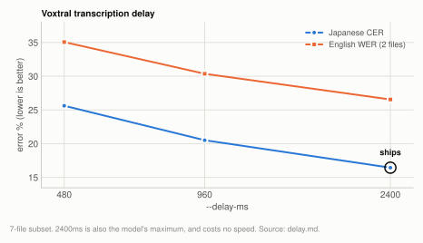
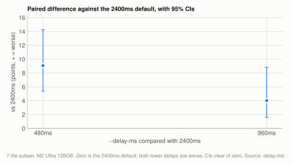

# Lever: transcription delay

`--delay-ms 2400` is the default, and it is the largest accuracy lever measured in this
project at no throughput cost: coverage error drops from 25.62% to 16.44% between 480ms
and 2400ms at the same throughput, and 2400ms won on all 7 files individually at both
comparison points. 2400 is the maximum the model supports. Voxtral only: the delay is a
property of that model's streaming design, and the other engines have no equivalent and
reject `--delay-ms`.

| setting | default | why |
|---|---|---|
| `--delay-ms` | `2400` | lowest error in both languages, 7-0 on files, no throughput cost; applied on every machine and not part of the hardware profile, since there is no tradeoff to tune |

**Setup:** [7-file subset](reference/corpus.md#the-7-file-subset), M2 Ultra 128GB, Voxtral at 30s
chunks, batch 32, kv8, via `scripts/benchmarks/run_corpus.py`; scored by
[coverage CER/WER](reference/metrics.md#coverage-cer-and-why-it-had-to-exist) at `min_cut` 30
characters / 6 words.

## Experiment: transcription delay

**Basis:** [7-file subset](reference/corpus.md#the-7-file-subset), M2 Ultra 128GB, Voxtral at 30s chunks, batch 32, kv8, delay stepped 480ms / 960ms / 2400ms.

<picture>
  <source media="(prefers-color-scheme: dark)" srcset="img/delay-dark.svg">
  
</picture>

**Table:** error and throughput at each transcription delay.

| delay | JP coverage CER | EN coverage WER | x realtime |
|---|---|---|---|
| 480ms | 25.62% | 35.06% | 29.5x |
| 960ms | 20.51% | 30.36% | 30.7x |
| **2400ms** | **16.44%** | **26.55%** | 28.9x |

Error falls monotonically in both languages, and throughput is flat: the 1.8x spread in
x-realtime across those rows is machine noise, since the delay does not change the step
count. A rerun of the 2400ms config reproduced 16.44% / 26.55% byte-identically at 31.2x,
which both confirms determinism and shows how much the speed column wanders between runs
on a shared machine.

Paired across files, bootstrapped over files with 20k resamples:

<picture>
  <source media="(prefers-color-scheme: dark)" srcset="img/delay-paired-dark.svg">
  
</picture>

**Table:** paired per-file difference of each lower delay against 2400ms, with its 95% CI and file wins.

| comparison | diff | 95% CI | files won |
|---|---|---|---|
| 480ms vs 2400ms | +9.07 | [+5.41, +14.25] | 7-0 |
| 960ms vs 2400ms | +4.02 | [+1.59, +8.84] | 7-0 |

Positive means the lower delay is worse. Winning 7 files to 0 at both comparison points
makes this the most robust finding in the project: the corpus only resolves effects of
about 3.2 points at n=7, and this one is 9.

Every other lever in this project is small, machine-dependent, or trades speed for
accuracy. This one is large, reproduces on every file, holds on prepared speech as well
(see [Superseded](#superseded)), and costs nothing. A consequence for benchmarking
Voxtral elsewhere: a run at the library default delay does not measure the model's
accuracy. It is roughly 9 points worse than the model can do at no cost.

## How it works

Voxtral Realtime consumes 80ms of audio per decoder position and emits one token per
position. The transcription delay is how much audio the model is allowed to see before
it must commit to a token. A larger delay means the leading tokens of each chunk cover
more audio, so the model is guessing less.

The model supports multiples of 80ms in [80, 1200], plus 2400 as a standalone value.
There is nothing above 2400 to try; the Voxtral paper's suggestion to raise it further
is already exhausted.

Cost is nil because the step count is set by audio duration rather than by the delay.
Nothing extra is decoded.

## Superseded

On the [single narration clip](reference/corpus.md#the-single-clip) the same lever reads 14.74% at
480ms versus 7.49% at 2400ms. The corpus result above replaces it as the measurement of
record; the clip confirms that the direction and rough magnitude hold on prepared speech.

## Related

[chunking.md](chunking.md) is the next-largest lever and does trade against speed.
