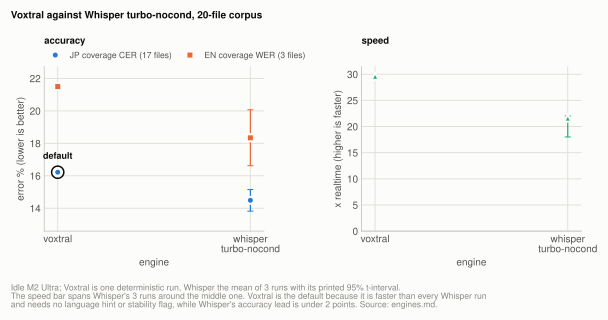
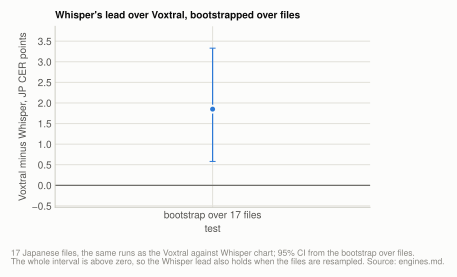
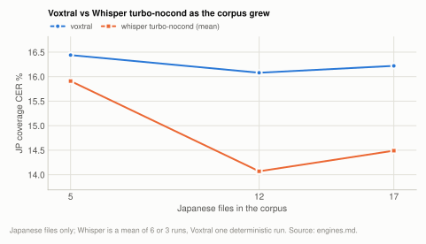
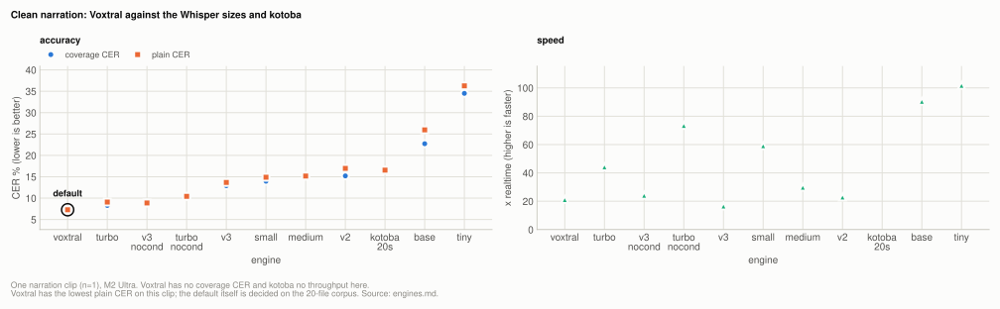
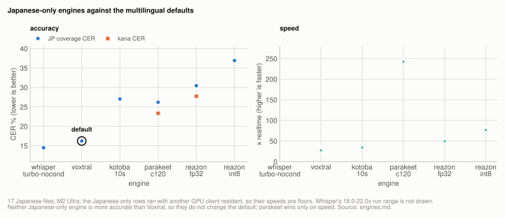

# Lever: which engine

`voxtral` is the default engine, and `large-v3` is Whisper's default size (since
2026-10-06; it ties turbo on the 20-file corpus and the tie goes to capacity). Whisper with
`condition_on_previous_text=False` is the more accurate engine, about 1.7 points ahead of
Voxtral on Japanese and resolved by every test available here including a bootstrap over
files; that comparison was measured with large-v3-turbo, and since `large-v3` ties turbo,
the verdict is about the engine rather than one size. Voxtral is the default because it is
1.35-1.65x faster, needs no language hint and no long-form-stability flag, and reproduces
on a given machine. No "fastest on Apple Silicon" claim survives measurement.

Neither Japanese-specialized engine changes the default. Parakeet scores 26.19%
coverage CER against turbo-nocond's 14.49%, losing on 16 of 17 files; reazon-k2 fp32
scores 30.45%.

Settings and sweeps specific to one engine family are on that family's page:
[voxtral.md](engines/voxtral.md), [whisper.md](engines/whisper.md),
[kotoba.md](engines/kotoba.md), [qwen3-asr.md](engines/qwen3-asr.md),
[voxtral-v1.md](engines/voxtral-v1.md), [parakeet.md](engines/parakeet.md) and
[reazon.md](engines/reazon.md).

| setting | default | why |
|---|---|---|
| `--model` (engine family) | `voxtral` | 1.35-1.65x faster than turbo-nocond, no language hint, no stability flag, deterministic on one machine; Whisper is about 1.7 JP points more accurate |

**Setup:** [20-file corpus](reference/corpus.md#the-20-file-corpus) (17 Japanese, 3 English, 7.95h) for the comparisons, the [7-file subset](reference/corpus.md#the-7-file-subset) for the superseded tables, and [the single clip](reference/corpus.md#the-single-clip) for the narration comparison; M2 Ultra, scored by coverage CER/WER at `min_cut` 30/6 ([metrics.md](reference/metrics.md)).

## Experiment: Voxtral against Whisper

**Basis:** the [20-file corpus](reference/corpus.md#the-20-file-corpus), idle M2 Ultra, Voxtral at 30s b32 kv8 against Whisper `large-v3-turbo` with `condition_on_previous_text=False`, 3 Whisper runs.

Measured 2026-08-06 on an idle `Apple M2 Ultra 128GB (Mac14,14)`, mlx 0.32.0, macOS
26.4.1. 20 recordings, 7.95h, 17 Japanese and 3 English. Voxtral at `--chunk-seconds 30
--max-batch 32 --kv-bits 8 --delay-ms 2400`; Whisper at `large-v3-turbo` with
`condition_on_previous_text=False` and the language taken per file from its reference.
Arms were run one at a time, never concurrently.

**Re-measured 2026-08-19** after fixing a reference-loading defect that fused a word at
every line break on the word-level path. The English figures below supersede the earlier
ones; Japanese is unchanged, because Japanese has no word spaces and could not be affected.

<picture>
  <source media="(prefers-color-scheme: dark)" srcset="img/engines-voxtral-whisper-dark.svg">
  
</picture>

**Table:** Voxtral's single run against the three Whisper turbo-nocond runs on accuracy and speed, with the verdict per row.

| | Voxtral (deterministic) | turbo-nocond, 3 runs | verdict |
|---|---|---|---|
| JP coverage CER, 17 files | 16.22% | 14.29 / 14.37 / 14.79 -> **14.49% ±0.27** | CI [13.82, 15.15] entirely below -> **whisper** |
| EN coverage WER, 3 files | 21.50% | 17.85 / 18.04 / 19.13 -> **18.34% ±0.69** | CI [16.62, 20.07] entirely below -> **whisper** |
| x realtime | **29.6x** | 18.0 / 21.6 / 22.0x | **voxtral, ~1.4x** |

Whisper wins accuracy on both units, in all 3 runs, with the whole interval below
Voxtral's fixed value. Voxtral is 1.35-1.65x faster depending on the Whisper run, since
Whisper's sampling ladder makes its own throughput vary by more than 20%. Per file the split
is structural rather than noisy: Whisper wins 13 of 20 files in all 3 runs and loses 5 of 20
in all 3, with 2 files changing sign between runs. So the aggregate reflects a consistent
per-file ordering rather than one file carrying the result, and those 5 losses are the reason
the win is under 2 points rather than a rout.

The method matters for the Whisper column. Its temperature-fallback ladder samples, so a
single run is a draw rather than a score; the interval above is a one-sample t-interval on
the Whisper mean with Voxtral as a constant, since only one side has sampling error
(`scripts/benchmarks/repeat_distribution.py`). Voxtral gets no error bar because greedy
decoding reproduces byte-identically on one machine, which is also why its column is one
run rather than three. See [determinism.md](reference/determinism.md).

Qwen3-ASR was added as a fourth engine on 2026-08-19 and is measured on the same 20 files
with the same scorers: 19.33% JP / 25.45% EN at 21.8x for the 1.7B, 23.27% / 24.26% at
32.8x for the 0.6B. Both are behind the two rows above on Japanese, so neither changes the
verdict here; the 0.6B is the fastest engine this project has measured. It gets one run
each, being greedy, and it writes no subtitles. See [qwen3-asr.md](engines/qwen3-asr.md).

Voxtral v1 (Mini 3B and Small 24B, 2507) was added on 2026-09-25, same 20 files, same
scorers: 36.52% JP / 17.86% EN at 12.9x for the 3B at 8bit, 27.56% / 16.86% at 3.1x for
the 24B at 8bit. Japanese is outside its card's eight languages and it is behind every
other multilingual row there; the 24B's English is the lowest measured, on three files. It
writes no subtitles. See [voxtral-v1.md](engines/voxtral-v1.md).

## Experiment: the generalization test over files

**Basis:** the 17 Japanese files of the [20-file corpus](reference/corpus.md#the-20-file-corpus), the same Voxtral run and 3 Whisper runs as above, idle M2 Ultra.

The interval above answers "does this hold on a rerun", which is what
`repeat_distribution.py` is for. It contains no between-file uncertainty, so on its own it
cannot say whether the result would hold on different audio. That second question needs a
bootstrap over *files*, and it had never been run at this sample size. It resolves:

<picture>
  <source media="(prefers-color-scheme: dark)" srcset="img/engines-generalization-dark.svg">
  
</picture>

**Table:** four tests of whether Whisper's Japanese lead holds, from reruns to resampling over files, and the verdict of each.

| test | result | verdict |
|---|---|---|
| 3 repeat runs vs the fixed baseline | 3/3 beat it | whisper |
| run-distribution t-interval | [13.82, 15.15], below 16.22 | whisper |
| **bootstrap over 17 files** | **+1.85, CI [+0.58, +3.33]** | **whisper** |
| sign test over files | 13 of 17 won, p=0.049 | whisper |

All four agree, so the engine conclusion is stronger than it was when it rested on the
rerun interval alone. The file bootstrap is the strictest of these and its interval is
much wider, which is the honest measure of how much this generalizes: the lower bound is
+0.58 points rather than +1.7.

## Experiment: the Whisper margin as the corpus grew

**Basis:** the Japanese files of the [7-file subset](reference/corpus.md#the-7-file-subset) (5), the intermediate corpus (12) and the [20-file corpus](reference/corpus.md#the-20-file-corpus) (17), M2 Ultra, Voxtral at 30s b32 kv8 against Whisper turbo-nocond (6 or 3 runs).

<picture>
  <source media="(prefers-color-scheme: dark)" srcset="img/engines-corpus-size-dark.svg">
  
</picture>

**Table:** Japanese coverage CER for both engines at each corpus size, with the Whisper run spread and whether the gap is resolvable.

| corpus | JP files | voxtral | turbo-nocond | verdict |
|---|---|---|---|---|
| original | 5 | 16.44% | 15.91% ±0.94 (n=6) | not resolvable |
| grown | 12 | 16.08% | 14.07% ±0.17 (n=3) | whisper better |
| final | 17 | 16.22% | 14.49% ±0.27 (n=3) | whisper better, and resolved over files |

The ordering held at every corpus size and only became resolvable as n grew. Voxtral's own
number barely moved (16.44 -> 16.08 -> 16.22) while the corpus more than tripled, which
says the original 5 files were not unrepresentative. What changed is the *resolution*
rather than the estimate. That is the argument for more audio rather than more reruns.

## Experiment: clean narration

**Basis:** [one clip](reference/corpus.md#the-single-clip), M2 Ultra, Voxtral at 60s b16 kv8 against the Whisper sizes and kotoba-whisper.

The same models on the single narration clip, where the reference is complete:

<picture>
  <source media="(prefers-color-scheme: dark)" srcset="img/engines-narration-dark.svg">
  
</picture>

**Table:** coverage CER, plain CER and speed of each engine on the single narration clip.

| engine | coverage CER | plain CER | x realtime |
|---|---|---|---|
| **voxtral (M2 Ultra 128GB, 60s b16 kv8)** | - | **7.28%** | 21.2x |
| whisper large-v3-turbo | 8.28% | 9.08% | 44.3x |
| whisper large-v3, no-condition | 8.87% | 8.87% | 24.2x |
| whisper large-v3-turbo, no-condition | 10.42% | 10.42% | 73.5x |
| whisper large-v3 | 12.91% | 13.67% | 16.6x |
| whisper small | 13.96% | 14.89% | 59.2x |
| whisper medium | 15.17% | 15.17% | 29.9x |
| whisper large-v2 | 15.20% | 16.96% | 23.0x |
| kotoba-whisper v2.2, chunk 20s | 16.55% | 16.55% | n/c |
| whisper base | 22.73% | 25.97% | 90.5x |
| whisper tiny | 34.51% | 36.27% | 101.8x |

On clean narration the gap nearly closes. Voxtral's 7.28% leads turbo's 9.08%, a much
narrower margin than the corpus suggests, and turbo is faster on this clip. Two caveats:
this is n=1, and **`--no-condition` *hurts* on clean audio** (turbo 8.28% -> 10.42%)
exactly where it helped enormously on long spontaneous audio. The flag is a
long-form-instability fix rather than a general improvement.

## Experiment: the Japanese-only engines against the multilingual defaults

**Basis:** the 17 Japanese files of the [20-file corpus](reference/corpus.md#the-20-file-corpus), M2 Ultra on 2026-08-23 with another GPU client resident (45GB of GPU memory, load near 5 of 24 cores; throughput figures are floors), the four arms below beside the multilingual rows from [Voxtral against Whisper](#experiment-voxtral-against-whisper) and [kotoba.md](engines/kotoba.md).

**Table:** the four Japanese-only arms, their weights and windows, and why each was run.

| arm | config | notes |
|---|---|---|
| `parakeet_c120` | `mlx-community/parakeet-tdt_ctc-0.6b-ja`, 120s windows, 2s overlap | the default window, and the measured winner ([parakeet.md](engines/parakeet.md)) |
| `parakeet_c300` | same weights, 300s windows | run to test the one-file tie; it reversed sign |
| `reazon fp32 c30` | authors' ONNX, fp32 encoder/decoder/joiner, 30s energy-minima windows | the default |
| `reazon int8 c30` | same, int8 files | measured to test the quantization ([reazon.md](engines/reazon.md)) |

<picture>
  <source media="(prefers-color-scheme: dark)" srcset="img/engines-japanese-only-dark.svg">
  
</picture>

**Table:** Japanese coverage CER, kana CER, speed and peak memory of the Japanese-only engines beside the multilingual rows.

| engine | JP coverage CER | kana CER | x realtime | peak |
|---|---|---|---|---|
| whisper-turbo no-cond (3-run mean) | **14.49%** | - | 18.0-22.0x | 5.53GB |
| voxtral | 16.22% | - | 29.6x | - |
| kotoba chunk10s | 27.01% | - | 36.2x | - |
| **parakeet c120** | 26.19% | 23.35% | **244.6x** | 4.77GB |
| **reazon-k2 fp32 c30** | 30.45% | 27.73% | 51.6x | 3.31GB RSS |
| reazon-k2 int8 c30 | 36.93% | - | 78.9x | 2.90GB RSS |

Kana CER is reported beside coverage CER because both models' text style
(punctuation, numerals) differs from an editorial reference without the transcription
being wrong. Both engines decode greedily, so accuracy is unaffected by contention.

Per file against turbo (17 common files): parakeet wins once, by 9.0 points on the
prepared-narration-style `rec-12`, and loses everywhere else by 1.2 to 22.3 points
(mean +9.8). Reazon wins the same file and two others but loses the rest by far more.
The losses are not concentrated in one or two files that could be excluded as
pathological: they are the shape of the whole corpus.

Parakeet decodes 6.78h of audio in 100 seconds. For a rough transcript of everything
as fast as possible, nothing measured here comes close. For subtitles worth
publishing, turbo remains the accuracy pick and parakeet is not close enough to trade.

## How it works

`scripts/benchmarks/run_whisper.py` scores with the *same* functions `run_corpus.py` uses,
on the *same* cached 16kHz files (verified byte-identical to what the Voxtral runs read),
so rows sit next to each other without an asterisk. Engine: `mlx-whisper` 0.4.3.

Whisper is run at library defaults (temperature ladder 0.0-1.0,
`condition_on_previous_text=True`) unless a row says otherwise, because that is what
`mlx_whisper.transcribe` gives a user. Paired comparisons bootstrap over files,
length-weighted, 20k resamples (`scripts/benchmarks/compare_engines.py`).

Whisper samples, so a single run is a draw from a distribution; see
[determinism.md](reference/determinism.md) for why the headline uses a 3-run mean.

### Provenance of the Voxtral and Whisper comparison

Both columns are re-measured and both result files record the machine and its state. This
closes the gap an earlier version of this page described: the numbers had come from a
single session with no surviving result file, and a re-run attempted earlier on 2026-08-06
was voided because the host was doing unrelated GPU work throughout.

Two things the re-measurement establishes beyond the comparison itself. Voxtral's Japanese
accuracy reproduced the earlier session **exactly** (16.22%), across three separate sessions
and two reference-loader versions, which is evidence that the voided session's accuracy work
was sound even though its timings were not. Whisper's accuracy did not reproduce exactly,
and is not expected to: its Japanese mean has read 14.93%, 14.74% and 14.49% across
sessions, all inside the run-to-run spread, which is the behaviour that requires 3 runs in
the first place.

The English figures moved for a different and non-statistical reason: a reference-loading
defect fixed on 2026-08-19. Reference lines were joined with no separator, so on the
word-level path the last word of each line fused to the first of the next. One
subtitle-shaped reference carried 131 such fusions and scored 20.09% where the correct
figure is 3.29%, moving the Voxtral English aggregate from 25.24% to 21.50% and Whisper's
from 22.81% to 18.34%. Japanese could not be affected, having no word spaces. Every English
number published before that date is superseded; see [metrics.md](reference/metrics.md).

Throughput changed more than accuracy did. Voxtral now measures 29.6-29.8x against 22.8x
before, and Whisper 18.0-23.3x against 15.0-20.1x. The previous figures came from the
session with no recorded machine state, so the most likely explanation is that they were
taken while the host was busy. That is the argument for recording state automatically
rather than noting it by hand, which the runners now do.

One of the three Whisper runs began with 25.9GB of GPU memory already allocated by an
unrelated resident process and was flagged `busy` by the harness. It is kept, because the
flag turned out to be conservative here: that run measured 21.3x against 21.5x for an idle
run, while the fastest run was also idle at 23.3x. Parked memory on a 115GB working set
cost nothing measurable, and the spread is Whisper's own sampling. The flag stays
deliberately cautious, since the cost of investigating a false warning is far below the
cost of publishing a contaminated figure.

### Why the default is not the most accurate engine

`voxtral` is the default despite Whisper being ~1.3 points more accurate, because it is
faster (~1.4-2x), needs no language hint, needs no stability flag, has better-behaved
timestamps ([timestamps.md](timestamps.md)), and reproduces on a given machine
([determinism.md](reference/determinism.md)). Whisper is one flag away for anyone who wants the
accuracy.

The two `qwen3-asr` aliases are available without displacing anything. The 1.7B is last of
the four on accuracy; the 0.6B is the fastest here (32.8x in 2.36GB), which is the case for
keeping it. Both refuse `-f srt`.

### Domain match and the Japanese-only engines

**Relation to the fine-tuning question.** These two engines are the strongest open
evidence this project has against the "just fine-tune on domain data" hypothesis from
the corpus side: parakeet-ja was trained on tens of thousands of hours of naturalistic
Japanese including spontaneous speech, which is exactly this corpus's material, and
still loses to a generic multilingual Whisper checkpoint by 11.7 points. Domain match
alone does not explain engine quality; instruction breadth, long-form behaviour and
code-switching handling dominate it on real recordings.

## Superseded

### The 7-file paired comparisons

Replaced by the [generalization test](#experiment-the-generalization-test-over-files) on 17 Japanese files.
Paired against Voxtral, positive meaning Whisper is worse:

**Table:** each Whisper configuration paired against Voxtral on the 7-file subset, as differences with 95% CIs (positive means Whisper is worse).

| comparison | JP diff | 95% CI | EN diff | 95% CI |
|---|---|---|---|---|
| turbo-nocond | -1.51 | [-4.62, +0.67] | **-4.56** | [-7.27, +1.74] |
| large-v3-nocond | +0.91 | [-2.46, +4.45] | -2.97 | [-7.34, +7.20] |
| turbo (defaults) | **+8.52** | [+1.12, +13.24] | **+4.14** | [+3.09, +6.58] |
| large-v2 | **+8.58** | [+3.86, +13.13] | **+1.50** | [+1.12, +1.67] |
| large-v3 | **+23.47** | [+11.16, +38.61] | **+2.82** | [+2.30, +4.05] |
| medium | **+12.49** | [+7.47, +21.91] | **-3.02** | [-4.25, -0.17] |
| small | **+12.16** | [+4.90, +17.04] | -0.74 | [-2.54, +3.43] |
| base | **+13.52** | [+11.32, +15.02] | **+5.61** | [+3.14, +11.36] |
| tiny | **+42.83** | [+24.83, +67.27] | **+13.92** | [+8.91, +25.58] |
| turbo, autodetect | **+33.70** | [+19.65, +42.36] | -3.82 | [-5.85, +0.90] |

**At library defaults, Voxtral beats every Whisper size on Japanese.** That is the honest
default-versus-default result, and it is mostly a statement about Whisper's defaults on
long-form audio (see [`condition_on_previous_text=False`](engines/whisper.md#experiment-condition_on_previous_textfalse)).

**On English, Voxtral is behind**, and this is the most robust accuracy finding here:
medium by 3.02 points with a CI excluding zero at 0.69x the speed, and turbo-nocond by
4.56 points in every one of 6 repeat runs. The English side is n=2 here, n=3 in the
final corpus, so treat it as a direction rather than a magnitude.

The 7-file size and engine table these comparisons were drawn from is on
[whisper.md](engines/whisper.md#the-7-file-size-and-engine-table).

## Not settled

The English side is n=3. The clean-narration comparison is n=1.

## Related

- [voxtral.md](engines/voxtral.md): the default engine, and the levers that apply to it
- [whisper.md](engines/whisper.md): every Whisper size, `condition_on_previous_text`, the language hint and the competing runners
- [kotoba.md](engines/kotoba.md): kotoba-whisper's driver and window length
- [qwen3-asr.md](engines/qwen3-asr.md) and [voxtral-v1.md](engines/voxtral-v1.md): the other multilingual engine families
- [parakeet.md](engines/parakeet.md) and [reazon.md](engines/reazon.md): the Japanese-only engines
- [corpus.md](reference/corpus.md): the 20-file corpus, the 7-file subset and the single clip
- [metrics.md](reference/metrics.md): coverage CER/WER and the 2026-08-19 reference-loader fix
- [determinism.md](reference/determinism.md): why Whisper needs 3 runs and Voxtral one
- [timestamps.md](timestamps.md): timestamp behaviour by engine
