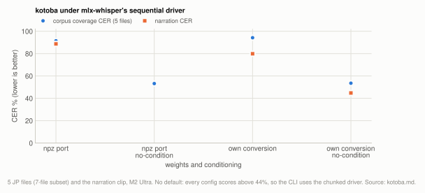
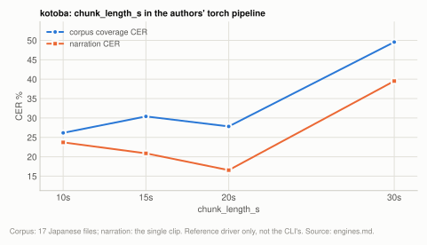
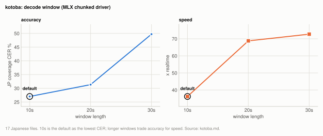

# Engine: kotoba-whisper

kotoba-whisper runs through the MLX chunked driver with 10s windows, where it scores
27.01% coverage CER on the 17 Japanese files at 36.2x, behind both Voxtral and Whisper
turbo-nocond ([engines.md](../engines.md)). The driver matters more than the weights: the
same checkpoint under mlx-whisper's sequential driver scores 94.23% on the 5 Japanese files
of the [7-file subset](../reference/corpus.md#the-7-file-subset), because a 2-layer
distil decoder cannot carry state across windows. Window length is this engine's largest
setting, worth up to 23 points, and its optimum depends on the material. The registry uses
v2.0, converted to MLX on first use, since its ASR weights are bit-identical to v2.2.

| setting | default | why |
|---|---|---|
| kotoba driver | chunked, 10s windows (MLX) | 27.01% against 31.33% at 20s and 49.71% at 30s; the sequential driver scores 94.23% (on 5 files) |
| kotoba checkpoint | v2.0, converted on first use | bit-identical ASR weights to v2.2 |

**Setup:** the 17 Japanese files of the [20-file corpus](../reference/corpus.md#the-20-file-corpus) for the MLX chunked driver, the 5 Japanese files of the [7-file subset](../reference/corpus.md#the-7-file-subset) for the sequential driver and the authors' pipeline, plus the narration on [the single clip](../reference/corpus.md#the-single-clip) for the runner comparison; M2 Ultra, scored by coverage CER at `min_cut` 30 ([metrics.md](../reference/metrics.md)).

## Experiment: kotoba runner and chunk length

**Basis:** the 5 Japanese files of the [7-file subset](../reference/corpus.md#the-7-file-subset) (the whole corpus at the time) and the narration on [one clip](../reference/corpus.md#the-single-clip), M2 Ultra, kotoba-whisper under mlx-whisper's sequential driver and the authors' chunked pipeline. Every "corpus" figure in this section is a 5-file aggregate.

Our first measurement of this Japanese-finetuned distil model was 91.47% coverage CER.
That figure reflects our harness rather than the model: we ran it under `mlx-whisper`,
whose long-form algorithm is a poor match for a distil checkpoint. Running it the way its
authors document recovers most of the difference, 68 points in all. Recorded here because
the same mistake is easy to make with any model whose published recipe differs from your
preferred runtime.

<picture>
  <source media="(prefers-color-scheme: dark)" srcset="../img/kotoba-sequential-dark.svg">
  
</picture>

**Table:** kotoba-whisper under mlx-whisper's sequential driver, by weight source and `condition_on_previous_text`; corpus CER on 5 Japanese files, plus the narration clip.

| what was run | corpus coverage CER | narration | extra_ratio | engine |
|---|---|---|---|---|
| third-party npz port | 91.47% | 88.70% | 0.13 | mlx-whisper (sequential) |
| same, `--no-condition` | 53.20% | - | 1.03 | mlx-whisper |
| official weights, own MLX conversion | 94.23% | 79.88% | 0.10 | mlx-whisper |
| same, `--no-condition` | 53.53% | 44.78% | 1.03 | mlx-whisper |

<picture>
  <source media="(prefers-color-scheme: dark)" srcset="../img/engines-kotoba-authors-chunk-dark.svg">
  
</picture>

**Table:** kotoba-whisper through the authors' chunked transformers pipeline at four `chunk_length_s` values; corpus CER on the same 5 Japanese files, plus the narration clip.

| what was run | corpus coverage CER | narration | extra_ratio | engine |
|---|---|---|---|---|
| official pipeline, `chunk_length_s=30` | 49.57% | 39.52% | 1.29 | transformers (chunked) |
| official pipeline, `chunk_length_s=20` | 27.82% | **16.55%** | 1.35 | transformers |
| official pipeline, `chunk_length_s=15` | 30.40% | 20.88% | 1.37 | transformers |
| official pipeline, `chunk_length_s=10` | **26.16%** | 23.71% | 1.39 | transformers |

This is the authors' torch pipeline, used as a reference; the CLI runs kotoba through the MLX chunked driver below.

**The cause is the long-form algorithm rather than the weights.** `mlx-whisper` implements
Whisper's *sequential* 30s-window algorithm, which leans on the decoder to carry state
across windows. Distil models keep 2 decoder layers instead of 32 and cannot do that. The
model card uses transformers' *chunked* pipeline, which decodes independent windows.

Evidence it is under-transcribing rather than terminating early: on a 600s slice the MLX
sequential run reached the final second of audio but emitted 2053 characters where turbo
emitted 2630, with 44 zero-duration and 12 empty segments. The official chunked pipeline
emitted 2527 on the same slice.

Same weights, three runners, **68 points of spread**, none of it attributable to the
checkpoint. The chunk-length sensitivity is the signature of the same cause, and the
optimum is material-dependent: 10s is best on spontaneous speech, 20s on clean narration,
so the model card's 15s is a sensible general default. Worth up to 23 points, so sweep it
on your own audio.

## Experiment: kotoba chunked long-form on MLX

**Basis:** the 17 Japanese files of the [20-file corpus](../reference/corpus.md#the-20-file-corpus), M2 Ultra, kotoba-whisper v2.0 through `mlx_asr/chunked.py` at 10, 20 and 30s windows beside the torch reference and the sequential driver (those two rows are 5-file results from the experiment above).

That conclusion was half-applied at first: kotoba was left running on torch/MPS with its
throughput marked "not comparable". But slicing audio, decoding each window independently
and offsetting timestamps requires nothing from torch, so chunked long-form is a property
of the driver rather than the framework. `mlx_asr/chunked.py` is that driver on MLX. Same
weights; the MLX chunked rows are on 17 Japanese files, while the two reference rows were
measured on the 5-file subset above and carry its corpus CER:

<picture>
  <source media="(prefers-color-scheme: dark)" srcset="../img/engines-kotoba-window-dark.svg">
  
</picture>

**Table:** kotoba-whisper v2.0 through the MLX chunked driver at three window lengths, beside the authors' torch pipeline and mlx-whisper's sequential driver as reference rows.

| driver | runtime | coverage CER | x realtime | comparable? |
|---|---|---|---|---|
| chunked, 10s windows | **MLX** | 27.01% | **36.2x** | yes |
| chunked, 20s windows | MLX | 31.33% | 68.8x | yes |
| chunked, 30s windows | MLX | 49.71% | 72.7x | yes |
| chunked, 10s (authors' pipeline) | torch/MPS | 26.16% | 25.4x | no |
| sequential 30s (mlx-whisper) | MLX | 94.23% | 64.8x | no |

**MLX-chunked matches the torch reference to within a point at 1.4x the throughput**, so
the asterisk is gone and so is the torch dependency. The two CERs come from different file
sets (17 files against 5), so "within a point" is an agreement across material rather than
a paired comparison. For scale, Voxtral's CER moved from 16.44% to 16.22% between those two
file sets ([engines.md](../engines.md)); kotoba was not rerun on both. The chunk-length
curve has the same shape as on torch, confirming the mechanism. Throughput moves the opposite way to
accuracy, since fewer windows means less per-window overhead.

Generalising, because this is the reusable part: **any distil-derived Whisper checkpoint
(2-4 decoder layers) is a poor match for a sequential driver** and should be routed to a
chunked one. `models.infer_backend` sends both `kotoba` and `distil` repo ids to
`mlx-chunked` for that reason.

Run as its authors intend, kotoba scores 26-27% on this material (26.16% on 5 files
through the authors' pipeline, 27.01% on 17 through the MLX driver), behind both Voxtral and
turbo-nocond. That comparison measures a 2-layer distil model against full-size decoders
on spontaneous multi-speaker audio with editorial references, which is not the setting its
published numbers describe. Its appeal is throughput, and there it is competitive (36.2x
through our MLX chunked driver).

## Experiment: v2.0 against v2.2

**Basis:** the `model.safetensors` of both checkpoints, every tensor differenced; no audio.

Measured rather than assumed from version numbers. Loading both checkpoints'
`model.safetensors` and differencing every tensor: 539 tensors each, identical keys, **max
absolute difference exactly 0.0**. The files differ only in container metadata and stored
dtype.

v2.2's own model card agrees, describing itself as v2.0 plus speaker diarization
(`diarizers`) and punctuation (`punctuators`), both separate post-processing models loaded
by its custom pipeline, and `punctuators` needs torch. So v2.2's additions are not weights.
The registry uses v2.0 and converts it to MLX on first use, which gives up nothing
reachable and avoids a torch dependency.

An earlier version of this project's notes claimed v2.2 superseded v2.0 on weights. That
was inferred from the version numbers rather than checked, and it was wrong.

## Related

- [engines.md](../engines.md): kotoba beside the other engines, including on clean narration
- [whisper.md](whisper.md): the Whisper sizes, and `condition_on_previous_text=False`, which also moves kotoba under the sequential driver
- [chunking.md](../chunking.md): `--chunk-seconds`, which sets kotoba's window length
- [determinism.md](../reference/determinism.md): kotoba samples, like Whisper
- [corpus.md](../reference/corpus.md) and [metrics.md](../reference/metrics.md): the material and the scorers
