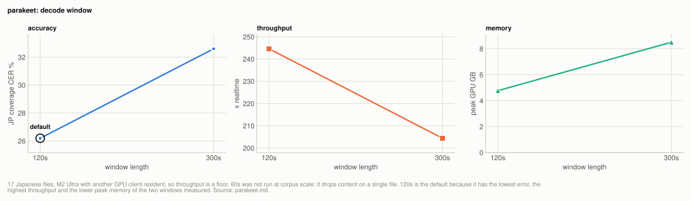

# Engine: parakeet

Parakeet does not change the default. It scores 26.19% coverage CER on the 17 Japanese
files against turbo-nocond's 14.49%, losing on 16 of 17 files
([engines.md](../engines.md#experiment-the-japanese-only-engines-against-the-multilingual-defaults)).
Parakeet is the fastest engine measured in this project: 244.6x realtime, 7x faster than
anything else measured here, at 4.77GB of peak GPU memory. If throughput ever matters more
than accuracy, parakeet has no competitor here. Its window defaults to 120s: 300s is worse
at corpus scale, and 60s drops content.

| setting | default | why |
|---|---|---|
| `parakeet --chunk-seconds` | `120` | 300s is 5.81 points worse on average over 17 files and nearly doubles peak memory; 60s drops content |

**Setup:** the 17 Japanese files of the [20-file corpus](../reference/corpus.md#the-20-file-corpus) (6.78h), M2 Ultra on 2026-08-23 with another GPU client resident (45GB of GPU memory, load near 5 of 24 cores), scored by coverage CER at `min_cut` 30 ([metrics.md](../reference/metrics.md)). The engine decodes greedily, so accuracy is unaffected by contention; throughput figures are floors.

## Experiment: parakeet window length

**Basis:** the 17 Japanese files of the [20-file corpus](../reference/corpus.md#the-20-file-corpus), M2 Ultra on 2026-08-23 with another GPU client resident (throughput figures are floors), `mlx-community/parakeet-tdt_ctc-0.6b-ja` at 120s and 300s windows.

On one file, 120s and 300s tied (380 characters each) while 60s lost content, so 300s
looked free. At corpus scale it is not:

<picture>
  <source media="(prefers-color-scheme: dark)" srcset="../img/parakeet-window-dark.svg">
  
</picture>

**Table:** parakeet accuracy, throughput and peak GPU memory at 120s and 300s windows over the 17 Japanese files.

| window | JP coverage CER | x realtime | peak GPU |
|---|---|---|---|
| **120s** | **26.19%** | 244.6x | 4.77GB |
| 300s | 32.60% | 204.4x | 8.5GB |

Paired over 17 files, 300s is +5.81 points worse on average and loses on 11, with the
damage concentrated where windows are longest relative to speech density (one file
goes 32.6% to 50.3%). The one-file tie was the corpus-size trap this project has
documented before: several single-clip findings here reversed sign when a real corpus
arrived ([corpus.md](../reference/corpus.md)). 60s was not swept at corpus scale because it
demonstrably drops content on even one file.

## How it works

**Chunk length interacts with model training the opposite way to Whisper.** For
kotoba and qwen3, shorter windows were neutral-to-better. Parakeet needs long windows
(60s lost content against 120s), and reazon needs windows at all. A model trained on
short independent segments degrades when asked for more context than it saw; a model
trained to carry state across windows degrades when denied it. Chunking advice does
not transfer between models; each needs its own sweep.

**Parakeet is deterministic.** Three decodes through the CLI code path give
byte-identical text and cues, so every single-run figure above is a score rather than
a draw.

## Reproducing

`scripts/benchmarks/run_parakeet.py` drives the exact function the CLI runs
(`backends.parakeet_decode`), loads once outside the timing loop, and reports
kana/lenient CER beside coverage CER. Result file: `benchmarks/parakeet_c120.json`.

## Related

- [engines.md](../engines.md): parakeet and reazon against the multilingual engines, and the Whisper rows compared here
- [reazon.md](reazon.md): the other Japanese-only engine
- [corpus.md](../reference/corpus.md): the corpus, and the single-clip findings that reversed at corpus scale
- [metrics.md](../reference/metrics.md): coverage CER and `min_cut`
