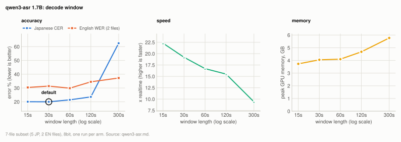
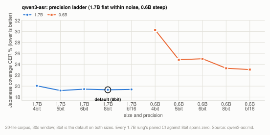
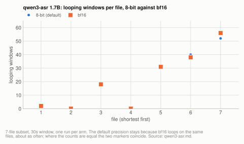
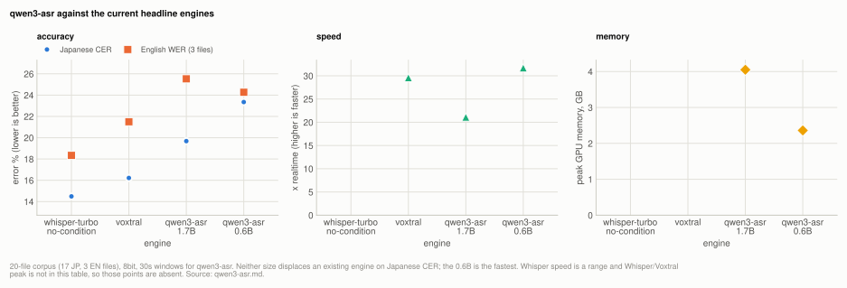
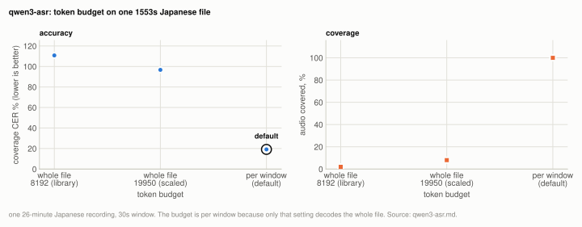

# Engine: Qwen3-ASR

Qwen3-ASR is available as two sizes and neither becomes the default engine: on the 20-file
corpus the 1.7B scores 19.33% Japanese coverage CER at 21.8x realtime, behind Voxtral
(16.22%, 29.6x) and Whisper turbo-nocond (14.49%), so it is last of the three on accuracy
and slower than Voxtral. Within the family the default size is the 1.7B, 3.9 points ahead
of the 0.6B (23.27%); the 0.6B is the fastest multilingual engine measured in this project
(32.8x in 2.36GB). The default precision is 8bit, which the 1.7B ties at every rung and the
0.6B needs, and the default window is 30s, where accuracy, speed and memory are all at or
near their best.

| setting | default | why |
|---|---|---|
| size (`--size`) | `1.7B` | 19.33% against 23.27% Japanese coverage CER on the 20-file corpus. The `0.6B` is the speed option: 32.8x in 2.36GB |
| precision (`--quantization`) | `8bit` | the 1.7B ties across all five rungs, so a tie does not move the default; the 0.6B's 8bit beats every lower rung with the interval clear of zero, by 7 points over 4bit |
| window (`--chunk-seconds`) | `30` | shorter is better on accuracy, speed and memory down to 30s; 15s ties on accuracy, so this is a plateau. The library default of 1200s makes any ordinary file one window |
| output format (`-f`) | `txt` or `json` only | its timestamps are decode-window boundaries, so `srt`, `vtt` and `all` exit 2 |
| language (`--language`) | forced to English when not passed | the upstream autodetect path leaks a prompt prefix into the transcript from the second window onward |
| `--max-batch` | refused | swept, and batching loses monotonically ([qwen3-batch.md](../qwen3-batch.md)) |

**Setup:** the [20-file corpus](../reference/corpus.md#the-20-file-corpus), and the
[7-file subset](../reference/corpus.md#the-7-file-subset) for the window sweep, on an idle M2 Ultra
128GB (Mac14,14), scored by coverage CER/WER at `min_cut` 30/6 plus coverage kana and
lenient CER ([metrics.md](../reference/metrics.md)). The engine is greedy and deterministic, so each
figure is one run.

## Experiment: the decode window

**Basis:** the [7-file subset](../reference/corpus.md#the-7-file-subset), idle M2 Ultra 128GB (Mac14,14), 1.7B at 8bit, windows of 15/30/60/120/300s.

One run per arm, run sequentially with `machine_state` confirming `busy: false` before
each arm; the 300s arm waited out a load spike before starting.
`scripts/benchmarks/sweep_qwen3_chunk.py`.

The library's 1200s is not an arm because it is not a candidate: at that value every file
in this corpus is one window, so it measures nothing about window length and disables
batching by construction.

<picture>
  <source media="(prefers-color-scheme: dark)" srcset="../img/qwen3-asr-window-dark.svg">
  
</picture>

**Table:** Qwen3-ASR 1.7B accuracy, speed, segment count and peak memory for each decode window.

| window | JP coverage CER | kana CER | lenient CER | EN coverage WER | x realtime | segments | peak GB |
|---|---|---|---|---|---|---|---|
| 15s | 20.04% | 21.88% | 19.80% | 30.38% | **22.3x** | 1236 | **3.73** |
| **30s** | **19.98%** | **21.20%** | **19.71%** | 31.38% | 19.2x | 622 | 4.05 |
| 60s | 21.42% | 22.12% | 21.19% | **29.86%** | 16.7x | 315 | 4.10 |
| 120s | 23.55% | 23.27% | 23.33% | 34.47% | 15.5x | 158 | 4.68 |
| 300s | 62.47% | 74.08% | 62.37% | 37.24% | 9.4x | 66 | 5.77 |

**Shorter is better on every axis at once, down to 30s**, which is unusual here and is the
opposite of the shape Voxtral shows (where 30s versus 60s is a non-effect and longer
chunks are faster). Japanese accuracy, throughput and peak memory all improve as the
window shrinks, so above 30s there is no trade to make. 300s is catastrophic rather than
merely worse: one file scored **149.38%** coverage CER, and the aggregate more than
doubles.

15s was added after the fact, because the first four arms were monotonic and a
sweep whose best value sits at its own boundary has not found an optimum. It shows the
accuracy curve **flattening** rather than continuing: 20.04% against 19.98% is 0.06 points
on a corpus that resolves about 3.2, i.e. a tie. Throughput and memory do keep improving
(22.3x, 3.73GB), so 15s is the right choice if you are memory-bound, and 30s is the right
default because it is the accuracy optimum and the difference in speed is not what anyone
is choosing this engine for. Neither value is a boundary of the sweep any more.

The mechanism is visible in the per-file rows. Repetition loops get more likely and more
expensive as the window grows, because a loop runs until its window's token budget is
exhausted and that budget scales with window length. At 30s, 5 of 7 files contained at
least one looping window; at 120s and 300s, 7 of 7 did. A loop in a 300s window destroys
five minutes of transcript, and it also costs the decode time to emit thousands of junk
tokens, which is why throughput falls with window length instead of rising.

That the loop rate rises with window length is also why the memory figure moves: it is
not the audio encoder alone but the KV cache of runaway generations.

**So the default is 30s**, and the sweep was run before the corpus comparison
precisely because the library's unmeasured 1200s would otherwise have set it.

## Experiment: precision ladder

**Basis:** the [20-file corpus](../reference/corpus.md#the-20-file-corpus), idle M2 Ultra 128GB (Mac14,14), both sizes at 4bit/5bit/6bit/8bit/bf16, window fixed at 30s.

Every rung, both sizes, 20 files, window fixed at 30s, one harness, idle M2 Ultra. Only
the weights change. This closes the gap where the lower rungs were exposed with no
accuracy figure at all.

<picture>
  <source media="(prefers-color-scheme: dark)" srcset="../img/qwen3-asr-precision-dark.svg">
  
</picture>

**Table:** Japanese CER, the per-file paired difference against 8bit with its 95% CI, speed and peak memory for every precision rung of both sizes.

| size | quant | JP coverage CER | paired against 8bit | x realtime | peak |
|---|---|---|---|---|---|
| 1.7B | 4bit | 20.06% | -0.73, CI [-1.76, +0.31] | **26.3x** | **3.19GB** |
| 1.7B | 5bit | 19.19% | +0.15, CI [-0.37, +0.78] | 23.3x | 3.40GB |
| 1.7B | 6bit | 19.45% | -0.11, CI [-0.53, +0.29] | 24.2x | 3.62GB |
| 1.7B | **8bit (default)** | 19.33% | | 21.9x | 4.05GB |
| 1.7B | bf16 | 19.40% | -0.07, CI [-0.23, +0.10] | 16.2x | 5.66GB |
| 0.6B | 4bit | 30.29% | **-7.02**, CI [-8.82, -5.30] | 26.9x | **2.06GB** |
| 0.6B | 5bit | 24.84% | **-1.57**, CI [-2.16, -1.06] | 32.0x | 2.14GB |
| 0.6B | 6bit | 25.01% | **-1.74**, CI [-2.94, -0.86] | 33.5x | 2.21GB |
| 0.6B | **8bit (default)** | 23.27% | | 31.9x | 2.36GB |
| 0.6B | bf16 | 23.03% | -0.51, CI [-1.01, +0.13] | 30.3x | 2.92GB |

**The 1.7B does not care about precision.** All five rungs tie, 4bit against bf16 included,
across a 2.5x range in weight bytes. So on that size 4bit is a free 20% throughput
gain and 0.86GB saving over the default.

**The 0.6B cares intensely.** 8bit beats every lower rung with the interval clear of zero,
and 4bit by **7 points**. Same architecture, same corpus, same harness, same window.

That split is the main result of the ladder. Precision sensitivity here is a property of
the *checkpoint*, not of the architecture or the workload, so it cannot be read off one
model and applied to another. Voxtral's ladder is monotonic with 4bit last
([quantization.md](../quantization.md)); the 1.7B here is flat; the 0.6B is steep. Three
ladders, three shapes.

**Neither default changes.** The 0.6B's is now proven correct rather than assumed. The
1.7B's is a tie with three cheaper rungs, and by this project's rule a tie does not move a
default, so 4bit is documented as the speed option rather than promoted. The intermediate
rungs are no longer "a memory choice made blind".

Both sizes are now adjudicated on accuracy, so `--quantization` no longer offers rungs whose
cost is unknown. What remains unmeasured is whether these figures hold on material unlike
this corpus, which is true of everything here.

The cost side tracks weight bytes, as the bandwidth model predicts and as the Voxtral fp16
measurement found ([quantization.md](../quantization.md)): bf16 is the slowest rung on both
sizes.

## Experiment: repetition loops by precision

**Basis:** the [7-file subset](../reference/corpus.md#the-7-file-subset), idle M2 Ultra 128GB (Mac14,14), 1.7B at 8-bit and bf16, window fixed at 30s.

Quantization does not cause the repetition loops. Worth checking, because it was a live hypothesis: repetition is a decoder degeneracy, and
quantization noise perturbs exactly the near-tie logits that sustain one, so unlike a
fractional CER difference a loop-rate change would be large enough for this corpus to see.

Per-file looping-window counts, 1.7B at 30s on the 7-file subset, in corpus order:

<picture>
  <source media="(prefers-color-scheme: dark)" srcset="../img/qwen3-asr-loops-dark.svg">
  
</picture>

**Table:** looping-window count per file and the number of files affected, 8-bit against bf16.

| precision | per-file loop counts (shortest file first) | files affected |
|---|---|---|
| 8-bit | 3, 0, 19, 0, 31, 40, 52 | 5 of 7 |
| bf16 | 2, 0, 18, 0, 31, 38, 56 | 5 of 7 |

Effectively identical, including which files are affected and which are clean. So the
loops are a property of these weights on this material, not an artifact of the default
precision, and running bf16 is not a workaround for them.

## Experiment: against the current headline

**Basis:** the [20-file corpus](../reference/corpus.md#the-20-file-corpus), idle M2 Ultra 128GB (Mac14,14), both sizes at 8bit with 30s windows.

Full 20-file corpus (7.95h), one run per size since both are greedy, on the same idle
M2 Ultra 128GB with the same scorers and the same cached audio as the rows above them.

<picture>
  <source media="(prefers-color-scheme: dark)" srcset="../img/qwen3-asr-headline-dark.svg">
  
</picture>

**Table:** Japanese CER, English WER, speed and peak memory for both Qwen3-ASR sizes beside the two existing engines.

| engine | JP coverage CER | EN coverage WER | x realtime | peak GB |
|---|---|---|---|---|
| whisper-turbo, no-condition | **14.49%** ±0.27 | **18.34%** ±0.69 | 18.0-22.0x | |
| voxtral (default) | 16.22% | 21.50% | 29.6x | |
| qwen3-asr (1.7B) | 19.33% | 25.45% | 21.8x | 4.05 |
| qwen3-asr-small (0.6B) | 23.27% | **24.26%** | **32.8x** | **2.36** |

Both runs: 20 files, complete, `busy: false`, no truncated files. The Whisper default has
since moved to large-v3, which scores 14.55% / 18.26% on the same corpus
([engines.md](../engines.md)); the comparison below is unchanged by that.

**Neither size displaces either default on Japanese.** The 1.7B is 3.1 points behind
Voxtral and 4.8 behind Whisper; the 0.6B is 7.1 and 8.8 behind. Nothing in this table
recommends the 1.7B as an engine: it is third of three on accuracy and slower than Voxtral.

The 0.6B is the more useful row, and only on two axes it was not being judged on. It is
**the fastest multilingual engine measured in this project** (32.8x against Voxtral's
29.6x) in **2.36GB**, and its English WER (24.26%) beats the 1.7B's (25.45%) while using a
third of the weights. That is a narrow niche (a 16GB machine, English, speed over
accuracy), and the English side of this corpus is n=3, so the ordering of two engines
1.2 points apart there should not be quoted as a fact.

Its kana CER (17.97% for the 1.7B) sits **1.4 points below** its coverage CER, the largest
such gap in this project, which is the inverse-text-normalisation confound appearing as
predicted: it formats numbers differently from the reference typist and plain CER charges
each difference. The Voxtral and Whisper rows have **not** been rescored on the kana
metric, so 17.97% is not a like-for-like figure against 16.22% and must not be quoted as
one. What it does is bound how much of the 3.1-point gap could be orthographic, and the
bound (1.4) is well under the gap.

The per-file spread says something the aggregate hides. On the files sourced from public
recordings the 1.7B does well (12.63%, 15.15%, 18.13%, 21.09% coverage CER) with **zero
repetition loops**; on the close-mic interview material it does badly, and every looping
file is in that group. 9 of 20 files contained at least one looping window, on both
sizes. So the aggregate is partly a measure of how often this engine breaks down on
this specific material rather than of its transcription quality, and a different corpus
could move it in either direction.

## How it works

Two aliases, both on the `mlx-qwen3` backend, selected as `--model qwen3-asr` with
`--size`:

**Table:** the two aliases, their repositories and weight sizes.

| alias | repo | weights |
|---|---|---|
| `qwen3-asr` | `mlx-community/Qwen3-ASR-1.7B-8bit` | 2.3GB |
| `qwen3-asr-small` | `mlx-community/Qwen3-ASR-0.6B-8bit` | 0.94GB |

Both deterministic, both multilingual, both windowed at **30s** rather than the library's
1200s, and both refusing `-f srt`/`-f vtt`. Zero new dependencies: mlx-audio has had a
first-class `qwen3_asr` loader in its dispatch table since 0.3.1, so this is the same `load`
the Voxtral path calls on a different repo id.

`--max-batch` is refused, and it is the one refusal in this project whose reason is not "the
knob does not exist". `generate(batch_size=)` does batch whole windows. It was refused as
unmeasured at first; it has since been swept and it loses, monotonically and by a wide
margin, so it stays refused on evidence: [qwen3-batch.md](../qwen3-batch.md).

Four properties of the engine are structural rather than statistical, and they shaped the
integration more than the scores did:

1. **Its timestamps are decode-window boundaries, not speech boundaries.** `-f srt` and
   `-f vtt` are a hard error (exit 2). No variant of these weights has finer times.
2. **The library's whole-file token budget silently truncates long audio**, so this
   project drives the chunk loop itself with a per-window budget. Cost of not doing so,
   measured: 110.77% coverage CER on a 26-minute file, 98% of whose audio was simply
   absent from the output with nothing saying so.
3. **`chunk_duration=1200.0`, the library default, is unusable.** At 20 minutes per
   window any ordinary recording is a single window: one segment, and the upstream batched
   path can never engage because it needs more than one chunk. The measured optimum is
   **30s** (see the window sweep above).
4. **Repetition loops are frequent on this material**, on 9 of 20 files for both sizes,
   and they are a property of the weights. They are now capped at one window each and
   counted, rather than being allowed to eat the rest of the file.

### Harness and metrics

`scripts/benchmarks/run_qwen3.py`, scoring with the *same* functions `run_corpus.py` and
`run_whisper.py` use, on the *same* cached 16kHz mono files, so a row here sits beside a
Voxtral or Whisper row without an asterisk. Model load is outside the timing loop, matching
both other runners.

The engine decodes greedily (`temperature=0.0` becomes `mx.argmax`, no fallback ladder), so
one run is its score, as with Voxtral and unlike Whisper. `--repeat` exists to verify that
rather than to build a distribution.

Language is set per file from the reference script, by the same `is_space_delimited` test
that picks the scoring unit, so a language-ID failure is never scored as an ASR error and
the two choices cannot disagree. This matches `run_whisper.py` and for the same reason.

Three metrics are reported per file:

**Table:** the three per-file metrics and what each one charges as an error.

| metric | what it charges |
|---|---|
| coverage CER | every differing character, with long insertion runs excused as omitted-from-reference audio |
| coverage kana CER | the same, on hiragana readings, so kanji/kana/digit variants that share a reading cost nothing |
| coverage lenient CER | the same, forgiving edit regions whose two sides are the same word respelled |

The reading-based pair exists because this model's Japanese finetune advertises inverse
text normalisation: it prefers `2018年` where a reference typist may have written the
reading out. Plain coverage CER charges each such difference as a misrecognition, and the
gap between the figures is the size of that confound.

`scripts/metrics/eval_coverage_kana.py` composes the two ideas. It also fixes a gap in the
existing kana metric: **pykakasi does not read numerals**, converting `2018年` to `2018ねん`
rather than `にせんじゅうはちねん`, so kana CER as previously written left the largest
orthographic difference on this material entirely uncollapsed. On two spellings of one
sentence, kana CER read 55% before and 0% after. The number reader is opt-in
(`read_digits`), so every figure already published from `eval_cer_kana.py` keeps its
meaning.

### The blocker: no speech-level timestamps

Each segment upstream is:

```python
"start": offset_sec,
"end":   offset_sec + len(chunk_audio) / sample_rate,
```

Those are the boundaries of the decode window, not of the speech inside it. A subtitle file
built from them would carry cues that do not correspond to anything a viewer hears, and at
the library's own default window it would be a single cue holding the entire transcript.

No variant of these weights has finer times. The streaming path is worse rather than better:
its per-token times are a fraction of the 8192-token *budget* rather than of elapsed time,
so at 300 generated tokens every timestamp lands in the first 4% of the chunk.

So `-f srt`, `-f vtt` and `-f all` exit 2 with a message naming the reason and the way out;
`txt` and `json` work normally. Refusing beats writing a plausible-looking file, which is the
same rule this CLI applies to unsupported flags.

Every result file from this engine also carries `cue_source: "chunk_boundaries"`, so a
break-F1 or timing-drift figure computed from these cues can never be put beside Voxtral's
or Whisper's by mistake.

The only route to word times is `Qwen3-ForcedAligner-0.6B` (80ms resolution, single
forward pass, MLX conversion exists), but Japanese alignment there needs `nagisa` plus
DyNet, so it belongs behind a research script rather than in the CLI.

### The truncation bug, and why the chunk loop moved

This is the finding that cost the most run time, and it is worth stating precisely because
the failure produces a **well-formed transcript** rather than an error.

Upstream, `max_tokens` (default 8192) is a budget for the whole file:

```python
remaining_tokens = max_tokens
for chunk_audio, offset_sec in chunk_iter:
    if remaining_tokens <= 0:
        break                       # no exception, no warning
    ...
    remaining_tokens -= gen_toks
```

Measured on one 1553s Japanese recording at a 30s window:

<picture>
  <source media="(prefers-color-scheme: dark)" srcset="../img/qwen3-asr-truncation-dark.svg">
  
</picture>

**Table:** segments, audio covered and coverage CER for three token-budget configurations on one file.

| configuration | segments | audio covered | coverage CER |
|---|---|---|---|
| library default, whole-file budget of 8192 | 1 | 2% | **110.77%** |
| whole-file budget scaled to duration (19950) | 2 | 8% | **96.69%** |
| **per-window budget (default)** | **52** | **100%** | **19.15%** |

The first window entered a repetition loop (one 7-character phrase repeated 2048 times, exactly 8192 tokens at
1.75 chars/token), spent the file's entire budget, and the loop `break`ed. 1523 of 1553
seconds were never decoded, and nothing in the output said so.

Raising the budget does not fix this; it only lets the loop run longer, which the middle row
shows. The budget has to be per window, so a degenerate window costs one window. That is why
`mlx_asr/backends.py` drives the chunk loop itself rather than handing the whole recording to
`generate`. Nothing else is reimplemented: the cut points still come from upstream's own
`split_audio_into_chunks`, and each window goes through the same `generate` one at a time,
which is the path a `batch_size=1` call takes anyway.

Two things are now recorded per file so this class of failure cannot hide again:

* `audio_coverage`, the fraction of the audio the returned segments span. Below 0.99 prints
  a warning saying the rest of the file is missing.
* `runaway_segments`, windows emitting text faster than 25 chars/s. Real Japanese narration
  runs 6-9, so this cannot fire on a dense speaker.

**Repetition loops still happen** and are a property of the weights, not of this adapter:
19 of 52 windows on the file above, 31 of 102 on another. They are now capped at one window
each and counted rather than passed off as a transcript. Their cost to the aggregate is part
of what the window sweep measures.

### Language must be passed explicitly

Two silent upstream behaviours, either of which produces worse output with no error:

**An unmapped string is interpolated verbatim.** `_build_prompt` looks the value up in the
checkpoint's own `support_languages` case-insensitively and, on a miss, uses it as given, so
`--language ja` yields the prefix `language ja<asr_text>` and a token sequence the model
never saw in training. `mlx_asr/languages.py` maps every spelling to the English *name* this
engine wants, and an unmappable value is exit 2 before the audio is read.

**Passing nothing is worse than passing the wrong thing.** On the autodetect path
`generate` reassigns its own `language` variable inside the chunk loop from the first
chunk's detection. From chunk two onward `extract_language` therefore no longer strips the
prefix, and `language X<asr_text>` stays embedded in the transcript text. So this engine
never autodetects here: with no `--language` it is forced to English and says so.

That is a loss, because its language identification was the best of the four engines it
was compared against and the only one that reports what it found. It is not usable until
the reassignment is fixed upstream.

### Determinism: confirmed

7 files, decoded twice each in one process, 30s windows, idle host.
**7 of 7 byte-identical.** So one run is this engine's score, as with Voxtral and unlike
Whisper, and the aggregates above need no distribution. Wall clock varied by up to 4%
between the paired runs (e.g. 43.2x and 45.0x on one file), which is scheduling noise, not
output variation.

This was worth checking rather than inferring: the claim rests on `temperature=0.0`
resolving to `mx.argmax` upstream, and a sampler that silently kept a nonzero floor would
have made every single-run figure in this document a draw from an unmeasured distribution.

## Superseded

### 8bit against bf16 on the 7-file subset

The first precision comparison, before the full ladder above replaced it on the 20-file
corpus: 7-file subset, window fixed at 30s, one run per arm, idle host, `busy: false`
recorded. Only the weights change.

**Table:** 8-bit against bf16 for both sizes on the 7-file subset: accuracy, speed, peak memory and weight size.

| model | precision | JP coverage CER | kana CER | EN coverage WER | x realtime | peak GB | weights |
|---|---|---|---|---|---|---|---|
| 1.7B | **8-bit** | **19.98%** | 21.20% | 31.38% | **19.2x** | **4.05** | **2.47GB** |
| 1.7B | bf16 | 20.16% | **20.95%** | 31.41% | 14.1x | 5.66 | 4.08GB |
| 0.6B | **8-bit** | **23.27%** | **21.88%** | 30.38% | **32.8x** | **2.36** | **1.01GB** |
| 0.6B | bf16 | 26.24% | 26.93% | **29.35%** | 23.0x | 2.92 | 1.57GB |

The 0.6B 8-bit row is its 7-file entry at the same window and config as the others.

**bf16 bought nothing here and cost a third of the throughput.** On the 1.7B it is +0.18
points, which against this corpus's ~3.2-point resolution is a tie, for **1.36x the wall
clock** and **1.4x the peak memory**. On the 0.6B it is worse on both: 2.97 points
*behind* and 1.43x slower, and it would drop that model from 32.8x to 23.0x, i.e. below
Voxtral, which would remove the main reason to offer it at all.

That +0.18 and the 0.6B's -2.97 are both inside noise individually; what is not noise is
the cost, which tracks weight bytes exactly as the bandwidth model predicts and as the
Voxtral fp16 measurement found ([quantization.md](../quantization.md)).

One nuance recorded rather than hidden: bf16 wins the 1.7B's *kana* CER (20.95% vs
21.20%), so its errors may be marginally more phonetically faithful where its character
score is not better. That is the same pattern fp16 showed on Voxtral, and it is also
inside the noise band.

## Not settled

Settled on this page, for contrast: the window default (30s, swept 15/30/60/120/300 on
7 files); determinism (7/7 byte-identical, so one run per config); that neither size is
more accurate than the two existing engines on this corpus, on a 20-file margin of 3.1
points, which is close to this corpus's resolution at n=7 but comfortable at n=20; and
that the timestamp limitation is structural and not a tuning problem, which is why
`-f srt` is refused whatever the CER.

*The English ordering.* `qwen3-asr-small` beating `qwen3-asr` on English WER (24.26%
against 25.45%) rests on **three recordings**. Do not quote it as a fact about the two
model sizes.

*Whether the loops are the material or the model.* Every looping file is close-mic
interview audio recorded for this project; the public-source files produced none. That is
suggestive, not established, and it means this corpus may be unusually hard for this
engine specifically. A second corpus would resolve it, and would be worth more than any
further tuning here.

*How much of the gap is orthographic.* The kana metric bounds it at 1.4 points of the 3.1,
but the Voxtral and Whisper rows have not been rescored on that metric, so no like-for-like
kana comparison exists. Running one is cheap (the hypotheses are on disk) and has not been
done.

*The 0.6B window.* The sweep was run on the 1.7B only. The mechanism behind it belongs to
the decoding loop rather than to model size, so it should carry over, but that is an
argument rather than a measurement.

**Deliberately not open.** Batch size, now settled by measurement rather than left
unexamined ([qwen3-batch.md](../qwen3-batch.md)), and `--repeat` beyond the determinism check,
because greedy decoding makes further runs information-free.

## Related

* [engines.md](../engines.md): every engine on the 20-file corpus.
* [quantization.md](../quantization.md): the Voxtral precision ladder, for the contrast with
  both sizes here.
* [qwen3-batch.md](../qwen3-batch.md): why `--max-batch` stays refused.
* [corpus.md](../reference/corpus.md) and [metrics.md](../reference/metrics.md): the material and the scorers.
* [../DEFAULTS.md](../../DEFAULTS.md): the rationale for every default, this engine's included.
