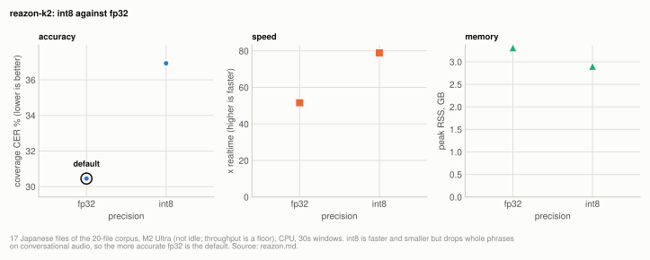

# Engine: reazon-k2

reazon-k2 does not change the default. At fp32 it scores 30.45% coverage CER on the 17
Japanese files at 51.6x on CPU, against turbo-nocond's 14.49% and parakeet's 26.19%
([engines.md](../engines.md#experiment-the-japanese-only-engines-against-the-multilingual-defaults)).
On spontaneous, code-switching studio audio, training-domain match does not beat
Whisper's breadth. The weights cannot decode a whole file, so 30s windows are mandatory,
and int8 drops whole phrases on this corpus, so fp32 is the default.

| setting | default | why |
|---|---|---|
| `reazon --chunk-seconds` | `30` | not a sweep: the weights cannot decode a whole file, so windows are mandatory; 30s energy-minima windows hold the front end constant with the Voxtral rows |
| `reazon` precision | fp32 | int8 drops whole phrases mid-file on this corpus (36.93% against 30.45%); a test guards the default |

**Setup:** the 17 Japanese files of the [20-file corpus](../reference/corpus.md#the-20-file-corpus) (6.78h), M2 Ultra on 2026-08-23 with another GPU client resident (45GB of GPU memory, load near 5 of 24 cores), scored by coverage CER at `min_cut` 30 ([metrics.md](../reference/metrics.md)). The engine decodes greedily, so accuracy is unaffected by contention; throughput figures are floors.

## Experiment: reazon-k2 int8 against fp32

**Basis:** the 17 Japanese files of the [20-file corpus](../reference/corpus.md#the-20-file-corpus), M2 Ultra on 2026-08-23 with another GPU client resident (throughput figures are floors), the authors' ONNX at fp32 and int8, 30s energy-minima windows.

<picture>
  <source media="(prefers-color-scheme: dark)" srcset="../img/reazon-precision-dark.svg">
  
</picture>

**Table:** reazon-k2 at fp32 and int8 on the 17 Japanese files: accuracy, CPU throughput and peak resident memory (rows from [engines.md](../engines.md#experiment-the-japanese-only-engines-against-the-multilingual-defaults)).

| precision | JP coverage CER | kana CER | x realtime | peak |
|---|---|---|---|---|
| **fp32 (default)** | 30.45% | 27.73% | 51.6x | 3.31GB RSS |
| int8 | 36.93% | - | 78.9x | 2.90GB RSS |

Reazon's release notes put int8 within ~0.3 CER of fp32 on JSUT, Common Voice and
TEDxJP-10K. On this corpus int8 drops whole phrases mid-file: 296 against 376
characters on one 112s recording, and 36.93% against 30.45% over the corpus
([results table](../engines.md#experiment-the-japanese-only-engines-against-the-multilingual-defaults)).
Read-speech benchmarks and conversational material disagree about what
int8 costs; this corpus is the closer match to what the CLI is for, so fp32 is the
default and a test guards it.

## How it works

**reazon-k2 cannot be decoded whole-file.** Fed a 112s file in one stream it returned
124 characters; it is trained on short VAD segments and skips badly outside that
distribution, which is why its own recipe segments by VAD. Every figure here uses 30s
windows cut at energy minima, the same front end the Voxtral rows use. Parakeet shows the
opposite dependence on window length ([parakeet.md](parakeet.md#how-it-works)).

**reazon-k2 is deterministic.** Three decodes through the CLI code path give
byte-identical text and cues, so every single-run figure above is a score rather than
a draw.

## Reproducing

`scripts/benchmarks/run_reazon.py` drives the exact function the CLI runs
(`backends.reazon_k2_decode`), loads once outside the timing loop, and reports
kana/lenient CER beside coverage CER. Result files: `benchmarks/reazon_fp32_c30.json`,
`benchmarks/reazon_int8_c30.json`.

## Related

- [engines.md](../engines.md): reazon and parakeet against the multilingual engines, and the Whisper rows compared here
- [parakeet.md](parakeet.md): the other Japanese-only engine
- [corpus.md](../reference/corpus.md): the corpus
- [metrics.md](../reference/metrics.md): coverage CER and `min_cut`
