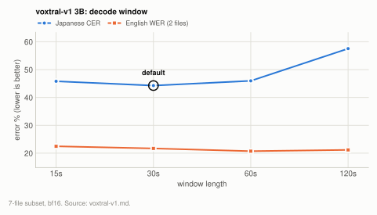
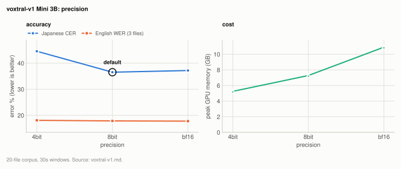
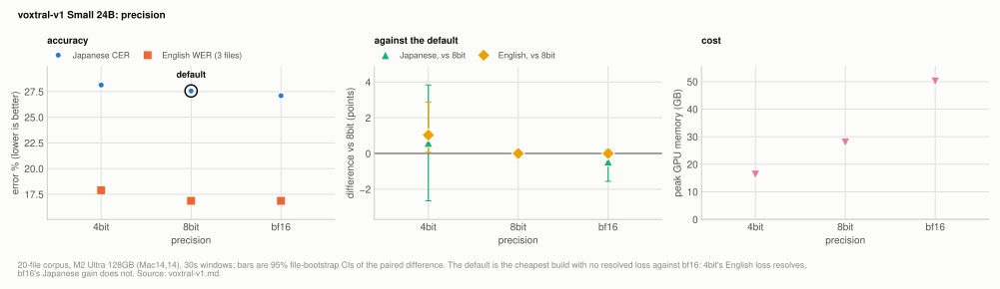
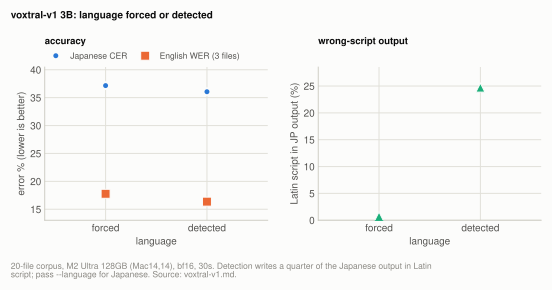

# Engine: Voxtral v1 (Mini 3B and Small 24B, 2507)

`--model voxtral-v1` adds two sizes and changes no default engine; its own defaults are
the 3B, 8bit on both sizes, and 30s decode windows. At those settings the 3B scores 36.52%
Japanese coverage CER and 17.86% English coverage WER at 12.9x realtime in 7.28GB, and
the 24B scores 27.56% and 16.86% at 3.1x in 27.92GB. On Japanese both are behind every
other multilingual engine here (voxtral 16.22%, whisper turbo 14.49%, qwen3-asr 1.7B
19.33%); on English the 24B's 16.86% is the lowest figure measured in this project with
the language given, against 18.34% for whisper turbo and 21.50% for voxtral, but that is
three files, and the 24B costs 28GB and runs at 3.1x.

| setting | default | why |
|---|---|---|
| `--size` | `3B` | Its 7.28GB peak fits inside the 12.7GB GPU working set of a 16GB Mac, which the 24B's does not at any precision. |
| `--quantization`, 3B | `8bit` | Ties bf16 (-0.64 points on Japanese, CI [-1.56, +0.32]); 4bit costs +8.01 points. The cheapest build that loses nothing. |
| `--quantization`, 24B | `8bit` | Nothing measurable lost on English, a Japanese deficit against bf16 the corpus cannot resolve, and 22GB less than bf16. |
| decode window | 30s | Best on Japanese; Japanese collapses above 60s. English prefers 60s by about a point, which does not pay for the Japanese cost. |
| `--language` | as given; detected when omitted | Detection switches whole Japanese windows into other languages, so pass it for Japanese. |

**Setup:** the [7-file subset](../reference/corpus.md#the-7-file-subset) (5 Japanese, 2 English,
5.18h) for the window sweep and the [20-file corpus](../reference/corpus.md#the-20-file-corpus) (17
Japanese, 3 English, 7.95h) for everything else, on the M2 Ultra 128GB (Mac14,14),
2026-09-24/25, with other GPU clients resident on the host between runs, scored by
coverage CER/WER at `min_cut` 30/6 ([metrics.md](../reference/metrics.md)). Runner and measurement
details are under [How the runs were made](#how-the-runs-were-made).

## Experiment: the decode window

**Basis:** the [7-file subset](../reference/corpus.md#the-7-file-subset), M2 Ultra 128GB (Mac14,14), 2026-09-24/25, other GPU clients resident on the host between runs; 3B, bf16.

<picture>
  <source media="(prefers-color-scheme: dark)" srcset="../img/voxtral-v1-window-dark.svg">
  
</picture>

**Table:** error, speed and peak memory of the 3B at bf16 by decode window.

| window | JP coverage CER | EN coverage WER | x realtime | peak |
|---|---|---|---|---|
| 15s | 45.81% | 22.47% | 10.5x | 10.86GB |
| **30s (default)** | **44.27%** | 21.70% | 10.0x | 10.91GB |
| 60s | 45.97% | **20.72%** | 6.4x | 10.91GB |
| 120s | 57.54% | 21.17% | 4.6x | 11.13GB |

Japanese is best at 30s and collapses above 60s. Paired over files, 60s against 30s is
+1.70 points, CI [-0.13, +3.93], 30s winning 4 of 5 files; 15s against 30s is not
resolvable either (+1.54, CI [-7.74, +10.72]) and swings by more than 11 points on single
files in both directions, which is what loops do to a per-file score. English prefers 60s
by about a point (-0.98, CI [-1.52, -0.75], both files), which does not pay for the
Japanese cost. A 300s arm was stopped after the trend was clear.

The mechanism is Qwen3-ASR's: each window's token budget scales with its length, so a
repetition loop in a longer window writes more text before it is cut off.

## Experiment: precision, 3B

**Basis:** the [20-file corpus](../reference/corpus.md#the-20-file-corpus), M2 Ultra 128GB (Mac14,14), 2026-09-24/25, other GPU clients resident on the host between runs; 3B, 30s windows.

<picture>
  <source media="(prefers-color-scheme: dark)" srcset="../img/voxtral-v1-precision-3b-dark.svg">
  
</picture>

**Table:** error, speed, peak memory and weight size of the 3B by precision.

| precision | JP coverage CER | kana CER | EN coverage WER | x realtime | peak | weights |
|---|---|---|---|---|---|---|
| 4bit | 44.54% | 50.27% | 18.08% | 14.0x | 5.25GB | 3.55GB |
| **8bit (default)** | **36.52%** | **39.19%** | 17.86% | 12.9x | 7.28GB | 5.57GB |
| bf16 | 37.16% | 40.10% | **17.77%** | 10.0x | 10.91GB | 9.37GB |

8bit ties bf16: -0.64 points on Japanese, CI [-1.56, +0.32], and +0.09 on English, CI
[-0.06, +0.19]. 4bit does not tie 8bit: **+8.01 points on Japanese, CI [+4.77, +11.73],
worse on 16 of 17 files** (English +0.21, not resolvable). That is the same shape as
Qwen3-ASR 0.6B at 4bit (-7.02) and unlike the 1.7B, so small models are where 4bit is
costly here. 8bit is the default because it is the cheapest build that loses nothing.

## Experiment: Small 24B

**Basis:** the [20-file corpus](../reference/corpus.md#the-20-file-corpus), M2 Ultra 128GB (Mac14,14), 2026-09-24/25, other GPU clients resident on the host between runs; 24B, 30s windows (the window was swept on the 3B only).

<picture>
  <source media="(prefers-color-scheme: dark)" srcset="../img/voxtral-v1-precision-24b-dark.svg">
  
</picture>

**Table:** error, speed, peak memory and weight size of the 24B by precision, with each build's paired difference against 8bit (points, 95% file-bootstrap CI).

| precision | JP coverage CER | kana CER | EN coverage WER | JP vs 8bit | EN vs 8bit | x realtime | peak | weights |
|---|---|---|---|---|---|---|---|---|
| 4bit | 28.14% | 31.91% | 17.89% | +0.59 [-2.65, +3.83] | +1.03 [+0.06, +2.87] | **4.3x** | **16.27GB** | 14.7GB |
| **8bit (default)** | 27.56% | 28.81% | **16.86%** | 0.00 | 0.00 | 3.1x | 27.92GB | 26.4GB |
| bf16 | **27.10%** | 28.89% | **16.86%** | -0.46 [-1.56, +0.25] | 0.00 (exact tie) | 2.4x | 50.08GB | 48.5GB |

**Size is worth far more than precision here.** bf16 24B against the 3B default is -9.42
points on Japanese, CI [-11.01, -7.95], better on all 17 files, and -1.01 on English, CI
[-3.15, -0.10], all three files. It still loops, on 10 to 16 of the 17 Japanese files
depending on precision, so the loops are a property of the family rather than of the small
model.

Within the size the ladder is flat: the three Japanese figures span about one point.
8bit against bf16 is +0.46 on Japanese, CI [-0.25, +1.56], and an exact tie on English,
at 56% of the memory. bf16 is ahead on 13 of 16 Japanese files by small margins (sign
test p=0.021), so it is the better choice where 50GB is free, but the aggregate does not
resolve it. 4bit against 8bit is not resolvable on Japanese (+0.59, CI [-2.65, +3.83])
and costs about a point on English (+1.03, CI [+0.06, +2.87], all three files).

8bit is the default: nothing measurable lost on English, a Japanese deficit the corpus
cannot resolve, and 22GB less than bf16.

The 8bit build here was produced by `scripts/benchmarks/convert_drop_source.py` rather than
by the first-use conversion, because the host could not hold the 48.5GB of shards and the
27GB output at once. It runs the same mlx-audio calls in the same order and deletes the
shards before saving; on the 3B its 8bit output was checked against a normal conversion
and all 1190 tensors and the config were bit-identical.

## Experiment: leaving the language to the model

**Basis:** the [20-file corpus](../reference/corpus.md#the-20-file-corpus), M2 Ultra 128GB (Mac14,14), 2026-09-24/25, other GPU clients resident on the host between runs; 3B, bf16, 30s windows, with and without the `lang:` prefix.

<picture>
  <source media="(prefers-color-scheme: dark)" srcset="../img/voxtral-v1-language-dark.svg">
  
</picture>

**Table:** error, Latin-script share of the Japanese output and loop count of the 3B at bf16, with the language forced from the reference or detected by the model.

| language | JP coverage CER | EN coverage WER | Latin-script share of JP output | files with loops |
|---|---|---|---|---|
| forced from the reference | 37.16% | 17.77% | 0.7% | 14 |
| detected by the model | 36.06% | **16.36%** | **24.7%** | 10 |

On English, detection is better on all three files (-1.42, CI [-2.70, -0.06]), and its
output contains no other script. On Japanese the aggregate moves by -1.10 (CI [-3.07,
+1.21]), but the output is different in kind: on the close-mic interview files, 20-40% of
the characters are Latin script, whole windows transcribed or translated as English or
Turkish. Those recordings contain side conversation in other languages that the
references omit, and coverage CER excuses text absent from the reference by design, so a
window emitted in the wrong language costs little on this metric while being useless to a
reader. The public-video files, which have no such chatter, barely change (0.2-3.6% Latin
either way).

So `--language` is honoured when given and the model detects when it is not, and for
Japanese the flag should be passed.

## Experiment: repeat decodes

**Basis:** the 7 shortest files of the [20-file corpus](../reference/corpus.md#the-20-file-corpus), M2 Ultra 128GB (Mac14,14), 2026-09-24/25, other GPU clients resident on the host between runs; 3B at 8bit and 24B at 4bit, each file decoded twice.

The 7 shortest files, each decoded twice: 7/7 byte-identical for the 3B at 8bit and 7/7
for the 24B at 4bit, as greedy decoding predicts. So one run per configuration is its
score.

## How it works

**Japanese is outside what these weights claim.** The model card lists English, Spanish,
French, Portuguese, Hindi, German, Dutch and Italian. On this corpus's Japanese the 3B
falls into greedy repetition loops in most long files, and those loops decide its
Japanese score more than anything tunable does.

mlx-asr uses mlx-audio's model classes for the forward pass and nothing else from its
Voxtral v1 path (`mlx_asr/voxtral_v1.py`). mlx-audio's own entry point is not used, for
three reasons that each fail quietly:

- **The prompt needs torch and soundfile upstream.** `Model.generate` builds its input with
  transformers' `VoxtralProcessor.apply_transcription_request`, which accepts no
  `return_tensors` other than `"pt"`, and mistral_common's `Audio` asserts that soundfile
  is installed before it will hold an array. Neither is a dependency of this project. The
  prompt, `[BOS][INST][BEGIN_AUDIO][AUDIO]x n[/INST]lang:xx[TRANSCRIBE]`, is assembled from
  mistral_common's own pieces instead, and `tests/test_voxtral_v1.py` checks it against
  `encode_transcription` token for token.
- **`max_tokens` defaults to 128 per call**, about a minute of speech, and exhausting it
  ends the transcript without an error. The window loop and its per-window budget are the
  ones Qwen3-ASR uses, for the same reason ([qwen3-asr.md](qwen3-asr.md)).
- **The authors' repos hold every weight twice**, as `consolidated.safetensors` in
  Mistral's native key layout beside the HF-format shards, and mlx-audio's loader prefers
  the consolidated file, whose keys this model's `sanitize` does not map. Only the shards
  are downloaded (48.5GB rather than 97GB for Small 24B).

Weights come from `mistralai/` only. bf16 loads from their shards directly; 8bit and 4bit
are converted once on first use into the Hugging Face cache, by mlx-audio's own converter,
which leaves the audio encoder unquantized.

Parity against the upstream path was checked once, on 30s windows of a Japanese and an
English file: prompt token ids identical, maximum feature difference 0.0, decoded text
identical, on all 7 windows, including one that loops. That check needs torch, soundfile
and librosa, which is exactly what this path exists to avoid, so it is not kept as a
script; the token-level prompt test in `tests/test_voxtral_v1.py` is what guards the
equivalence from here on.

### How the runs were made

`scripts/benchmarks/run_qwen3.py`, which drives both windowed text-only engines through
the same loop in `mlx_asr/backends.py` (same splitter, same per-window token budget, same
decode-health checks) and scores with the same functions as every other runner, on the
same cached 16kHz mono files. Model load is outside the timing loop. Language is set per
file from the reference script, as in `run_whisper.py`, except in the one arm that tests
leaving it out.

Decoding is greedy (the card recommends `temperature=0.0` for transcription), so one run
is its score. Peak memory is the maximum of `mx.get_peak_memory()` over the corpus,
including the load, which is the figure a CLI run with `--stats-json` reports. Throughput
is the run's own.

### What it does not do

- **No subtitles.** `-f srt`, `-f vtt` and `-f all` exit 2. The weights emit text and no
  times, and the cue boundaries would be decode windows.
- **No batching.** `--max-batch` exits 2. Windows are decoded one at a time.
- **Every Voxtral Realtime flag is refused**, as on the other non-Voxtral engines:
  `--prompt`, `--delay-ms`, `--vad`, `--compact-silence`, the KV flags and the cue flags.

## Not settled

- **15s against 30s**, and 60s against 30s on Japanese, do not resolve on the 7-file
  subset; 30s is the default because it is best in aggregate and wins 4 of 5 files
  against 60s.
- **bf16 against 8bit on the 24B**: bf16 is ahead on 13 of 16 Japanese files, but the
  aggregate CI spans zero.
- **The window was swept on the 3B only**; the 24B uses the same 30s.
- **English is three files** (two in the window sweep), so every English difference
  here rests on very few recordings.

## Related

- [qwen3-asr.md](qwen3-asr.md): the other windowed text-only engine, which shares this
  engine's window loop and token budget.
- [engines.md](../engines.md): the Voxtral and Whisper comparison the Japanese and English
  figures above are set against.
- [metrics.md](../reference/metrics.md): coverage CER/WER and the paired comparisons.
- [corpus.md](../reference/corpus.md): the 20-file corpus and the 7-file subset.
- [peak-memory.md](../reference/peak-memory.md): how the peak figures are measured across engines.
- [RESULTS.md](../../../RESULTS.md): the headline rows for both sizes.
