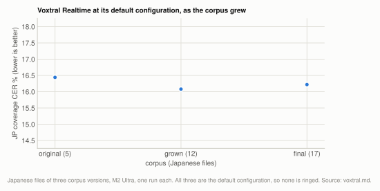

# Engine: Voxtral Realtime

`--model voxtral` (Voxtral Mini 4B Realtime, 2602) is the default engine. On the 20-file
corpus at its default configuration it scores 16.22% Japanese coverage CER and 21.50%
English WER at 29.6x realtime: about 1.7 Japanese points behind Whisper turbo-nocond and
1.35-1.65x faster ([engines.md](../engines.md#experiment-voxtral-against-whisper)). It needs
no language hint and no long-form-stability flag, and greedy decoding reproduces
byte-identically on one machine, so one run is a score rather than a draw. Most of its
settings are levers with their own page, linked from the table below; several of those
flags exist only on this engine and the others refuse them.

| setting | default | why |
|---|---|---|
| `--delay-ms` | `2400` | the largest accuracy lever measured, at no throughput cost ([delay.md](../delay.md)) |
| `--chunk-seconds` and batch | per machine: 30s/B32 on M2 Ultra, 60s/B16 on M4 | 30s and 60s are indistinguishable on the 20-file corpus; throughput decides, and it reverses across hardware ([chunking.md](../chunking.md), [decode-throughput.md](../decode-throughput.md)) |
| `--overlap-seconds` | 0 | won on one clip at 30s chunks, reversed sign on the 7-file corpus ([chunking.md](../chunking.md)) |
| `--quantization` | `4bit` | last of five on the corpus, but fp16 peaks at 12.98GB and the 8-bit that ties fp16 is not published in a loadable form ([quantization.md](../quantization.md)) |
| `--kv-bits` | `8` | ties unquantized KV on the corpus and reads half the cache bytes per step ([quantization.md](../quantization.md)) |
| `--gain` | `auto` | quiet input costs accuracy; `auto` lifts only quiet files and leaves the rest byte-identical ([input-level.md](../input-level.md)) |
| `--prompt` | empty | costs English 14 to 72 WER points in every variant tested, with no measurable vocabulary recall ([prompt.md](../prompt.md)) |
| `--gap-seconds`, `--max-chars` | `1.2`, `28` | deliberately not the sweep optimum, since every timed reference is by one editor ([cue-layout.md](../cue-layout.md)) |

**Setup:** each lever page states its own material and machine; the figures on this page are from the [20-file corpus](../reference/corpus.md#the-20-file-corpus) (17 Japanese, 3 English, 7.95h) and its earlier, smaller versions, M2 Ultra, scored by coverage CER/WER at `min_cut` 30/6 ([metrics.md](../reference/metrics.md)).

## Experiment: the default configuration

**Basis:** the Japanese files of the [7-file subset](../reference/corpus.md#the-7-file-subset) (5), the intermediate corpus (12) and the [20-file corpus](../reference/corpus.md#the-20-file-corpus) (17, plus 3 English), M2 Ultra (idle on 2026-08-06 for the 20-file run, English re-scored 2026-08-19), `--chunk-seconds 30 --max-batch 32 --kv-bits 8 --delay-ms 2400`, one deterministic run per corpus; the Voxtral rows of [Voxtral against Whisper](../engines.md#experiment-voxtral-against-whisper) and [the Whisper margin as the corpus grew](../engines.md#experiment-the-whisper-margin-as-the-corpus-grew).

<picture>
  <source media="(prefers-color-scheme: dark)" srcset="../img/voxtral-corpus-growth-dark.svg">
  
</picture>

**Table:** Voxtral Realtime at its default configuration on each corpus version: Japanese CER, English WER and speed where measured.

| corpus | JP files | JP coverage CER | EN coverage WER | x realtime |
|---|---|---|---|---|
| original | 5 | 16.44% | - | - |
| grown | 12 | 16.08% | - | - |
| final | 17 | 16.22% | 21.50% | 29.6x |

Voxtral's own number barely moved (16.44 -> 16.08 -> 16.22) while the corpus more than
tripled. Its Japanese accuracy reproduced the earlier session exactly (16.22%), across
three separate sessions and two reference-loader versions. The English figure is the one
after the 2026-08-19 reference-loader fix, which moved the Voxtral English aggregate from
25.24% to 21.50% ([metrics.md](../reference/metrics.md)).

Against the other engines on the same files, Whisper turbo-nocond is ahead on both
languages and slower, and every other engine family is behind on Japanese
([engines.md](../engines.md)). On the single narration clip, where the reference is
complete, Voxtral scores 7.28% plain CER, ahead of turbo's 9.08%
([clean narration](../engines.md#experiment-clean-narration)).

## Related

- [engines.md](../engines.md): Voxtral against Whisper and the other engines, and why it is the default
- [delay.md](../delay.md): `--delay-ms`, Voxtral only
- [chunking.md](../chunking.md): chunk length, overlap and cut points
- [decode-throughput.md](../decode-throughput.md): batch size, Voxtral only
- [quantization.md](../quantization.md): weight and KV-cache precision
- [input-level.md](../input-level.md): `--gain`, Voxtral only
- [prompt.md](../prompt.md): `--prompt`, Voxtral only
- [cue-layout.md](../cue-layout.md): subtitle cue grouping, Voxtral only
- [timestamps.md](../timestamps.md): Voxtral's timestamps against Whisper's
- [determinism.md](../reference/determinism.md): why one run is a score
- [voxtral-v1.md](voxtral-v1.md): the earlier, non-realtime Voxtral models, a separate engine family
