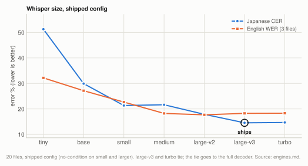
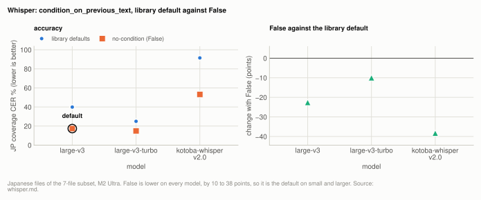
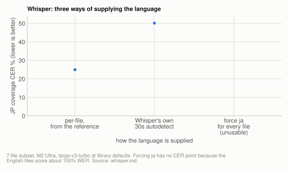
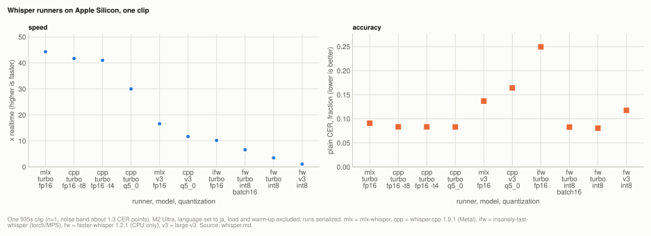

# Engine: Whisper

`large-v3` is Whisper's default size (since 2026-10-06). It ties `turbo` on the 20-file
corpus (14.55% against 14.68% Japanese coverage CER, 18.26% against 18.31% English WER),
and the tie goes to capacity, with `turbo` kept as the speed option at 2.1x the throughput
and 1.5GB less memory. The largest Whisper lever measured is
`condition_on_previous_text=False`, worth 7 to 25 CER points on long audio, which the CLI
sets on `small` and larger. The language is best supplied per file: Whisper's own 30s
autodetect cost 25 points on the 7-file subset. Among Apple Silicon runners, mlx-whisper and
whisper.cpp are effectively tied on one clip, and faster-whisper has no GPU path here. How
Whisper compares with the other engines is on [engines.md](../engines.md).

| setting | default | why |
|---|---|---|
| Whisper `--size` | `large-v3` | ties `turbo` at n=20 (14.55% vs 14.68% JP); the tie goes to capacity, turbo stays the speed option |
| Whisper `condition_on_previous_text` | `False` on `small` and larger | worth 7 to 25 CER points on long audio; library defaults on `tiny` and `base` |

**Setup:** the [20-file corpus](../reference/corpus.md#the-20-file-corpus) (17 Japanese, 3 English, 7.95h) for the size sweep, the [7-file subset](../reference/corpus.md#the-7-file-subset) for the `condition_on_previous_text`, language and superseded tables, and [the single clip](../reference/corpus.md#the-single-clip) for the runner comparison; M2 Ultra, scored by coverage CER/WER at `min_cut` 30/6 ([metrics.md](../reference/metrics.md)).

## Experiment: every Whisper size at its default config

**Basis:** the [20-file corpus](../reference/corpus.md#the-20-file-corpus), idle M2 Ultra, each size at its default config.

20 files, 7.95h, idle M2 Ultra, `--no-condition` on `small` and larger and library defaults
on `tiny` and `base`, which is each size's default config. Peak GPU memory from
`mx.get_peak_memory()`, reset per file. An independent re-run reproduced every peak here
within 0.02GB and found that Whisper's figure grows with audio length rather than being a
property of the size ([peak-memory.md](../reference/peak-memory.md)). The last column is the superseded
7-file measurement at library defaults (see [Superseded](#superseded)), kept beside the new
one because the gap between them is a finding.

<picture>
  <source media="(prefers-color-scheme: dark)" srcset="../img/whisper-sizes-dark.svg">
  
</picture>

**Table:** every Whisper size at its default config on the 20-file corpus: accuracy, throughput, peak GPU memory, and the superseded 7-file figure; `large-v3` ties `turbo` and the tie goes to capacity, so `large-v3` is the default.

| size | JP coverage CER | EN coverage WER | x realtime | peak GPU | old table, library defaults |
|---|---|---|---|---|---|
| `tiny` | 51.28% | 32.17% | **52.7x** | **3.98GB** | 59.27% |
| `base` | 29.93% | 27.14% | 34.5x | 4.07GB | 29.96% |
| `small` | 21.33% | 22.68% | 20.1x | 4.37GB | 28.61% |
| `medium` | 21.63% | 18.23% | 21.4x | 5.43GB | 28.93% |
| `large-v2` | 17.87% | 17.68% | 14.4x | 6.97GB | 25.02% |
| `large-v3` **(default)** | **14.55%** | 18.26% | 11.4x | 7.00GB | 39.91% |
| `turbo` | 14.68% | 18.31% | 23.7x | 5.53GB | 24.97% |

**`turbo` and `large-v3` tie**: 14.68% against 14.55% on Japanese, well inside the ±0.27
that repeat runs of turbo spread, and 18.31% against 18.26% on English. The earlier 7-file
table appeared to show turbo winning outright; at n=20 with both at their default config
the honest statement is that the corpus cannot separate them. Turbo is **2.1x faster** and
uses 1.5GB less memory. The default was turbo on that basis until 2026-10-06, and is now
**`large-v3`**: a tie on 20 files from a few sources is not evidence that turbo's 4-layer
decoder holds up on material the corpus does not cover, so the tie is broken toward
capacity, and turbo stays available as the speed option.

**`large-v3` was the worst-served by the old measurement.** 39.91% at library defaults
against 14.55% at its default config, a 25-point artifact of cross-window repetition loops
that `condition_on_previous_text=False` prevents. Anyone reading the old table would have
concluded the model was broken.

**Peak memory barely tracks download size.** `tiny` downloads 0.07GB and peaks at 3.98GB,
because the working set is the 30s mel window and decoder activations rather than the
weights. So the whole size ladder fits in 4 to 7GB, and picking `tiny` to save memory buys
almost nothing while costing 37 points.

The `turbo` row was measured while the host was not idle, so its 23.7x is a floor rather
than a clean figure; the accuracy figures are unaffected, since contention costs wall clock
only. Its 14.68% is consistent with the separately published 3-run mean of 14.49% ±0.27.

## Experiment: `condition_on_previous_text=False`

**Basis:** the Japanese files of the [7-file subset](../reference/corpus.md#the-7-file-subset), M2 Ultra, mlx-whisper library defaults against `condition_on_previous_text=False`.

Whisper's *library defaults* are worth 7 to 25 CER points on this material, all of it
cross-window repetition loops, so any Whisper figure taken without
`condition_on_previous_text=False` describes the defaults rather than the model. The CLI
sets that flag by default on `small` and larger. It is the single largest Whisper lever
here:

<picture>
  <source media="(prefers-color-scheme: dark)" srcset="../img/whisper-condition-dark.svg">
  
</picture>

**Table:** Japanese coverage CER per model at library defaults and with `condition_on_previous_text=False`, and the change.

| model | defaults | no-condition | change |
|---|---|---|---|
| large-v3 | 39.91% | 17.36% | **-22.6 points** |
| large-v3-turbo | 24.97% | 14.93% | **-10.0 points** |
| kotoba-whisper v2.0 | 91.47% | 53.20% | -38.3 points |

The mechanism is the known Whisper failure mode: conditioning each 30s window on the
previous window's text lets a repetition loop, once started, feed itself across windows.
Per-file on large-v3, the 26-minute file goes 68.8% -> 14.5% and the 52-minute file 58.9%
-> 24.1%, while the short 13-minute file barely moves (15.9% -> 12.4%). **Long files are
where the loop has room to compound.**

This also inverts the size ranking: at defaults large-v3 (39.91%) is *worse* than small
(28.61%) on Japanese, purely from loop instability, and turbo beats the full large-v3 it
was distilled from. Anyone quoting "large-v3 is the best Whisper" on long-form Japanese
should check this flag first. The registry sets it on `small` and larger; `tiny` and `base` keep the library default.

Voxtral has no equivalent knob and no equivalent failure, because it decodes independent
chunks.

Pure greedy decoding is not a fix for the resulting nondeterminism: `--greedy` collapses
to 84.92% / 93.00%, because the fallback ladder is what rescues looping segments.

## Experiment: telling Whisper the language

**Basis:** the [7-file subset](../reference/corpus.md#the-7-file-subset), M2 Ultra, Whisper `large-v3-turbo` at library defaults with three ways of supplying the language.

Voxtral takes no language token. Whisper does, and all three ways of supplying it on a
mixed corpus cost something:

<picture>
  <source media="(prefers-color-scheme: dark)" srcset="../img/whisper-language-dark.svg">
  
</picture>

**Table:** Japanese coverage CER for three ways of supplying the language to Whisper.

| approach | JP coverage CER | note |
|---|---|---|
| per-file, from the reference | 24.97% | what the tables above use |
| Whisper's own 30s autodetect | 50.14% | +25.2 points |
| force `ja` for every file | unusable | English files score ~100% WER |

Autodetect returned **Russian** for two Japanese files (and on tiny, 102-106% CER with
`extra_ratio` 8.5). That is not a random misfire: these recordings genuinely contain
Russian speech at the start, so a 30-second window is a bad sample of a 90-minute file.
Since the harness knows each file's language from its reference, the main tables give
Whisper that information for free; the autodetect row is what a zero-config user gets.
`run_whisper.py` refuses `--language` on a mixed-script set rather than silently producing
the 100% rows.

## Experiment: competing Apple Silicon runners

**Basis:** [one clip](../reference/corpus.md#the-single-clip) (935s, complete reference), M2 Ultra, `--language ja`, model load and warm-up excluded, runs serialized.

Run because the alternative was an unfalsifiable speed claim. Same 935s clip, complete
reference so plain CER is valid, `--language ja`, model load and warm-up excluded,
serialized so nothing contends for the GPU.

<picture>
  <source media="(prefers-color-scheme: dark)" srcset="../img/whisper-runners-dark.svg">
  
</picture>

**Table:** throughput and plain CER of each Whisper runner and model config on the single clip.

| runner | model / quant | GPU? | x realtime | plain CER |
|---|---|---|---|---|
| mlx-whisper | large-v3-turbo fp16 | yes (MLX) | **44.3x** | 0.0908 |
| whisper.cpp 1.9.1 | large-v3-turbo fp16 (`-t 8`) | yes (Metal) | **41.7x** | **0.0832** |
| whisper.cpp 1.9.1 | large-v3-turbo fp16 (`-t 4`) | yes (Metal) | 41.0x | 0.0832 |
| whisper.cpp 1.9.1 | large-v3-turbo q5_0 | yes (Metal) | 30.0x | 0.0830 |
| mlx-whisper | large-v3 fp16 | yes (MLX) | 16.6x | 0.1367 |
| whisper.cpp 1.9.1 | large-v3 q5_0 | yes (Metal) | 11.7x | 0.1641 |
| insanely-fast-whisper | large-v3-turbo fp16 | yes (torch/MPS) | 10.2x | 0.2495 |
| faster-whisper 1.2.1 | large-v3-turbo int8, batched 16 | **no, CPU** | 6.6x | 0.0828 |
| faster-whisper 1.2.1 | large-v3-turbo int8 | no, CPU | 3.5x | 0.0804 |
| faster-whisper 1.2.1 | large-v3 int8 | no, CPU | 1.1x | 0.1175 |

whisper.cpp used the Metal backend, confirmed by its own
`whisper_backend_init_gpu: using MTL0 backend` log line, with flash attention on by
default in 1.9.1 and no CoreML encoder built.

**No "fastest on Apple Silicon" claim survives this.** whisper.cpp (41.7x, CER 0.0832) and
mlx-whisper (44.3x, CER 0.0908) are effectively tied: 6% apart on throughput, 0.8 CER
points apart in the other direction, on one clip where the documented noise band is about
1.3 points. Anyone claiming one beats the other on this evidence is reading noise.
whisper.cpp also has far fewer dependencies. What this project contributes is the Voxtral
engine, one interface over several engines, and the measurement harness, rather than a
faster Whisper.

**faster-whisper cannot use the GPU here at all**, which is the most load-bearing finding
for anyone choosing a runner, because it is the most-cited "fast whisper" and its
reputation was built on CUDA. CTranslate2 4.8.1 has no Metal backend, verified rather than
assumed: `get_cuda_device_count()` returns 0, `get_supported_compute_types("cuda")` raises
`ValueError: This CTranslate2 package was not compiled with CUDA support`, and the CPU
compute types are `{float32, int8, int8_float32}` with **no float16**. During the run it
sat at 460-520% CPU with the 60-core GPU idle. Its accuracy is fine (0.0804 is the best
CER in the table), so the problem is purely throughput and it is structural.

**Quantization costs speed on the GPU** as well as accuracy: q5_0 is 27% slower than fp16
at identical CER, because dequantization is work an fp16 matmul does not do. So quantize
when memory-bound rather than for speed. Thread count is irrelevant (`-t 4` and `-t 8`
gave 41.0x and 41.7x with byte-identical output), so the workload is Metal-bound.

large-v3 q5_0 at 0.1641 is a repetition loop rather than a quantization artifact, with one
segment duplicated five times. turbo, with 4 decoder layers instead of 32, avoided it,
which matches the pattern above: the deeper decoder is the less stable one on long audio.

Not measured: whisperX (its ASR stage is faster-whisper, so its throughput is bounded above
by the CPU-only rows), and whisper.cpp with a CoreML encoder (the Homebrew bottle is built
`COREML = 0`).

## Superseded

### The 7-file size and engine table

Replaced by the [20-file size sweep](#experiment-every-whisper-size-at-its-default-config)
for the size ranking and by the [20-file comparison](../engines.md#experiment-voxtral-against-whisper)
for the engine verdict. This table ran `large-v2`, `medium` and `small` at mlx-whisper's
library defaults, while the CLI's default for those three is
`condition_on_previous_text=False`, so its rows described configs this CLI does not run
and understated them by 7 to 25 points. Library defaults except where a row says otherwise,
so the `large-v2`, `medium`, `small`, `base`, `tiny` and plain `large-v3`/`turbo` rows do
not describe anything the CLI runs. 7 recordings (5 Japanese, 2 English).

**Table:** the superseded 7-file accuracy and throughput of Whisper configs and two Voxtral configs.

| engine / config | JP coverage CER | EN coverage WER | x realtime |
|---|---|---|---|
| whisper large-v3-turbo, no-condition (mean of 6 runs) | **15.91%** ±0.94 | **22.24%** ±0.96 | 15.4x |
| **voxtral 30s b32 kv8** | 16.44% | 26.55% | **31.3x** |
| whisper large-v3, no-condition | 17.36% | 23.57% | 9.2x |
| voxtral 60s b16 kv8 | 18.21% | 27.75% | 21.4x |
| whisper large-v3-turbo | 24.97% | 30.69% | 17.3x |
| whisper large-v2 | 25.02% | 28.05% | 15.0x |
| whisper small | 28.61% | 25.80% | 26.4x |
| whisper medium | 28.93% | 23.52% | 21.8x |
| whisper base | 29.96% | 32.16% | 25.5x |
| whisper large-v3 | 39.91% | 29.37% | 9.1x |
| whisper large-v3-turbo, autodetect | 50.14% | 22.73% | 24.3x |
| whisper tiny | 59.27% | 40.47% | 46.4x |
| whisper large-v3-turbo, greedy | 84.92% | 93.00% | 82.3x |

## Not settled

The competing-runner table is n=1. Whisper's own chunking/VAD front-ends (faster-whisper,
whisperX) are untested and would likely help turbo further.

## Related

- [engines.md](../engines.md): Whisper against Voxtral and the other engines on the 20-file corpus
- [kotoba.md](kotoba.md): kotoba-whisper, a Japanese distil checkpoint that needs a chunked driver
- [peak-memory.md](../reference/peak-memory.md): the peak GPU column
- [determinism.md](../reference/determinism.md): why Whisper needs 3 runs
- [timestamps.md](../timestamps.md): timestamp behaviour by engine
- [corpus.md](../reference/corpus.md) and [metrics.md](../reference/metrics.md): the material and the scorers
