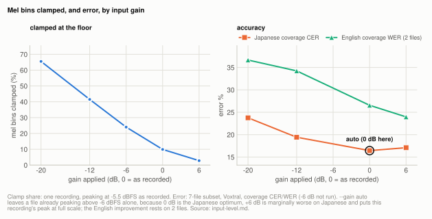
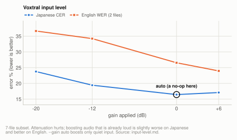

# Lever: input level (`--gain`)

The default is `--gain auto`: boost a file whose peak is below -6 dBFS up to -1 dBFS,
never attenuate, never clip. Quiet input is damaging and fails silently: attenuating the
corpus by 12 dB cost 3.78 points of coverage error with no other symptom, while amplifying
audio that was already healthy was close to a wash. `auto` encodes that asymmetry, is a
byte-identical no-op on well-recorded material, and recovered essentially all of a 2.2-point
loss on a clip attenuated by 14 dB.

**Voxtral only** as a flag, though the underlying mel floor is Whisper's too: both use the
same front end, so quiet input is likely to cost accuracy on either. Only the Voxtral path
applies gain, so `--gain` is rejected on the other engines and this was measured on Voxtral.

| setting | default | why |
|---|---|---|
| `--gain` | `auto` | quiet input costs accuracy through an absolute mel floor; `auto` lifts only quiet files and leaves the rest byte-identical |

**Setup:** [7-file subset](corpus.md#the-7-file-subset) for the gain sweep (recorded at
-0.5 to -5.3 dBFS peak), Voxtral at 30s chunks, batch 32, kv8, `scripts/benchmarks/sweep_gain.py`,
scored by [coverage CER/WER](metrics.md#coverage-cer-and-why-it-had-to-exist). The
recovery check uses [one clip](corpus.md#the-single-clip), scored by plain CER.

## Experiment: mel bins clamped by input level

**Basis:** one recording, mel front end only, share of mel bins at the floor at five gain settings.

The mel front end flattens anything with `log10(power)` below `global_log_mel_max - 8.0`.
That threshold is **absolute**, not relative to the utterance, so quiet input has its
low-level detail destroyed before the encoder ever sees it. Measured share of mel bins
sitting exactly at the floor, one recording:

<picture>
  <source media="(prefers-color-scheme: dark)" srcset="img/input-level-clamp-dark.svg">
  
</picture>

| gain | peak dBFS | % mel bins clamped |
|---|---|---|
| -20dB | -25.5 | 65.5% |
| -12dB | -17.5 | 41.5% |
| -6dB | -11.5 | 24.0% |
| unity | -5.5 | 9.9% |
| +6dB | 0.0 | 2.8% |

This is a question of level, and bit depth plays no part. The sources are 32-bit float, so
gain is mathematically lossless; what matters is only where the signal sits relative to
the model's fixed floor.

## Experiment: error by input gain

**Basis:** [7-file subset](corpus.md#the-7-file-subset), Voxtral at 30s chunks, batch 32, kv8, coverage CER/WER.

The 7-file subset needed no normalization, and unity gain was already near-optimal.

<picture>
  <source media="(prefers-color-scheme: dark)" srcset="img/gain-dark.svg">
  
</picture>

| mode | JP coverage CER | EN coverage WER |
|---|---|---|
| -20 dB | 23.76% | 36.65% |
| -12 dB | 19.42% | 34.23% |
| **unity (as recorded)** | **16.44%** | 26.55% |
| peak to -1 dBFS | 16.74% | 26.38% |
| +6 dB | 17.09% | **23.96%** |
| rms to -23 dBFS | 17.09% | **23.93%** |

Paired across files:

| comparison | diff | 95% CI | verdict |
|---|---|---|---|
| -20dB vs unity | +7.79 | [+5.39, +12.08] | **attenuation hurts badly** |
| -12dB vs unity | +3.78 | [+1.82, +7.83] | **attenuation hurts** |
| +6dB vs unity, all files | +0.09 | [-1.21, +0.94] | not resolvable |
| +6dB vs unity, English only | **-2.59** | [-3.19, -1.18] | **amplifying helps** |
| +6dB vs unity, Japanese only | +0.65 | [+0.00, +1.08] | marginally hurts |
| peak-normalize vs unity | +0.21 | [-0.19, +0.64] | not resolvable |

Two readings, one solid and one a lead:

- **Attenuation is significantly harmful**, and the clamping measurement above explains why.
- **Amplifying healthy audio splits by content.** The two English multi-speaker recordings
  improved by 2.6 points while the five Japanese ones got marginally worse. Plausibly the
  English files have quieter off-mic speakers whose detail was being clamped, whereas the
  Japanese ones are close-mic single-speaker where amplification mostly lifts the noise
  floor. **n=2 on the English side, so treat that as a lead rather than a result.**

## Experiment: recovery of an attenuated clip

**Basis:** [one clip](corpus.md#the-single-clip), Voxtral, plain CER.

Attenuating a clip by 14 dB and transcribing it three ways:

| condition | CER |
|---|---|
| original level | 8.63% |
| attenuated -14 dB, `--gain none` | 10.84% |
| attenuated -14 dB, `--gain auto` | **8.61%** |

`auto` recovers essentially all of the 2.2-point loss, which is what makes it safe as the
default: inert on well-recorded material, and it repairs quiet material almost exactly.

## How it works

The two findings give an asymmetric rule rather than a loudness target: quiet audio must be
lifted, loud audio must be left alone.

| peak dBFS | gain applied | result |
|---|---|---|
| -0.5 to -5.3 (this corpus) | 0.0 dB | byte-identical, no-op |
| -7.4 | +6.4 dB | -1.0 dBFS |
| -13.3 | +12.3 dB | -1.0 dBFS |
| -21.3 | +20.3 dB | -1.0 dBFS |
| -41.3 | +40.3 dB | -1.0 dBFS |

Gain is never negative and the target sits below full scale, so `auto` cannot clip.
Verified as a no-op on all 7 corpus files and on the narration clip.

**One scalar for the whole file.** `auto` decides from the file peak and applies a single
scalar before chunking, so relative dynamics are preserved exactly. It deliberately does
not adapt per chunk. Most chunks of a normal recording sit well below the file peak (94% of
chunks are under -6 dBFS on this corpus, with up to 70dB of spread inside one file), so a
per-chunk normalizer would apply tens of dB of differential gain and flatten the loud/quiet
structure the model uses. `mlx_asr.audio.per_chunk_gain_db` exists so that can be
evaluated, not because it is recommended.

**Other modes.** Besides the default, `--gain` accepts a number of dB, `peak` (targets
-1 dBFS rather than 0, since clipping is the one irreversible loss), `rms` (targets
speech-active frames only, so a recording with long pauses is not pushed up by its
silence), and `none`. The CLI reports the clipped-sample percentage whenever gain is
applied.

## Superseded

The older advice in this project was to leave levels alone. That is still right for audio
already peaking near full scale, which is exactly what `auto` declines to touch.

## Related

- [corpus.md](corpus.md): the recordings and the narration clip
- [metrics.md](metrics.md): coverage CER/WER and the paired comparison
- [delay.md](delay.md): the other Voxtral-only lever, measured on the same config
