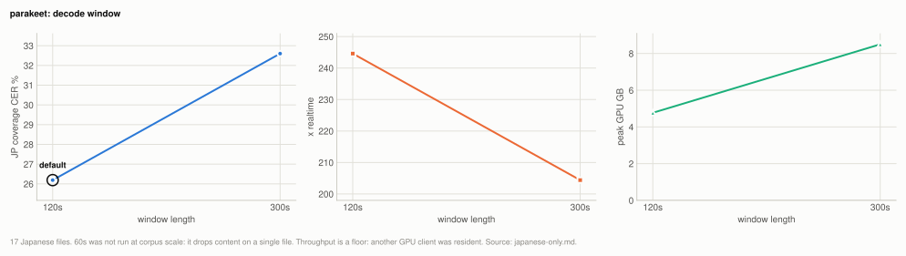

# Engine: the Japanese-only engines (parakeet, reazon)

Neither Japanese-specialized engine changes the default. Parakeet scores 26.19%
coverage CER against turbo-nocond's 14.49%, losing on 16 of 17 files; reazon-k2 fp32
scores 30.45%. Parakeet is the fastest engine measured in this project: 244.6x
realtime, 7x faster than anything else measured here, at 4.77GB of peak GPU memory.
On spontaneous, code-switching studio audio, training-domain match does not beat
Whisper's breadth; if throughput ever matters more than accuracy, parakeet has no
competitor here.

| setting | default | why |
|---|---|---|
| `parakeet --chunk-seconds` | `120` | 300s is 5.81 points worse on average over 17 files and nearly doubles peak memory; 60s drops content |
| `reazon --chunk-seconds` | `30` | not a sweep: the weights cannot decode a whole file, so windows are mandatory; 30s energy-minima windows hold the front end constant with the Voxtral rows |
| `reazon` precision | fp32 | int8 drops whole phrases mid-file on this corpus (36.93% against 30.45%); a test guards the default |

**Setup:** the 17 Japanese files of the [20-file corpus](corpus.md#the-20-file-corpus)
(6.78h), M2 Ultra on 2026-08-23 with another GPU client resident (45GB of GPU memory,
load near 5 of 24 cores), scored by coverage CER at `min_cut` 30
([metrics.md](metrics.md)). Both engines decode greedily, so accuracy is unaffected by
contention; throughput figures are floors.

## Experiment: the engines against the multilingual defaults

**Basis:** the 17 Japanese files of the [20-file corpus](corpus.md#the-20-file-corpus), M2 Ultra on 2026-08-23 with another GPU client resident (throughput figures are floors), the four arms below beside the multilingual rows from [engines.md](engines.md).

| arm | config | notes |
|---|---|---|
| `parakeet_c120` | `mlx-community/parakeet-tdt_ctc-0.6b-ja`, 120s windows, 2s overlap | the default window, and the measured winner (next section) |
| `parakeet_c300` | same weights, 300s windows | run to test the one-file tie; it reversed sign |
| `reazon fp32 c30` | authors' ONNX, fp32 encoder/decoder/joiner, 30s energy-minima windows | the default |
| `reazon int8 c30` | same, int8 files | measured to test the quantization |

| engine | JP coverage CER | kana CER | x realtime | peak |
|---|---|---|---|---|
| whisper-turbo no-cond (3-run mean) | **14.49%** | - | 18.0-22.0x | 5.53GB |
| voxtral | 16.22% | - | 29.6x | - |
| kotoba chunk10s | 27.01% | - | 36.2x | - |
| **parakeet c120** | 26.19% | 23.35% | **244.6x** | 4.77GB |
| **reazon-k2 fp32 c30** | 30.45% | 27.73% | 51.6x | 3.31GB RSS |
| reazon-k2 int8 c30 | 36.93% | - | 78.9x | 2.90GB RSS |

Kana CER is reported beside coverage CER because both models' text style
(punctuation, numerals) differs from an editorial reference without the transcription
being wrong.

Per file against turbo (17 common files): parakeet wins once, by 9.0 points on the
prepared-narration-style `rec-12`, and loses everywhere else by 1.2 to 22.3 points
(mean +9.8). Reazon wins the same file and two others but loses the rest by far more.
The losses are not concentrated in one or two files that could be excluded as
pathological: they are the shape of the whole corpus.

Parakeet decodes 6.78h of audio in 100 seconds. For a rough transcript of everything
as fast as possible, nothing measured here comes close. For subtitles worth
publishing, turbo remains the accuracy pick and parakeet is not close enough to trade.

## Experiment: parakeet window length

**Basis:** the 17 Japanese files of the [20-file corpus](corpus.md#the-20-file-corpus), M2 Ultra on 2026-08-23 with another GPU client resident (throughput figures are floors), `mlx-community/parakeet-tdt_ctc-0.6b-ja` at 120s and 300s windows.

On one file, 120s and 300s tied (380 characters each) while 60s lost content, so 300s
looked free. At corpus scale it is not:

<picture>
  <source media="(prefers-color-scheme: dark)" srcset="img/japanese-only-parakeet-window-dark.svg">
  
</picture>

| window | JP coverage CER | x realtime | peak GPU |
|---|---|---|---|
| **120s** | **26.19%** | 244.6x | 4.77GB |
| 300s | 32.60% | 204.4x | 8.5GB |

Paired over 17 files, 300s is +5.81 points worse on average and loses on 11, with the
damage concentrated where windows are longest relative to speech density (one file
goes 32.6% to 50.3%). The one-file tie was the corpus-size trap this project has
documented before: several single-clip findings here reversed sign when a real corpus
arrived ([corpus.md](corpus.md)). 60s was not swept at corpus scale because it
demonstrably drops content on even one file.

## Experiment: reazon-k2 int8 against fp32

**Basis:** the 17 Japanese files of the [20-file corpus](corpus.md#the-20-file-corpus), M2 Ultra on 2026-08-23 with another GPU client resident (throughput figures are floors), the authors' ONNX at fp32 and int8, 30s energy-minima windows.

Reazon's release notes put int8 within ~0.3 CER of fp32 on JSUT, Common Voice and
TEDxJP-10K. On this corpus int8 drops whole phrases mid-file: 296 against 376
characters on one 112s recording, and 36.93% against 30.45% over the corpus (results
table above). Read-speech benchmarks and conversational material disagree about what
int8 costs; this corpus is the closer match to what the CLI is for, so fp32 is the
default and a test guards it.

## How it works

**reazon-k2 cannot be decoded whole-file.** Fed a 112s file in one stream it returned
124 characters; it is trained on short VAD segments and skips badly outside that
distribution, which is why its own recipe segments by VAD. Every figure here uses 30s
windows cut at energy minima, the same front end the Voxtral rows use.

**Chunk length interacts with model training the opposite way to Whisper.** For
kotoba and qwen3, shorter windows were neutral-to-better. Parakeet needs long windows
(60s lost content against 120s), and reazon needs windows at all. A model trained on
short independent segments degrades when asked for more context than it saw; a model
trained to carry state across windows degrades when denied it. Chunking advice does
not transfer between models; each needs its own sweep.

**Both engines are deterministic.** Three decodes each through the CLI code path give
byte-identical text and cues, so every single-run figure above is a score rather than
a draw.

**Relation to the fine-tuning question.** These two engines are the strongest open
evidence this project has against the "just fine-tune on domain data" hypothesis from
the corpus side: parakeet-ja was trained on tens of thousands of hours of naturalistic
Japanese including spontaneous speech, which is exactly this corpus's material, and
still loses to a generic multilingual Whisper checkpoint by 11.7 points. Domain match
alone does not explain engine quality; instruction breadth, long-form behaviour and
code-switching handling dominate it on real recordings.

**Runners:** `scripts/benchmarks/run_parakeet.py` and
`scripts/benchmarks/run_reazon.py`. Both drive the exact functions the CLI runs
(`backends.parakeet_decode`, `backends.reazon_k2_decode`), load once outside the
timing loop, and report kana/lenient CER beside coverage CER. Result files:
`benchmarks/parakeet_c120.json`, `benchmarks/reazon_fp32_c30.json`,
`benchmarks/reazon_int8_c30.json`.

## Related

- [engines.md](engines.md): the multilingual engines and the Whisper rows compared
  here, including the busy-flagged run kept under the same floor treatment
- [corpus.md](corpus.md): the corpus, and the single-clip findings that reversed at
  corpus scale
- [metrics.md](metrics.md): coverage CER and `min_cut`
