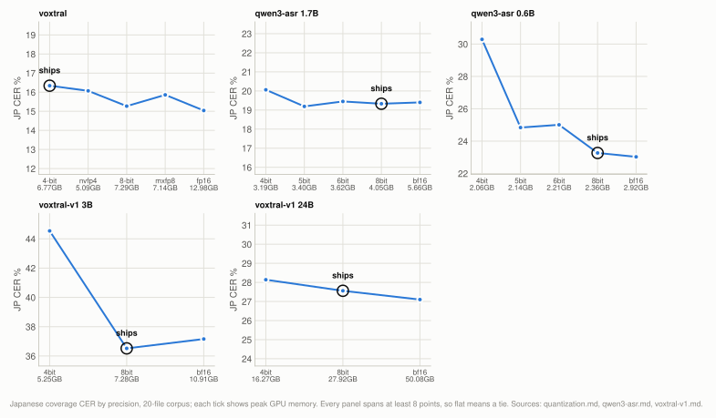
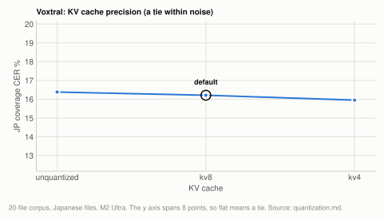

# Lever: weight and KV-cache precision

On Voxtral, 4-bit weights are last of the five precisions on the 20-file corpus, 1.30 points
behind fp16 and 1.07 behind 8-bit, and 4-bit is still the default because fp16 needs 13GB
of peak GPU memory and no loadable 8-bit build is published. Qwen3-ASR 1.7B ties at every
rung; the 0.6B loses 7 points at 4bit, so both default to 8bit. Voxtral-v1 at 8bit ties
bf16, and the 3B at 4bit loses 8 points, so 8bit is its default. `--kv-bits 8` ties
unquantized KV on the corpus and is on by default.

| setting | default | why |
|---|---|---|
| `--quantization` on `voxtral` | `4bit` | last of five on the corpus, but fp16 peaks at 12.98GB and 1.65x the wall clock, and the 8-bit that ties fp16 is not published in a loadable form |
| `--quantization` on `qwen3-asr` 1.7B | `8bit` | all five rungs tie; a tie does not move a default ([qwen3-asr.md](engines/qwen3-asr.md)) |
| `--quantization` on `qwen3-asr` 0.6B | `8bit` | 4bit is 7.02 points worse, 5bit and 6bit 1.57 and 1.74 ([qwen3-asr.md](engines/qwen3-asr.md)) |
| `--quantization` on `voxtral-v1` | `8bit` | ties bf16 on both sizes; the 3B at 4bit loses 8.01 points ([voxtral-v1.md](engines/voxtral-v1.md)) |
| `--quantization` on `whisper`, `kotoba` | fp16 | one build each, so the flag errors |
| `--quantization` on `parakeet` | its one build | one published build, so the flag errors |
| `reazon` precision | fp32 | not a `--quantization` choice; int8 drops whole phrases (36.93% against 30.45%), an engine decision ([reazon.md](engines/reazon.md)) |
| `--kv-bits` (Voxtral only) | `8` | ties unquantized KV on the corpus and on the clip, and reads half the cache bytes per step |

**Setup:** the [20-file corpus](reference/corpus.md#the-20-file-corpus), plus [one clip](reference/corpus.md#the-single-clip)
for the superseded ladder, M2 Ultra 128GB, scored by coverage CER ([metrics.md](reference/metrics.md)).

## Experiment: the weight-precision ladder

**Basis:** the [20-file corpus](reference/corpus.md#the-20-file-corpus), M2 Ultra 128GB. Voxtral on an idle host at 60s chunks, batch 16, kv8, delay 2400ms; `qwen3-asr` on an idle host (Mac14,14) with 30s windows; `voxtral-v1` on 2026-09-24/25 with other GPU clients resident on the host between runs, 30s windows.

Voxtral: five precisions, one config. Every arm through `run_corpus.py`, paired with
`compare_engines.py`. This overturns the clip result in
[Superseded](#the-single-clip-ladder).

<picture>
  <source media="(prefers-color-scheme: dark)" srcset="img/precision-dark.svg">
  
</picture>

**Table:** every model that offers `--quantization`, each rung's Japanese coverage CER on the 20-file corpus, its paired difference against that model's default where the source page prints one, throughput, peak GPU memory and weight size. Positive means the rung scored better than the default, except the two `voxtral-v1` 4bit cells, which print 4bit minus 8bit as their source does. Bold marks the best value within one model's ladder, as on the source pages. `voxtral` rows are from this page; the `qwen3-asr` rows from [qwen3-asr.md](engines/qwen3-asr.md#experiment-precision-ladder) and the `voxtral-v1` rows from [voxtral-v1.md](engines/voxtral-v1.md), where the paired cells are quoted from its prose. Weights are on disk for `voxtral` and as printed on [voxtral-v1.md](engines/voxtral-v1.md); [qwen3-asr.md](engines/qwen3-asr.md) does not print them.

| model | size | precision | JP coverage CER | paired against the default | x realtime | peak GPU | weights |
|---|---|---|---|---|---|---|---|
| `voxtral` | 4B | fp16 | **15.04%** | +1.30, CI [+0.59, +2.26] | 11.2x | 12.98GB | 8.9GB |
| `voxtral` | 4B | **8-bit** (local conversion) | **15.27%** | +1.07, CI [+0.18, +2.16] | **19.8x** | 7.29GB | 4.7GB |
| `voxtral` | 4B | mxfp8 | 15.86% | +0.48, CI [-0.43, +1.45] | 19.4x | 7.14GB | 4.6GB |
| `voxtral` | 4B | nvfp4 | 16.07% | +0.27, CI [-0.47, +1.23] | 19.6x | **5.09GB** | 2.5GB |
| `voxtral` | 4B | 4-bit (default) | 16.34% | | 18.5x | 6.77GB | 2.9GB |
| `qwen3-asr` | 1.7B | 4bit | 20.06% | -0.73, CI [-1.76, +0.31] | **26.3x** | **3.19GB** | |
| `qwen3-asr` | 1.7B | 5bit | 19.19% | +0.15, CI [-0.37, +0.78] | 23.3x | 3.40GB | |
| `qwen3-asr` | 1.7B | 6bit | 19.45% | -0.11, CI [-0.53, +0.29] | 24.2x | 3.62GB | |
| `qwen3-asr` | 1.7B | **8bit (default)** | 19.33% | | 21.9x | 4.05GB | |
| `qwen3-asr` | 1.7B | bf16 | 19.40% | -0.07, CI [-0.23, +0.10] | 16.2x | 5.66GB | |
| `qwen3-asr` | 0.6B | 4bit | 30.29% | **-7.02**, CI [-8.82, -5.30] | 26.9x | **2.06GB** | |
| `qwen3-asr` | 0.6B | 5bit | 24.84% | **-1.57**, CI [-2.16, -1.06] | 32.0x | 2.14GB | |
| `qwen3-asr` | 0.6B | 6bit | 25.01% | **-1.74**, CI [-2.94, -0.86] | 33.5x | 2.21GB | |
| `qwen3-asr` | 0.6B | **8bit (default)** | 23.27% | | 31.9x | 2.36GB | |
| `qwen3-asr` | 0.6B | bf16 | 23.03% | -0.51, CI [-1.01, +0.13] | 30.3x | 2.92GB | |
| `voxtral-v1` | 3B | 4bit | 44.54% | +8.01, CI [+4.77, +11.73] (4bit minus 8bit) | 14.0x | 5.25GB | 3.55GB |
| `voxtral-v1` | 3B | **8bit (default)** | **36.52%** | | 12.9x | 7.28GB | 5.57GB |
| `voxtral-v1` | 3B | bf16 | 37.16% | -0.64, CI [-1.56, +0.32] | 10.0x | 10.91GB | 9.37GB |
| `voxtral-v1` | 24B | 4bit | 28.14% | +0.59, CI [-2.65, +3.83] (4bit minus 8bit) | **4.3x** | **16.27GB** | 14.7GB |
| `voxtral-v1` | 24B | **8bit (default)** | 27.56% | | 3.1x | 27.92GB | 26.4GB |
| `voxtral-v1` | 24B | bf16 | **27.10%** | +0.46, CI [-0.25, +1.56] | 2.4x | 50.08GB | 48.5GB |

`whisper`, `kotoba` and `parakeet` publish one build each, so they have no precision choice
and `--quantization` errors on them. `reazon` has no `--quantization` either: it runs the
authors' fp32 ONNX, and int8 is measured and rejected as an engine decision in
[reazon.md](engines/reazon.md#experiment-reazon-k2-int8-against-fp32).

The ordering is monotonic in bit width **on this model**, which is what one would naively
expect and what the clip sweep denied. Two comparisons clear significance against 4-bit
(fp16 and 8-bit); mxfp8 and nvfp4 land inside the resolution floor. Nothing here has been
carried over to `qwen3-asr`, whose ladder is measured separately and behaves differently
([qwen3-asr.md](engines/qwen3-asr.md)). The two models share nothing but a `--quantization` flag,
so neither ladder says anything about the other.

**8-bit is the interesting result.** Against fp16 it is a tie (+0.23 points, CI [-0.12,
+0.70]), so it captures the full accuracy of unquantized weights while running at 4-bit's
speed (19.8x against 18.5x) and 7.29GB instead of 12.98GB. It also beats nvfp4 (+0.80, CI
[+0.03, +1.66]).

**The result is not a metric artifact.** For the fp16/4-bit pair, fp16 leads on all three
error types counted separately, and coverage excusal moves the wrong way to manufacture the
result:

**Table:** Voxtral fp16 and 4-bit error counts by type, summed over the 20-file corpus.

| | substitutions | deletions | insertions counted |
|---|---|---|---|
| 4-bit | 5,749 | 3,444 | 2,313 |
| fp16 | **5,185** | **3,274** | **2,132** |

The result also survives dropping the largest contributors one at a time and both together
(+1.20, +1.03, +0.93; every CI still clear of zero), so it is not one outlier file. Both
material types agree (spontaneous +1.58, published-video +0.73).

**The default stays 4-bit for now, deliberately.** Two things need settling before moving
a default that every user gets:

- **8-bit is not on the hub in a loadable form.** The two repos that advertise it ship raw
  Mistral `config.json` with no `model_type` and crash the loader (see
  [How it works](#two-published-voxtral-quants-are-absent)). Making 8-bit the default would
  mean either a local conversion step on first use or a new upload, which is a distribution
  decision rather than a benchmark one.
- **These are per-machine trades rather than one ranking.** On a 16GB machine fp16 cannot
  load at all and nvfp4's 5.09GB is the only comfortable option; on a 128GB machine 8-bit is
  clearly right. A single global default cannot express that, which is what
  `--quantization` is for.

So 4-bit remains the default as the safe option, documented as a ~1.1-point accuracy cost
rather than as free. **If you have the memory, pass `--quantization fp16`, or convert 8-bit
locally and point `--model` at it;** the local 8-bit matches fp16 at 7.3GB and full speed.

## Experiment: KV cache precision

**Basis:** the [20-file corpus](reference/corpus.md#the-20-file-corpus) on M2 Ultra 128GB at batch 16 (first table), and the earlier [single clip](reference/corpus.md#the-single-clip) on M4 16GB and M2 Ultra 128GB at the configs in the second table.

`--kv-bits 8` halves the cache bytes read per step, which matters because at batch 16 and
838 positions the cache is 1.43GB per step against 2.5GB of weights.

<picture>
  <source media="(prefers-color-scheme: dark)" srcset="img/quantization-kv-dark.svg">
  
</picture>

**Table:** Voxtral with unquantized, 8-bit and 4-bit KV cache on the 20-file corpus at batch 16: Japanese coverage CER, the paired difference kv8 minus that arm (negative means kv8 is better) with its 95% CI, and throughput.

| | JP coverage CER | kv8 minus this arm | x realtime |
|---|---|---|---|
| unquantized KV | 16.38% | -0.17, CI [-0.51, +0.12] | 19.7x |
| **kv8 (default)** | 16.21% | | 19.8x |
| kv4 | 15.95% | +0.27, CI [-0.51, +1.27] | 19.8x |

    kv8 vs unquantized: -0.17 points, CI [-0.51, +0.12]  -> tie
    kv8 vs kv4:         +0.27 points, CI [-0.51, +1.27]  -> tie

All three tie, so quantizing the cache is free in the sense that matters, and kv8 keeps the
default on its memory saving. kv4 is nominally best of the three, which is worth *not*
over-reading: it is well inside the interval, and the same trap as 4-bit weights ranking
nominally best on the narration clip. What kv4 does offer is a further halving of cache
bytes, unmeasured for memory here.

The default was set earlier on the clip, before the corpus existed:

**Table:** the earlier single-clip check of `--kv-bits 8`, per machine and config: CER and decode seconds without and with it.

| config | CER without | CER with kv8 | decode s without | decode s with |
|---|---|---|---|---|
| M4 16GB, 60s/B16 | 7.49% | **7.44%** | 78.9 | 72.8 |
| M2 Ultra 128GB, 60s/B16 | 7.23% | 7.25% | 31.8 | 29.9 |
| M2 Ultra 128GB, 30s/B32 | 9.13% | 9.11% | 17.2 | 15.6 |

Faster on both machines and no less accurate. Paired, kv8 versus unquantized KV is 0.02
points with CI [+0.00, +0.07], and **39 of 40 scored regions are identical**, which is the
strongest form of "free" available from this method. On by default in both hardware
profiles.

## How it works

**`--kv-bits` is Voxtral only**, since it applies to our own batched decoder.
**`--quantization` works on any model that publishes more than one build**, currently
`voxtral`, `qwen3-asr` and `voxtral-v1`; the `whisper` sizes point at fp16 MLX conversions
with no quantized builds in use here, so it errors there, as it does on `kotoba`,
`parakeet` and `reazon`. whisper.cpp quantization is
covered in [whisper.md](engines/whisper.md#experiment-competing-apple-silicon-runners), where it costs speed rather than accuracy.

### One measured default per model

Each model has **one default precision, chosen by measurement where a choice exists**, and
`--quantization` exposes the rest where the converters published more than one build. The
default is picked by this rule, in this order:

1. **Take the cheapest precision whose accuracy cost is worth its price.** On Voxtral that
   cost is now measured: 4-bit gives up ~1.1 points against 8-bit and ~1.3 against fp16. It
   is still the default, because fp16 needs 1.65x the time and more memory than a 16GB
   machine has, and no loadable 8-bit build is published.
2. **Where only one build exists, use that.** Nothing to choose.

**Table:** the default precision of every model family, the other builds `--quantization` accepts, and why that default was chosen.

| model | default | other options | why that default |
|---|---|---|---|
| `voxtral` | 4-bit | `fp16` | fp16 is 8.9GB of weights, 12.98GB peak and 1.65x the wall clock on the corpus, where it is 1.30 points better and 4-bit is last of five. 4-bit stays the default for memory and because no loadable 8-bit is published. Measured above |
| `whisper-*` | fp16 | none | 0.08-3.1GB; no quantized MLX builds in use here |
| `kotoba` | fp16 | none | 1.6GB, converted on first use |
| `parakeet` | its one build | none | one published MLX build |
| `reazon` | fp32 | none through `--quantization` | int8 drops whole phrases on this corpus (36.93% against 30.45%); see [reazon.md](engines/reazon.md) |
| `qwen3-asr` | **8-bit** | 4bit, 5bit, 6bit, bf16 | bf16 **tied** it on accuracy (20.16% vs 19.98%) while costing **1.36x the wall clock** (14.1x vs 19.2x) and **1.4x the peak memory** (5.66 vs 4.05GB) |
| `qwen3-asr-small` | **8-bit** | 4bit, 5bit, 6bit, bf16 | same, and the gap is wider: bf16 26.24% vs 23.27%, and 23.0x vs 32.8x, which would remove the only reason this model is offered |
| `voxtral-v1` | **8bit** | 4bit, bf16 | ties bf16 on both sizes at a fraction of the memory; the 3B at 4bit is 8.01 points worse. See [voxtral-v1.md](engines/voxtral-v1.md) |

The two `qwen3-asr` rows quote the earlier 8-bit against bf16 measurement. The full
five-rung ladder in [qwen3-asr.md](engines/qwen3-asr.md) reaches the same defaults with different
figures (1.7B bf16 19.40% against 8bit 19.33%; 0.6B bf16 23.03% against 23.27%, a tie), and
`qwen3-asr-small` is now `--model qwen3-asr --size 0.6B`.

So the shorthand is a precision name rather than a repo id:

```bash
mlx-asr jp.wav --model qwen3-asr --language ja -f txt                      # 8-bit
mlx-asr jp.wav --model qwen3-asr --language ja -f txt --quantization 4bit  # 1.61GB
mlx-asr jp.wav --model qwen3-asr --language ja -f txt --quantization none  # bf16
```

### A lookup, with no runtime conversion

`--quantization` is a **lookup from (model, precision) to a published repo id**, so only
precisions that exist are accepted, and an unpublished one is an error naming what does
exist rather than a 404 mid-download. It therefore does not combine with a repo id passed to
`--model`, which already names its own precision, and it errors on models that have a single
build. `--list-models` prints the options per model.

`none` resolves to whichever unquantized build a model publishes, which is not the same
name everywhere: bf16 for Qwen3-ASR and Voxtral-v1, fp16 for Voxtral. Both spellings work on
either.

On `voxtral` the flag also moves the **weight footprint used to size the batch**. That
matters: `derive_batch` subtracts it from the GPU budget, so on an unprofiled 16GB-class
machine 4-bit derives batch 32 and fp16 derives batch 1. Claiming 4-bit's 2.5GB while
loading 8.9GB would plan for memory already spent, and the failure would surface as an OOM
rather than as a bad default.

The default on `voxtral` resolves to `mlx-community/Voxtral-Mini-4B-Realtime-2602-4bit`
with `--kv-bits 8`. The M4 16GB profile was measured on nvfp4 while the Ultra profile was
measured on 4-bit affine, which is why those two rows are not a clean A/B of anything but
hardware.

KV quantization in mlx 0.32 needs mlx-lm's `quantized_scaled_dot_product_attention`,
because `QuantizedKVCache.update_and_fetch` returns triples that the dense
`mx.fast.scaled_dot_product_attention` rejects.

### Two published Voxtral quants are absent

`mlx-community/Voxtral-Mini-4B-Realtime-6bit` and
`ellamind/Voxtral-Mini-4B-Realtime-8bit-mlx` both fail to load with
`TokenizersBackend has no attribute tokenizer`. They ship raw Mistral-format `config.json`
with no `model_type`, so mlx-audio routes them to the non-realtime `voxtral` loader and dies
in `post_load_hook`. That is a repo packaging problem rather than a precision result, and the
locally converted 8-bit row above covers the same point. Listing them would turn a usage
error into a crash after a multi-gigabyte download.

Still true on 2026-08-20, which is why `--quantization` on `voxtral` offers only `4bit` and
`fp16`: those are the builds that load.

### Decoder degeneracy is the check worth repeating per engine

On a new engine the thing worth checking afresh is **decoder degeneracy**, where the effect
size is large rather than fractional. On Qwen3-ASR it made no difference: bf16 and 8-bit
produced near-identical repetition-loop counts (2/0/18/0/31 against 3/0/19/0/31 per file),
so its loops are not a quantization artifact. See [qwen3-asr.md](engines/qwen3-asr.md).

### Adjacent questions that came up and were closed

**Unsloth dynamic quants.** Unsloth publishes no Voxtral repos at all (their audio work is
Whisper-only), so there is nothing of theirs to evaluate. The idea of keeping sensitive
layers at higher precision is sound in general; the headroom it could recover is bounded by
the 1.30-point fp16 gap on the corpus (0.07 points on the clip at the best config), and the
locally converted 8-bit already recovers all of it.

**GGUF.** GGUF quants of Voxtral Realtime exist and are popular. They are unusable here for
a structural reason rather than a quality one: GGUF is llama.cpp's format, MLX cannot load
it, and this project's speed result comes entirely from a custom batched MLX decoder.
Adopting llama.cpp's runtime would mean giving up multi-stream batching, which is worth
3-4x, to chase a quantization difference of at most 1.30 points on the corpus, which 8-bit
in MLX already closes. If a GGUF path is ever wanted, `mx.quantize` already supports
affine/mxfp4/mxfp8/nvfp4 locally, which is how the 8-bit, mxfp8 and nvfp4 rows were
produced.

**Quantization on other runners is a different story.** On whisper.cpp, q5_0 is 27%
*slower* than fp16 at identical CER, because dequantization is work an fp16 matmul does not
do. So on Apple Silicon, quantize when memory-bound rather than for speed. See
[whisper.md](engines/whisper.md#experiment-competing-apple-silicon-runners).

## Superseded

### The single-clip ladder

This is superseded on accuracy by the corpus ladder above and still valid on cost (wall
clock, memory, decode steps/s), which are properties of the weights and the hardware rather
than of the audio, and which the corpus run reproduces.

It produced an earlier "quantization costs nothing measurable". On the single 935s Japanese
prepared-narration clip, which has a complete verbatim reference so plain CER is
meaningful, the five precisions span 0.43 points and 4-bit ranks nominally best. Both
measurements are sound on their own material and they disagree; the corpus one governs,
because it is the material this project is tuned for.

**Method.** `scripts/benchmarks/sweep_precision.py`. Everything fixed except the weights:
60s chunks, batch 16, delay 2400ms, same prompt. M2 Ultra 128GB, since a 16GB M4 cannot hold
fp16 at all. Differences are checked with a paired test over 40 regions of the same clip
(`scripts/benchmarks/compare_configs.py`) rather than by eyeballing two overall CERs.

**Table:** the superseded single-clip Voxtral ladder: five precisions on the 935s narration clip, with accuracy, throughput, decode rate and peak memory.

| weights | bytes | CER | kana CER | x realtime | decode steps/s | peak GB |
|---|---|---|---|---|---|---|
| fp16 (unquantized) | 8.9GB | 7.61% | 6.08% | 13.6x | 14.5 | 15.28 |
| 8-bit affine (local convert) | 4.7GB | 7.49% | 5.99% | 21.1x | 26.4 | - |
| mxfp8 (local convert) | 4.6GB | 7.66% | 5.97% | 21.2x | 26.5 | - |
| nvfp4 (local convert) | 2.5GB | 7.49% | 5.99% | 21.8x | 27.1 | - |
| **4-bit affine (hub)** | 2.9GB | **7.23%** | **5.60%** | **22.2x** | 26.3 | 9.36 |

The whole spread is 0.43 CER points. The fp16 and 4-bit hypotheses differ by 65 characters
out of 4205 (1.5%), and fp16's 15 extra errors are spread across categories rather than
concentrated:

**Table:** fp16 and 4-bit error counts by type on the single clip.

| weights | sub | ins | del | total |
|---|---|---|---|---|
| fp16 | 158 | 59 | 103 | 320 |
| 4bit | 149 | 52 | 104 | 305 |

Paired, fp16 versus 4-bit is 0.07 points with CI [-0.33, +0.48]. **On this clip, treat all
five as tied.** That does not generalise: fp16 beats 4-bit by 1.30 points on the 20-file
corpus, significantly, and all five precisions have since been run there.

What is *not* noise is the cost. Decode steps/s tracks weight bytes the way the bandwidth
model predicts (14.5 for 8.9GB versus 26-27 for the 2.5-4.7GB variants), which is the same
bandwidth story as [decode-throughput.md](decode-throughput.md).

Two confounds were ruled out explicitly:

- **The KV cache.** Repeating the comparison with `--kv-bits 8`: fp16 7.61% at 14.3x, 4-bit
  7.25% at 21.8x. Identical conclusion.
- **An untuned baseline.** Re-run at the best config found later (30s chunks, batch 32,
  kv8, 8s overlap), in case fp16 only pulls ahead once everything else is optimal: fp16
  7.32% at 17.8x versus 4-bit 7.25% at 26.7x. Still a tie, still 1.5x the cost.

One nuance recorded rather than hidden: at that tuned config fp16 wins on *kana* CER (5.51%
vs 5.93%), so its errors may be marginally more phonetically faithful even where its
character score is not better. That gap is also inside the noise band.

### The power calculation it fed

The clip sweep answered the general question once (is quantization silently costing
quality?) with "no", and every later model inherited that answer instead of being measured.
The corpus result shows the inheritance was unsound for at least one pair: fp16 versus 4-bit
is a tie on the clip and a significant 1.30 points on the corpus.

The mechanism of the mistake is worth naming, because the sample size alone does not
explain it. A **power calculation was fed an effect size measured on unrepresentative
material**. At n=7 the corpus resolved about 3.2 points, and the clip effects were
0.07-0.26 points, so the estimate said 8-bit versus 4-bit would need ~1,000 files, fp16
versus 4-bit ~15,000, and kv8 ~180,000; running the sweep across the corpus was skipped as
about 1.5h of GPU time for numbers inside the noise floor. Twenty files resolved fp16
cleanly, so the input to that calculation was wrong by two orders of magnitude, and any
other number it produced is equally untrustworthy. A power calculation inherits the
validity of its effect size, and an effect size from one recording of prepared narration
does not describe spontaneous multi-speaker audio.

### The cross-machine check it leaned on

The same config on an M4 16GB (nvfp4) and an M2 Ultra 128GB (4-bit affine) agreed to within
~1 point on 5 of 7 files. That comparison cannot fully separate quantization from hardware,
because the two machines do not produce byte-identical output even at identical weights
(see [determinism.md](reference/determinism.md)).

That confound was later bounded. Running one identical 4-bit config on both machines over
18 files put 11 of them at *identical* coverage CER and 16 within 0.16 points, so the
hardware term in that check is much smaller than the ~1 point it was assumed to be. Whatever
separated the nvfp4 and 4-bit rows was therefore mostly not hardware, and it was still under
a point. At the time this was read as strengthening the conclusion that precision is a
non-factor; the corpus ladder has since overturned that conclusion for Voxtral.

## Not settled

**Why the clip and the corpus disagree.** The clip put fp16 versus 4-bit at 0.07 points, CI
[-0.33, +0.48], on 40 paired regions, and ranked 4-bit nominally best of five. The corpus
reverses the ranking and resolves it. Both tests are sound on their own material. Material
type alone does not explain it, since both kinds of corpus audio favour the higher
precisions. Untested candidates: reference style (verbatim against editorial), and that a
935s single-speaker recording may simply not exercise whatever quantization degrades. Not
resolvable without a second corpus.

**A full ladder is not swept per model, and that policy is on notice.** The corpus result
shows that inheriting the clip's answer was unsound for Voxtral. The `qwen3-asr` and
`voxtral-v1` rungs have since been measured on the corpus too
([qwen3-asr.md](engines/qwen3-asr.md), [voxtral-v1.md](engines/voxtral-v1.md)).

**kv4's memory saving** is a further halving of cache bytes, unmeasured here.

## Related

[decode-throughput.md](decode-throughput.md) for why bytes-per-step sets the speed.
[metrics.md](reference/metrics.md) for why kana CER is reported but not trusted as the fair number.
[qwen3-asr.md](engines/qwen3-asr.md) and [voxtral-v1.md](engines/voxtral-v1.md) for the other two ladders.
