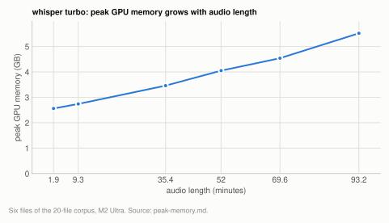
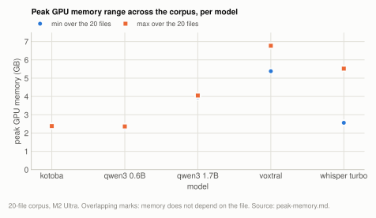

# Reference: peak GPU memory

The peak GPU memory a model reaches during a transcription, as reported by
`mx.get_peak_memory()`. It is the number that decides whether a model runs on a given
machine, and it is published instead of download size because the download does not predict
it: whisper `tiny` downloads 0.07GB and peaks at 3.99GB. Each figure is the maximum over the
20-file corpus on one M2 Ultra, at that model's default configuration for the machine.

**Setup:** [20-file corpus](corpus.md#the-20-file-corpus), M2 Ultra 128GB. Counter reset per
file, CLI run at its default per-machine config, cell = maximum over the 20 files.

## Method

Every cell in the [MODELS.md](../../MODELS.md) tables is the maximum of
`mx.get_peak_memory()` over the same 20-file corpus, reset per file, driven through the CLI
at its default per-machine config.

    M2 Ultra 128GB (Mac14,14), 60 GPU cores, macOS 26.4.1, mlx 0.32.0
    20 cells x 20 files = 400 decodes, 8.2h wall, zero failures
    load average 0.24/core at launch, 0 swapouts/s, GPU otherwise idle
    2026-08-21

All cells share one method, which is the reason for publishing a column: cells that came
from different bases cannot be compared to each other, and a reader who compares them
anyway gets a wrong answer about what fits.

This replaced a table that mixed three bases (the corpus for some cells, one 93-minute
file for the intermediate quantization rungs, three files for kotoba) while the prose
claimed two. The re-run reproduced **19 of 20 cells within 0.02GB**, so the earlier numbers
were right about the models and wrong about their provenance. Only kotoba moved, for the
reason below.

The six `voxtral-v1` cells were added on 2026-09-25 from the engine's corpus runs
(`run_qwen3.py`) rather than a CLI-per-file sweep. The basis is the same: the counter is
reset before the model loads, as the CLI does before `run()`, and the cell is the maximum
over the 20 files. The one file measured both ways read 10.91GB in each. Like qwen3-asr its
peak is flat across the corpus, because a fixed window fixes the working set.

## What the number is sensitive to

**Audio length, on the Whisper family.** Its peak grows monotonically with duration and
does not plateau inside this corpus, whose files run from 1.9 to 93 minutes:

<picture>
  <source media="(prefers-color-scheme: dark)" srcset="../img/peak-memory-whisper-duration-dark.svg">
  
</picture>

**Table:** whisper turbo peak GPU memory on six corpus files of increasing length.

| `whisper --size turbo` | peak |
|---|---|
| 1.9 min | 2.56GB |
| 9.3 min | 2.74GB |
| 35.4 min | 3.46GB |
| 52.0 min | 4.05GB |
| 69.6 min | 4.54GB |
| 93.2 min | 5.52GB |

The published whisper figures therefore describe a 93-minute file rather than whisper in
general. Every size behaves this way, with a spread of 2.9 to 3.6GB between the shortest and
longest file. On a memory-tight machine, a 20-minute recording costs Whisper substantially
less than this table implies. The mechanism is the transcript accumulating across the
sequential 30s window loop rather than any single window.

**Barely anything, on the other three.** Voxtral rises to a plateau and stays there (5.38
to 6.76GB, flat above ~35 minutes) because its working set is the batch, which is full
once the file is long enough to fill it. qwen3-asr moves 0.08 to 0.10GB across the whole
corpus, and kotoba is flat to the last decimal:

<picture>
  <source media="(prefers-color-scheme: dark)" srcset="../img/peak-memory-range-dark.svg">
  
</picture>

**Table:** smallest and largest per-file peak GPU memory over the 20 files, per model, and the gap between them.

| model | min | max | spread |
|---|---|---|---|
| `kotoba` | 2.38GB | 2.38GB | 0.00 |
| `qwen3-asr 0.6B/8bit` | 2.28GB | 2.36GB | 0.08 |
| `qwen3-asr 1.7B/8bit` | 3.95GB | 4.05GB | 0.10 |
| `voxtral 4bit` | 5.38GB | 6.77GB | 1.39 |
| `whisper turbo` | 2.56GB | 5.52GB | 2.96 |

A fixed decode window (10s for kotoba, 30s for qwen3-asr) is what makes a model's memory
predictable, and it is worth more than a small weight file when the question is whether
something fits.

## kotoba: the old 3.03GB figure measured the first-use conversion

This cell previously read 3.03GB and now reads 2.38GB. The old number was measured
correctly, but it measured the conversion rather than the decode.

kotoba is published in transformers format, so the first `--model kotoba` on a machine
converts it to MLX. That conversion `mx.load`s the entire checkpoint and writes an fp16
copy, all through MLX, so `get_peak_memory()` counts it. The original measurement ran on a
machine where the conversion cache was cold; every run afterwards is cheaper.

Reproduced deliberately by moving the cache aside:

    conversion cache cold   3.03GB      (the old published figure)
    conversion cache warm   2.38GB      (every subsequent run)

Both are real. 2.38GB is published because it is what a user sees for all but one run in
the life of the machine, and the 3.03GB one-off is noted in MODELS.md where the conversion
is described. As a side effect: converting twice produces byte-identical output, so the
conversion is deterministic.

## Caveats

- **One machine.** Peak memory depends on the allocator and the GPU working set, and
  [cross-machine nondeterminism](determinism.md) is established for output, so treat these
  as an M2 Ultra measurement rather than a constant. The M4 16GB has a much smaller
  recommended working set (12.71GB), which is close enough to the voxtral fp16 figure
  (12.98GB) that fp16 is not usable there.
- **Default config at measurement time.** Voxtral's figures were measured at the earlier
  60s/B16 profile; the current Ultra default is 30s/B128 ([chunking.md](../chunking.md#experiment-batch-size-end-to-end)), which peaks at 11.33GB on 4-bit. A
  different `--chunk-seconds`/`--max-batch` pair moves them: `quantization.md` reports
  9.36GB and 15.28GB for the same two builds at a different pair, on a different clip.
  Both are correct for what they measured.
- **n=1 per cell.** These are maxima over 20 files rather than repeated runs of one file,
  so they carry no rerun spread. Voxtral and qwen3-asr are deterministic, so a rerun would
  be identical; whisper samples, and its allocation pattern can therefore vary run to run
  by an amount not measured here.

## Reproducing

`scripts/docs/gen_model_matrix.py` holds the table as data and prints the markdown; it
does not measure. The sweep is a separate script kept out of the repo because it needs the
corpus, which is not distributable ([corpus.md](corpus.md)). It is 100 lines: for each
`(model, size, quantization)`, run the CLI over every file with `--stats-json`, take the
max of `peak_memory_gb`.

Any single run reports its own figure, which is the one that matters on your hardware:

```bash
mlx-asr audio.wav --stats-json stats.json      # peak_memory_gb in the JSON
```

## Related

- [MODELS.md](../../MODELS.md): the per-model table these figures populate.
- [quantization.md](../quantization.md): peak memory per Voxtral precision, at a fixed config.
- [chunking.md](../chunking.md): chunk length per chip and batch sized from memory.
- [determinism.md](determinism.md): how far results move across machines.
- [corpus.md](corpus.md): the corpus every cell is measured over.
